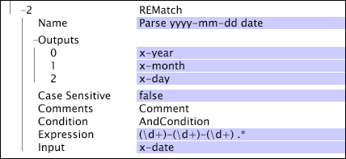

# REMatch{#rematch}

The REMatch transformation is a pattern-matching transformation that uses regular expressions to specify one or more patterns to look for and capture in the input.

 The transformation constructs an output field for each capturing sub-pattern in the regular expression. If the regular expression does not match the input field, the outputs are blank, and if the output field already exists, the values are replaced by the blank values. For a brief guide to using regular expressions, see [Regular Expressions](../../../../../home/c-dataset-const-proc/c-reg-exp.md#concept-070077baa419475094ef0469e92c5b9c).

>[!NOTE]
>
>The [!DNL REMatch] transformation operates similarly to the [!DNL RETransform] transformation (see [RETransform](../../../../../home/c-dataset-const-proc/c-data-trans/c-transf-types/c-standard-transf/c-retransform.md#concept-23f80aa0bc204565b337e5c4931f6a74)), which uses regular expressions to capture a string and stores that string in a single output field.

[!DNL REMatch] parses a string more efficiently than multiple [!DNL RETransform] transformations or a single [!DNL RETransform] transformation followed by a [!DNL Flatten] transformation. See [Flatten](../../../../../home/c-dataset-const-proc/c-data-trans/c-transf-types/c-standard-transf/c-flatten.md#concept-7acd351a6d2444bd960ca412ae3333ce).

<table id="table_7077578512B249E986BC79AE770CBD9A"> 
 <thead> 
  <tr valign="top"> 
   <th colname="col1" class="entry"> Parameter </th> 
   <th colname="col2" class="entry"> Description </th> 
   <th colname="col3" class="entry"> Default </th> 
  </tr> 
 </thead>
 <tbody> 
  <tr valign="top"> 
   <td colname="col1"> Name </td> 
   <td colname="col2"> Descriptive name of the transformation. You can enter any name here. </td> 
   <td colname="col3"></td> 
  </tr> 
  <tr valign="top"> 
   <td colname="col1"> Case Sensitive </td> 
   <td colname="col2"> True or false. Specifies whether the match is case-sensitive. </td> 
   <td colname="col3"></td> 
  </tr> 
  <tr valign="top"> 
   <td colname="col1"> Comments </td> 
   <td colname="col2"> Optional. Notes about the transformation. </td> 
   <td colname="col3"></td> 
  </tr> 
  <tr valign="top"> 
   <td colname="col1"> Condition </td> 
   <td colname="col2"> The conditions under which this transformation is applied. </td> 
   <td colname="col3"></td> 
  </tr> 
  <tr valign="top"> 
   <td colname="col1"> Expression </td> 
   <td colname="col2"> The regular expression used for matching. </td> 
   <td colname="col3"></td> 
  </tr> 
  <tr valign="top"> 
   <td colname="col1"> Input </td> 
   <td colname="col2"> The field against which the regular expression is evaluated. </td> 
   <td colname="col3"></td> 
  </tr> 
  <tr valign="top"> 
   <td colname="col1"> Outputs </td> 
   <td colname="col2"> 
The name of the output string or vector. In the case of string vectors as input, the outputs are also string vectors. 
 
 An output field must exist for each capturing sub-pattern in the expression. 
 </td> 
   <td colname="col3"></td> 
  </tr> 
 </tbody> 
</table>

>[!NOTE]
>
>[!DNL REMatch] transformations can be very slow and may account for much of the data processing time.

In this example, a [!DNL REMatch] transformation parses a date of the format YYYY-MM-DD into the fields x-year, x-month, and x-day. For the date 2007-01-02, the values of x-year, x-month, and x-day would be 2007, 01, and 02, respectively.

