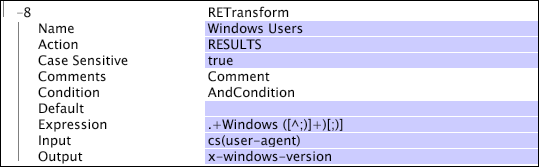

# RETransform{#retransform}

The RETransform (regular expression) transformation is a pattern-matching transformation that uses regular expressions to specify a pattern to look for and capture in the input and stores the captured string in a designated output field.

Regular expressions are evaluated against the entire input string. If the input does not match the pattern specified in the regular expression, no data is captured. For a brief guide to using regular expressions, see [Regular Expressions](../../../../../home/c-dataset-const-proc/c-reg-exp.md#concept-070077baa419475094ef0469e92c5b9c).

>[!NOTE]
>
>The [!DNL RETransform] transformation operates similarly to the [!DNL REMatch] transformation (see [REMatch](../../../../../home/c-dataset-const-proc/c-data-trans/c-transf-types/c-standard-transf/c-rematch.md#concept-7f0b1caad1df46aabef4448f88261a8e)), which constructs an output field for each capturing sub-pattern in the regular expression. You can think of [!DNL RETransform] as a combination of [!DNL REMatch] and [!DNL Format] transformations. If the Action parameter (see Action in the following table) is set to "RESULTS," then [!DNL RETransform] operates like a combination of [!DNL REMatch] and [!DNL Union] transformations.

<table id="table_51B7342E6A5E4E31913BD0F6A6ACC424"> 
 <thead> 
  <tr valign="top"> 
   <th colname="col1" class="entry"> Parameter </th> 
   <th colname="col2" class="entry"> Description </th> 
   <th colname="col3" class="entry"> Default </th> 
  </tr> 
 </thead>
 <tbody> 
  <tr valign="top"> 
   <td colname="col1"> Name </td> 
   <td colname="col2"> Descriptive name of the transformation. You can enter any name here. </td> 
   <td colname="col3"></td> 
  </tr> 
  <tr valign="top"> 
   <td colname="col1"> Comments </td> 
   <td colname="col2"> Optional. Notes about the transformation. </td> 
   <td colname="col3"></td> 
  </tr> 
  <tr valign="top"> 
   <td colname="col1"> Condition </td> 
   <td colname="col2"> The conditions under which this transformation is applied. </td> 
   <td colname="col3"></td> 
  </tr> 
  <tr valign="top"> 
   <td colname="col1"> Default </td> 
   <td colname="col2"> The default value to use if the condition is met and the input value is either not available or the regular expression does not match the input value. </td> 
   <td colname="col3"></td> 
  </tr> 
  <tr valign="top"> 
   <td colname="col1"> Action </td> 
   <td colname="col2"> 
Specifies how the result is treated. The default setting of RESULTS simply takes the patterns matched and creates a vector of strings from the patterns being extracted. 
 
 Alternatively, the action may be a formatting string to create a simple string output of a particular format. With this technique, you specify the number corresponding to the location of each matched pattern between % signs. For example, the 1st matched pattern would be %1%, and the 3rd matched pattern would be %3%. You would specify other characters in the formatting string literally. 
 </td> 
   <td colname="col3"> RESULTS </td> 
  </tr> 
  <tr valign="top"> 
   <td colname="col1"> Expression </td> 
   <td colname="col2"> The regular expression used for matching. </td> 
   <td colname="col3"></td> 
  </tr> 
  <tr valign="top"> 
   <td colname="col1"> Input </td> 
   <td colname="col2"> The field against which the regular expression is evaluated. </td> 
   <td colname="col3"></td> 
  </tr> 
  <tr valign="top"> 
   <td colname="col1"> Output </td> 
   <td colname="col2"> The name of the output string. </td> 
   <td colname="col3"></td> 
  </tr> 
 </tbody> 
</table>

>[!NOTE]
>
>[!DNL RETransform] transformations can be very slow and may account for much of the data processing time.

This example isolates the version of the Windows operating system that a website visitor is using and creates a field x-windows-version from that value. The output value in this case would simply be the version number.

If you wanted to include the string "Version" in front of the version number for readability, you would change the Action parameter from "RESULTS" to "Version %1%." To include a literal percent sign (%) in your output, escape it with a second percent sign, as in "%%." 
