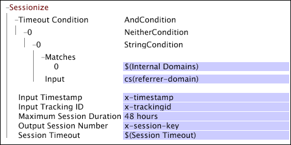

# Sessionize{#sessionize}

If you are working with data collected from website traffic, you can use the Sessionize transformation to determine how sessions are defined.

 The transformation takes as its input a timestamp and a tracking ID and outputs a session number for each log entry. The session number is "1" for the first session with a given tracking ID, "2" for the second session with the same tracking ID, and so on. The output can be used directly as a session key because it has a unique value for each session.

>[!NOTE]
>
>To work, the [!DNL Sessionize] transformation requires that the data is ordered in time and grouped by the tracking ID in your source data. Therefore, [!DNL Sessionize] works only when defined in the [!DNL Transformation.cfg] file or in a [!DNL Transformation Dataset Include] file.

<table id="table_34984DF9340149C0A5016F08EABAD158"> 
 <thead> 
  <tr valign="top"> 
   <th colname="col1" class="entry"> Parameter </th> 
   <th colname="col2" class="entry"> Description </th> 
   <th colname="col3" class="entry"> Default </th> 
  </tr> 
 </thead>
 <tbody> 
  <tr valign="top"> 
   <td colname="col1"> Name </td> 
   <td colname="col2"> Descriptive name of the transformation. You can enter any name here. </td> 
   <td colname="col3"> </td> 
  </tr> 
  <tr valign="top"> 
   <td colname="col1"> Comments </td> 
   <td colname="col2"> Optional. Notes about the transformation. </td> 
   <td colname="col3"> </td> 
  </tr> 
  <tr valign="top"> 
   <td colname="col1"> Condition </td> 
   <td colname="col2"> The conditions under which this transformation is applied. </td> 
   <td colname="col3"> </td> 
  </tr> 
  <tr valign="top"> 
   <td colname="col1"> Input Timestamp </td> 
   <td colname="col2"> The field containing the values of the timestamp to be used. </td> 
   <td colname="col3"> x-timestamp </td> 
  </tr> 
  <tr valign="top"> 
   <td colname="col1"> Input Tracking ID </td> 
   <td colname="col2"> 
The field containing the values of the tracking ID to be used. The value must be a 64-bit (16 digit) or smaller hexadecimal number or a decimal integers of 16 digits or less. 
 
 
Note: If you wish to use a field other than x-trackingid for the tracking ID, you need to hash the field first. See <a href="../../../../../home/c-dataset-const-proc/c-data-trans/c-transf-types/c-standard-transf/c-hash.md#concept-9c353923264941c3aea4428fed66d369" format="dita" scope="local"> Hash</a>. 
 
 </td> 
   <td colname="col3"> x-trackingid </td> 
  </tr> 
  <tr valign="top"> 
   <td colname="col1"> 
Maximum Session Duration 
 </td> 
   <td colname="col2">The longest length of session before a new session is started. (This keeps web pages that have auto content refreshing from creating sessions that are arbitrarily long.) If the  Timeout Condition is satisfied and the referrer of a click is set to one of the entries in the Internal Domains parameter, Maximum Session Duration is used to define the end of a session. No session may be longer than the specified Maximum Session Duration regardless of how many clicks it contains. The recommended value is 48 hours. For more information about the Maximum Session Duration and Internal Domains parameters, see <a href="../../../../../home/c-dataset-const-proc/c-config-web-data/c-config-web-data.md#concept-9a306b65483a484bb3f6f3c1d7e77519" format="dita" scope="local"> Configuration Settings for Web Data</a>. </td> 
   <td colname="col3"> 48 hours </td> 
  </tr> 
  <tr valign="top"> 
   <td colname="col1"> Output Session Number </td> 
   <td colname="col2"> The field in which the session number is stored. This field has a unique value for each session for each visitor. </td> 
   <td colname="col3"> </td> 
  </tr> 
  <tr valign="top"> 
   <td colname="col1"> Session Timeout </td> 
   <td colname="col2"> 
The amount of time that needs to pass between log entries of a given visitor to determine the end of one session and the start of a new session (that is, the typical timeout used to define a user session). The recommended value of this parameter is 30 minutes. If the Timeout Condition is not satisfied and the referrer of a click is not set to one of the referrers in the Internal Domains parameter, Session Timeout is used to define the session. 
 
 If the Timeout Condition is satisfied and cs(referrer-domain) for a log entry is in the list of internal domains, then Maximum Session Duration determines whether the current log entry is part of an existing session or the start of a new session. 
 
 For more information about the Session Timeout parameter, see <a href="../../../../../home/c-dataset-const-proc/c-config-web-data/c-config-web-data.md#concept-9a306b65483a484bb3f6f3c1d7e77519" format="dita" scope="local"> Configuration Settings for Web Data</a>. 
 </td> 
   <td colname="col3"> 30 minutes </td> 
  </tr> 
  <tr valign="top"> 
   <td colname="col1"> Timeout Condition </td> 
   <td colname="col2"> The condition that must be satisfied for a log entry to be considered the start of a new session. Note that the amount of time that passes between the log entry and the previous log entry must be at least the value of the Session Timeout parameter. </td> 
   <td colname="col3"> </td> 
  </tr> 
 </tbody> 
</table>

A new session begins when any one of the following situations occurs:

* The tracking ID changes. 
* The time since the last log entry is at least equal to the value of the Session Timeout parameter and the Timeout Condition is satisfied. 
* The time since the first log entry of the last session exceeds the value of the Maximum Session Duration parameter.

>[!NOTE]
>
>If you have already defined Maximum Session Duration and Session Timeout as parameters in the [!DNL Session Parameters.cfg] file, do not enter values for them in the configuration. You can reference the parameters by typing *$(parameter name)* as shown in the following example. For more information about these parameters, see [Configuration Settings for Web Data](../../../../../home/c-dataset-const-proc/c-config-web-data/c-config-web-data.md#concept-9a306b65483a484bb3f6f3c1d7e77519).

The [!DNL Sessionize] transformation in this example takes as its input the x-timestamp and x-trackingid fields and records the session number for each log entry in the x-session-key field. The transformation's [!DNL Timeout Condition] is based on a [!DNL Neither] condition: If the cs(referrer-domain) field for a log entry matches a member of the Internal Domains parameter, the condition evaluates to false. Note the references to the Internal Domains and Session Timeout parameters.

For information about the [!DNL NeitherCondition], see [Conditions](../../../../../home/c-dataset-const-proc/c-conditions/c-conditions.md#concept-9a576a00d5db48e7a599016c441e39e0). For information about the Internal Domains and Session Timeout parameters, see [Configuration Settings for Web Data](../../../../../home/c-dataset-const-proc/c-config-web-data/c-config-web-data.md#concept-9a306b65483a484bb3f6f3c1d7e77519).

