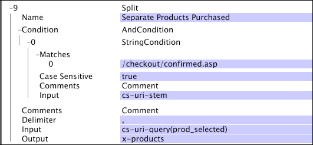

# Split{#split}

The Split transformation splits a string into a vector of substrings based upon a given delimiter character.

 [!DNL Split] is particularly useful for extracting individual values from a collection of values associated with a single URI query name value. 

<table id="table_C97DA4E45DA844FAB8D61AABA22FF809"> 
 <thead> 
  <tr> 
   <th colname="col1" class="entry"> Parameter </th> 
   <th colname="col2" class="entry"> Description </th> 
   <th colname="col3" class="entry"> Default </th> 
  </tr> 
 </thead>
 <tbody> 
  <tr> 
   <td colname="col1"> Name </td> 
   <td colname="col2"> Descriptive name of the transformation. You can enter any name here. </td> 
   <td colname="col3"> </td> 
  </tr> 
  <tr> 
   <td colname="col1"> Comments </td> 
   <td colname="col2"> Optional. Notes about the transformation. </td> 
   <td colname="col3"> </td> 
  </tr> 
  <tr> 
   <td colname="col1"> Condition </td> 
   <td colname="col2"> The conditions under which this transformation is applied. </td> 
   <td colname="col3"> </td> 
  </tr> 
  <tr> 
   <td colname="col1"> Delimiter </td> 
   <td colname="col2"> 
String that is used to separate the input string into substrings. Must be a single character in length. 
 
 If you hold down the Ctrl key and right-click within the Delimiter parameter, an Insert menu appears. This menu contains a list of special characters that often are used as delimiters. 
 </td> 
   <td colname="col3"> </td> 
  </tr> 
  <tr> 
   <td colname="col1"> Input </td> 
   <td colname="col2"> The name of the field whose value is split to create the output string vector. </td> 
   <td colname="col3"> </td> 
  </tr> 
  <tr> 
   <td colname="col1"> Output </td> 
   <td colname="col2"> The name of the output field. </td> 
   <td colname="col3"> </td> 
  </tr> 
 </tbody> 
</table>

Consider a website in which the products purchased by a customer are listed as part of the cs-uri-query value when the confirmation page associated with a successful purchase is accessed. The following is an example of such a string:

* /checkout/confirmed.asp?prod_selected=B57481,C46355,Z97123

The cs-uri-stem field is used to determine whether the page being requested by the log entry is the confirmation page. The codes for the products that the customer purchased are listed as the comma-separated values of the prod_selected name in the cs-uri-query. The [!DNL Split] transformation can be used to extract this information by splitting the product codes at the comma if the value of cs-uri-stem matches the value specified in the [!DNL String Match] condition. See [String Match](../../../../../home/c-dataset-const-proc/c-conditions/c-test-ops/c-test-op-con.md#section-f8d132085c6b4500bfbe4515b848142f). The following transformation details the solution to this problem.

Here, the output field is x-products, which would be used to create the desired extended dimension that maps the products purchased to the sessions during which the purchase was made.
