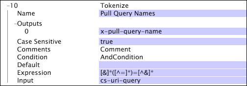

# Tokenize{#tokenize}

The Tokenize transformation iteratively applies a regular expression against the input string.

 However, unlike [!DNL RETransform], [!DNL Tokenize] does not have to match the entire string: the regular expression used for the [!DNL Tokenize] transformation can match a subset of the input. After a match is found, [!DNL Tokenize] applies the regular expression again, starting at the character after the end of the last match.

|  Parameter  | Description  | Default  |
|---|---|---|
|  Name  | Descriptive name of the transformation. You can enter any name here.  | |
|  Case Sensitive  | True or false. Specifies whether the match is case-sensitive.  | |
|  Comments  | Optional. Notes about the transformation.  | |
|  Condition  | The conditions under which this transformation is applied.  | |
|  Default  | The default value to use if the condition is met and the input value is either not available or the regular expression does not match the input value.  | |
|  Expression  | The regular expression used for matching.  | |
|  Outputs  | The names of the output strings. You can have multiple outputs for a given input string. The number of outputs must correspond to the number of capturing sub-patterns in the regular expression.  | |

In the following example, the [!DNL Tokenize] transformation uses a regular expression to capture the names of the query strings (in cs-uri-query) and output the captured sub-pattern (the query name) to x-pull-query-name.

For the query string "a=b&c=d," the output would be a vector containing "a" and "c."

For information about regular expressions, see [Regular Expressions](../../../../../home/c-dataset-const-proc/c-reg-exp.md#concept-070077baa419475094ef0469e92c5b9c). 
