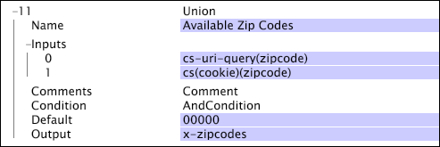

# Union{#union}

The Union transformation takes a set of inputs and creates a vector of strings as the output.

 If one of the inputs is itself a vector, each element in the input vector is associated with one element in the output vector (that is, the transformation does not create a vector of vectors).

|  Parameter  | Description  | Default  |
|---|---|---|
|  Name  | Descriptive name of the transformation. You can enter any name here.  | |
|  Comments  | Optional. Notes about the transformation.  | |
|  Condition  | The conditions under which this transformation is applied.  | |
|  Default  | The default value to use if the condition is met and the input value is not available.  | |
|  Inputs  | One or more input values.  | |
|  Output  | The name of the output field.  | |

This example uses fields of data from website traffic to create a list of the zip codes associated with the website's visitors (that is, within each log entry). The data provides two possible sources for this information: one in cs-uri-query and the other in a [!DNL zipcode] field of the cookie. If neither of these fields contains a zip code, the default value of 00000 is used.

While it is possible for both of these values to be available in a single log entry, you can select which value to use when you create a dimension based on the transformation's output. In a typical use case, you would create a simple dimension that takes either the first or the last of the encountered values. For information about creating simple dimensions, see [Extended Dimensions](../../../../../home/c-dataset-const-proc/c-ex-dim/c-abt-ex-dim.md). 
