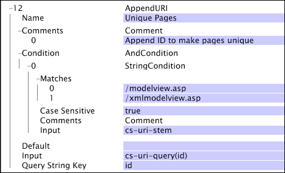

# AppendURI{#appenduri}

The AppendURI transformation provides a way to add information to the default value that comes from the log entries used to build the dataset.

 The transformation places a name-value pair at the end of the internal field used to create the URI dimension. The name-value pair is built using the Query String Key parameter as the name and the value of the identified Input parameter as the value of the pair. The [!DNL AppendURI] command adds any appropriate ? and & symbols necessary to separate the name-value pairs from the [!DNL URI] stem and from any previous [!DNL AppendURI] operations that may have been applied to the URI.

The [!DNL AppendURI] transformation works only when defined in the [!DNL Transformation.cfg] file or a [!DNL Transformation Dataset Include] file.

|  Parameter  | Description  | Default  |
|---|---|---|
|  Name  | Descriptive name of the transformation. You can enter any name here.  |  |
|  Comments  | Optional. Notes about the transformation.  |  |
|  Condition  | The conditions under which this transformation is applied.  |  |
|  Default  | The default value to use if the condition is met and the input value is not available.  |  |
|  Input  | The name of the field whose value is appended to the URI.  |  |
|  Query String Key  | The name to use in the creation of the name-value pair being appended.  |  |

Consider a website that was constructed using a traditional Model-View-Controller approach. In such systems, it is common to have a single web page be the point of access into the system. For such a site, visualizations of traffic patterns in the system would be very uninteresting and would provide no insights into visitor utilization and traffic flow. For example, consider a website that funnels all web requests through a URI of the following form:

* [!DNL https://www.examplesite.com/modelview.asp?id=login&name=bob]

The modelview ASP page receives all traffic and determines its actions based on the value of the id field in the query. By default, the URI dimension would contain a single entry:

* [!DNL modelview.asp]

This would result in a rather uninteresting mapping of the traffic through the site, as all traffic is being funneled through a single URI. To address this particular scenario and provide a more informative view into the underlying architecture of the website, [!DNL AppendURI] can be used to move some of the unique name-value pairs from the cs-uri-query field to the URI dimension used for visualizations. The transformation shown below gives the details of such a transformation:

In this example, there are two pages used by the system to handle all requests: [!DNL modelview.asp] and [!DNL xmlmodelview.asp]. One page is used for browser traffic, and the other is used for system-to-system XML communications. The application server process uses the id name of the cs-uri-query to determine which action to take. Therefore, you can extract the value from the id field and append it to the URI. The result is a collection of URIs with a range of variation that reflects visitor traffic through the website. Here, a [!DNL String Match] condition determines the log entries to which the transformation is applied by searching the cs-uri-stem field for the two web pages of interest and ignoring all others. The input (the value of our name-value pair) is the result of cs-uri-query(id), which is "login." As specified by the Query String Key parameter, the name being appended is "id." Thus, for the incoming cs-uri value of our example, the resulting URI used by the [!DNL URI] dimension is [!DNL /modelview.asp&id=login].
