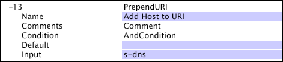

# PrependURI{#prependuri}

Similar to the AppendURI transformation, the PrependURI transformation affects the internal field used by the data workbench server to construct the URI dimension.

 The [!DNL PrependURI] transformation works by adding the value in the identified input field to the front of the value currently in the URI.

|  Parameter  | Description  | Default  |
|---|---|---|
|  Name  | Descriptive name of the transformation. You can enter any name here.  |  |
|  Comments  | Optional. Notes about the transformation.  |  |
|  Condition  | The conditions under which this transformation is applied.  |  |
|  Default  | The default value to use if the condition is met and the input value is not available.  |  |
|  Input  | The name of the field whose value is prepended to the URI.  |  |

The following example simply prepends the s-dns field onto the URI, extending the representation of the URI dimension to include the domain requested by the client device.

In this example, prepending the s-dns field to the URI

* [!DNL /modelview.asp&id=login]

results in the following URL:

* [!DNL www.adobe.com/modelview.asp?id=login]

Now the URI is extended to include the domain requested.
