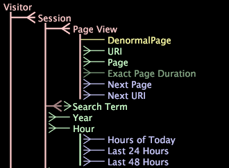

# Dataset Schema{#dataset-schema}

The Dataset Schema interface displays the extended dimensions (countable, simple, many-to-many, numeric, denormal, and time dimensions) defined in any Transformation Dataset Configuration file and the relationships between those dimensions.

 In addition, the [!DNL Dataset Schema] interface shows any derived dimensions that you have defined, as well as any extended dimensions that are configured to be hidden.

This section discusses the following topics:

* [To interpret dimension type using the Dataset Schema interface](../../../../home/c-dataset-const-proc/c-dataset-config-tools/c-dataset-config-int/c-dataset-schema.md#section-16a0a12b11334c07bec558c0b7d260b1) 
* [To display the default visualization for a dimension](../../../../home/c-dataset-const-proc/c-dataset-config-tools/c-dataset-config-int/c-dataset-schema.md#section-1bbb73a5cbb34ffb844eb1932db85318) 
* [To display a specific visualization for a dimension](../../../../home/c-dataset-const-proc/c-dataset-config-tools/c-dataset-config-int/c-dataset-schema.md#section-d46626df90bc4c44ae60c4b71eaeac7f)

## To Interpret Dimension Type Using the Dataset Schema Interface {#section-16a0a12b11334c07bec558c0b7d260b1}

The following table lists the dimension types and the colors in which their names appear in the [!DNL Dataset Schema] interface. Parents for the sample dimensions (from the example above) are noted as well.

<table id="table_20D1A9EAAED247338476C475C63255F5"> 
 <desc> 
  <b>  Dataset Schema Interface </b> 
 </desc> 
 <thead> 
  <tr valign="top"> 
   <th colname="col1" class="entry"> Dimension Type </th> 
   <th colname="col2" class="entry"> Color </th> 
   <th colname="col3" class="entry"> Sample Dimension and Parent </th> 
  </tr> 
 </thead>
 <tbody> 
  <tr valign="top"> 
   <td colname="col1"> Countable </td> 
   <td colname="col2"> Pink </td> 
   <td colname="col3"> 
Visitor - In this schema, Visitor is a root countable dimension. 
 
 Session - parent is Visitor. 
 </td> 
  </tr> 
  <tr valign="top"> 
   <td colname="col1"> Denormal </td> 
   <td colname="col2"> Yellow </td> 
   <td colname="col3"> DenormalPage - parent is Page View. </td> 
  </tr> 
  <tr valign="top"> 
   <td colname="col1"> Derived </td> 
   <td colname="col2"> Blue </td> 
   <td colname="col3"> Next Page - parent is Page View. </td> 
  </tr> 
  <tr valign="top"> 
   <td colname="col1"> Many-to-Many </td> 
   <td colname="col2"> Pink and Green (The stem from the parent is pink, while the dimension name is green.) </td> 
   <td colname="col3"> Search Term - parent is Session. </td> 
  </tr> 
  <tr valign="top"> 
   <td colname="col1"> Numeric </td> 
   <td colname="col2"> Green </td> 
   <td colname="col3"> Exact Page Duration - parent is Page View In this example, Exact Page Duration is a hidden numeric dimension. See the Hidden dimension type in this table. </td> 
  </tr> 
  <tr valign="top"> 
   <td colname="col1"> Simple </td> 
   <td colname="col2"> Green </td> 
   <td colname="col3"> Page - parent is Page View . </td> 
  </tr> 
  <tr valign="top"> 
   <td colname="col1"> Time </td> 
   <td colname="col2"> Green </td> 
   <td colname="col3"> Hour - parent is Session. </td> 
  </tr> 
  <tr valign="top"> 
   <td colname="col1"> Hidden </td> 
   <td colname="col2"> Hidden dimensions are a darker version of the appropriate dimension type color. For example, a hidden numeric dimension is a darker, less bright green. </td> 
   <td colname="col3"> Exact Page Duration - parent is Page View. </td> 
  </tr> 
 </tbody> 
</table>

## To Display the Default Visualization for a Dimension {#section-1bbb73a5cbb34ffb844eb1932db85318}

* In the [!DNL Dataset Schema] interface, click the desired dimension. The default visualization displays. For example, if the default visualization is a table displaying Sessions and the selected dimension, and you click the URI dimension, data workbench displays a table with URI by Sessions.

>[!NOTE]
>
>If you want to change the default visualization that displays, see the Configuring Interface and Analysis Features chapter in the *Data Workbench User Guide*.

## To Display a Specific Visualization for a Dimension {#section-d46626df90bc4c44ae60c4b71eaeac7f}

* In the [!DNL Dataset Schema] interface, right-click the desired dimension and click **[!UICONTROL Add Visualization]** > *< **[!UICONTROL visualization type]**>*.

