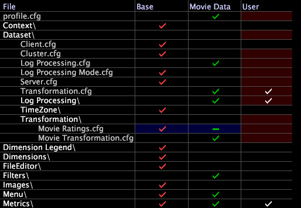

# Hiding Dataset Configuration Files{#hiding-dataset-configuration-files}

If you do not want to inherit a configuration file from an internal or other inherited profile (that is, you want the instructions in the file to be ignored during dataset construction), but you do not want to modify the file, you can create an empty (zero-byte) file with the same name and store the file in another profile.

**To zero-byte a dataset configuration file** 

1. In the [!DNL Profile Manager], open the necessary folders and subfolders to locate the file that you want to zero-byte.
1. Right-click the check mark next to the name of the file and click **[!UICONTROL Make Local]**.
1. Open the local file in a text editor such as Notepad and delete its contents.
1. Save and close the file.
1. In the [!DNL Profile Manager], save the zero-byte file to a profile to the right of the profile in which the original file resides. (You want the zero-byte file to take precedence over the original file.)

   In the [!DNL Profile Manager], a hyphen (-), instead of a check mark, in a column identifies the zero-byte file as shown in the example below.

   

When you reprocess your dataset, the dataset does not contain the dataset components that the original file defines.

>[!NOTE]
>
>If you zero-byte a configuration file that defines an extended dimension that is used in a visualization or a metric definition, data workbench produces an error for that visualization or metric, respectively.

You can also use zero-byte files to move a metric, dimension, or filter to another location in the profile or to hide menu items. For information, see the *Data Workbench User Guide*. 
