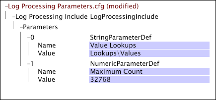

# String and Numeric Parameters{#string-and-numeric-parameters}

String and numeric parameters take as their values strings and numbers, respectively.

You can use them interchangeably, but numeric parameters must be defined to have a numerical value. You can reference string and numeric parameters when defining transformations, conditions, and extended dimensions, and you can reference more than one parameter in the same line.

You cannot reference string and numeric parameters in [!DNL Input] or [!DNL Output] fields, but you can use a string parameter to define a constant input field. In addition, you cannot reference string and numeric parameters in decoders or decoder groups.

This example shows a [!DNL Log Processing Dataset Include] file that defines a string parameter and a numeric parameter. Note that the string parameter, named "Value Lookups," defines a file location (Lookups\Values) relative to the data workbench server installation directory.

