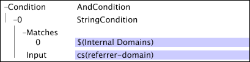

# Vector Parameters{#vector-parameters}

Vector parameters contain multiple values for a single variable.

 You can reference vector parameters only as the sole item of a vector. This example shows a [!DNL Transformation Dataset Include] file that defines a vector parameter. The vector parameter, "Internal Domains," consists of three values.

Note that the vector parameter is the only item listed for the [!DNL Matches] vector in the [!DNL String Match] condition.

For more information about internal domains, see [Configuration Settings for Web Data](../../../../home/c-dataset-const-proc/c-config-web-data/c-config-web-data.md#concept-9a306b65483a484bb3f6f3c1d7e77519). For information about the [!DNL String Match] condition, see [Conditions](../../../../home/c-dataset-const-proc/c-conditions/c-conditions.md#concept-9a576a00d5db48e7a599016c441e39e0). 
