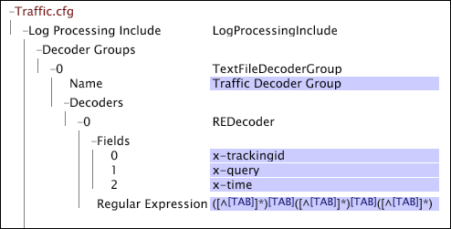
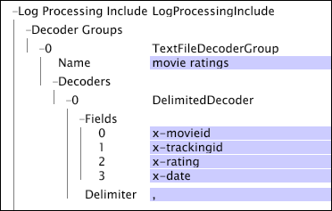

# Text File Decoder Groups{#text-file-decoder-groups}

The processing of log files as log sources requires the definition of a decoder within the Log Processing Dataset Include file to extract fields of data from the log entries.

Defining text file decoder groups for log file log sources requires knowledge of the log file's structure and contents, the data to be extracted, and the fields in which that data is stored. This section provides basic descriptions of the parameters that you can specify for decoders, but the manner in which you use any decoder depends on the log file that contains your source data.

For information about format requirements for log file log sources, see [Log Files](../../../../../home/c-dataset-const-proc/c-log-proc-config-file/c-log-sources.md#concept-3d4fb817c057447d90f166b1183b461e). For assistance with defining text file decoders, contact Adobe.

A text file decoder group can include:

* [Regular Expression Decoders](../../../../../home/c-dataset-const-proc/c-dataset-inc-files/c-types-dataset-inc-files/c-log-proc-dataset-inc-files/c-text-file-dec-groups.md#section-67aca2c1f008404da7f845a64abec97c) 
* [Delimited Decoders](../../../../../home/c-dataset-const-proc/c-dataset-inc-files/c-types-dataset-inc-files/c-log-proc-dataset-inc-files/c-text-file-dec-groups.md#section-7e0a23decdbc4c75ae750a42446997a6)

## Regular Expression Decoders {#section-67aca2c1f008404da7f845a64abec97c}

A regular expression decoder identifies complex string patterns within the log entries in a log file and extracts these patterns as fields of data. For each decoder, the number of fields must equal the number of capturing sub-patterns in the regular expression. The portion of the line matching the nth capturing sub-pattern is assigned to the nth field for that line.

**To add a regular expression decoder to a text file decoder group**

1. Open the [!DNL Log Processing Dataset Include] file as described in [Editing Existing Dataset Include Files](../../../../../home/c-dataset-const-proc/c-dataset-inc-files/c-work-dataset-inc-files/t-edit-ex-dataset-inc-files.md#task-456c04e38ebc425fb35677a6bb6aa077) and add a text file decoder group. See the table entry [Decoder Groups](../../../../../home/c-dataset-const-proc/c-dataset-inc-files/c-types-dataset-inc-files/c-log-proc-dataset-inc-files/c-log-proc-dataset-inc-files.md#concept-999475a22519432e98844622ca95b6ab). 

1. Right click **[!UICONTROL Decoders]** under the newly created decoder group, then click **[!UICONTROL Add new]** > **[!UICONTROL Regular Expression]**. 

1. Specify the following information:

    * **Fields:** List of the fields in the log file. If any of the fields defined here are to be passed to the transformation phase of dataset construction, those fields must be listed in the Fields parameter of one of the [!DNL Log Processing Dataset Include] files for the dataset. Custom field names must begin with "x-". 
    
    * **Name:** Optional identifier for the decoder. 
    * **Regular Expression:** Used to extract the desired fields from each line in the file.

1. Repeat steps 4 and 5 for any other decoders that you want to add to the group. 
1. To save the [!DNL Log Processing Dataset Include] file, right-click **[!UICONTROL (modified)]** at the top of the window and click **[!UICONTROL Save]**. 

1. To make the locally made changes take effect, in the [!DNL Profile Manager], right-click the check mark for the file in the [!DNL User] column. Click **[!UICONTROL Save to]** > *< **[!UICONTROL profile name]**>*, where profile name is the name of the dataset profile or the inherited profile to which the dataset include file belongs.

Do not save the modified configuration file to any of the internal profiles provided by Adobe, as your changes are overwritten when you install updates to these profiles.

>[!NOTE]
>
>A given log file can have multiple regular expression decoders. The order in which you define the decoders is important: the first decoder to match a line in the log file is the one used to decode that line.

This example illustrates the use of a regular expression decoder to extract fields of data from a tab-delimited text file. You can achieve the same result by defining a delimited decoder with a tab delimiter.

For more information about regular expression decoders, including terminology and syntax, see [Regular Expressions](../../../../../home/c-dataset-const-proc/c-reg-exp.md#concept-070077baa419475094ef0469e92c5b9c).

## Delimited Decoders {#section-7e0a23decdbc4c75ae750a42446997a6}

A delimited decoder decodes a log file whose fields are delimited by a single character. The number of fields must correspond to the number of columns in the delimited file; however, not all fields need to be named. If a field is left blank, the column is still required in the log file, but the decoder ignores it.

**To add a delimited decoder to a text file decoder group**

1. Open the [!DNL Log Processing Dataset Include] file as described in [Editing Existing Dataset Include Files](../../../../../home/c-dataset-const-proc/c-dataset-inc-files/c-work-dataset-inc-files/t-edit-ex-dataset-inc-files.md#task-456c04e38ebc425fb35677a6bb6aa077) and add a text file decoder group. See the table entry [Decoder Groups](../../../../../home/c-dataset-const-proc/c-dataset-inc-files/c-types-dataset-inc-files/c-log-proc-dataset-inc-files/c-log-proc-dataset-inc-files.md#concept-999475a22519432e98844622ca95b6ab). 

1. Right click **[!UICONTROL Decoders]** under the newly created decoder group, then click **[!UICONTROL Add new]** > **[!UICONTROL Delimited]**. 

1. Specify the following information:

    * **Fields:** List of the fields in the log file. If any of the fields defined here are to be passed to the transformation phase of dataset construction, those fields must be listed in the Fields parameter of one of the [!DNL Log Processing Dataset Include] files for the dataset. Custom field names must begin with "x-". 
    
    * **Delimiter:** Character that is used to separate fields in the output file.

1. Repeat steps 4 and 5 for any other decoders that you want to add to the group. 
1. To save the [!DNL Log Processing Dataset Include] file, right-click **[!UICONTROL (modified)]** at the top of the window and click **[!UICONTROL Save]**. 

1. To make the locally made changes take effect, in the [!DNL Profile Manager], right-click the check mark for the file in the [!DNL User] column, then click **[!UICONTROL Save to]** > *< **[!UICONTROL profile name]**>*, where profile name is the name of the dataset profile or the inherited profile to which the dataset include file belongs.

>[!NOTE]
>
>Do not save the modified configuration file to any of the internal profiles provided by Adobe, as your changes are overwritten when you install updates to these profiles.

This example illustrates the use of a delimited decoder to extract fields of data from a comma-delimited text file containing data about movies.

