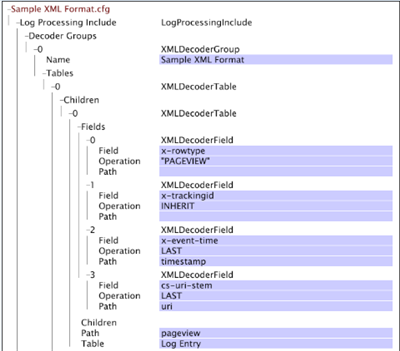
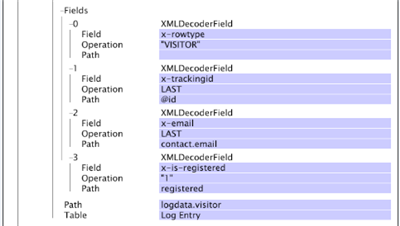

# XML Decoder Groups{#xml-decoder-groups}

The processing of XML files as log sources to define decoders for extracting data from the XML file.

>[!NOTE]
>
>Defining XML decoder groups for XML log sources requires knowledge of the XML file's structure and contents, the data to be extracted, and the fields in which that data is stored. This section provides basic descriptions of the parameters that you can specify for decoders. The manner in which you use any decoder depends on the XML file that contains your source data.

For information about format requirements for XML log sources, see [Log Sources](../../../../../home/c-dataset-const-proc/c-log-proc-config-file/c-log-sources.md#concept-6714c720fac044cbb9af003bf401b2ea). For assistance with defining XML decoders, contact Adobe.

The top level of an XML decoder is a decoder group (XMLDecoderGroup), which is a set of decoder tables that you use to extract data from an XML file of a particular format. If you have XML files of different formats, then you must define a decoder group for each format. Each decoder group consists of one or more decoder tables.

The following table describes the Tables parameter and all of the sub-parameters that you must specify to define an XML decoder group.

<table id="table_06C40C5149E94548A1B0C2ED4397624B"> 
 <thead> 
  <tr> 
   <th colname="col1" class="entry"> Parameter </th> 
   <th colname="col2" class="entry"> Description </th> 
  </tr> 
 </thead>
 <tbody> 
  <tr> 
   <td colname="col1"> Tables </td> 
   <td colname="col2"> <p>Each table in a decoder group represents one level of data to be extracted from the XML file. For example, if you want to extract data about visitors, then you would create a decoder table that consists of the information you want to extract for each visitor. You also can create decoder tables within decoder tables (see Children). </p> <p> <b>To add a table to a decoder group</b> 
     <ul id="ul_C73CAD77440B4465B9FCE08BF4FA0749"> 
      <li id="li_C4B8CC5A85D942898F1EB76778105818"> Right-click <span class="uicontrol"> Tables </span> and click <span class="uicontrol"> Add new </span> &gt; <span class="uicontrol"> XMLDecoderTable </span>. </li> 
     </ul> </p> </td> 
  </tr> 
  <tr> 
   <td colname="col1"> Fields </td> 
   <td colname="col2"> <p>The extended fields (for example, x-trackingid, x-email) in which the data is stored. The data to be stored in the field is determined by the Path and/or Operation subfields. </p> <p> The Path is the field's level within the structured XML file. A field's path is relative to the path of the table in which it is defined. Examples include <span class="filepath"> tag.tag.tag </span> or <span class="filepath"> tag.tag.tag.@attribute </span>. Note that paths are case-sensitive. </p> <p> An Operation is applied to each line in the specified path to produce an output. The following operations are available: 
     <ul id="ul_B264A411D7E3446288E7E69D62150B8B"> 
      <li id="li_5936E81C0EEF46AFB780E451A04A88E4"><b>LAST:</b> The field takes the value of the path's last occurrence in the XML file. </li> 
      <li id="li_7BC4F24F2CA84C2EB64B06FE09B4CAF6"><b>RANDOM:</b> Assigns a random value to the field. This operation is useful if you need to generate a unique id, such as for the x-trackingid field. </li> 
      <li id="li_C1D34EA11BFB4859A25A275A9B63FB56"><b>INHERIT:</b> The defined field inherits its value from the parent table's corresponding field. </li> 
      <li id="li_F62FB8CD962E4E1495D9A2D5B7A78E2A"><b>"<i>constant </i>":</b> The constant must be enclosed in quotation marks. You can use a constant operation to check for the existence of a particular path; if the path exists, then the field is assigned the constant's value. </li> 
     </ul> </p> <p> <b>To add a field to a decoder table</b> </p> <p> 
     <ul id="ul_91D104D927424DEA9E788E43B2F6FEA9"> 
      <li id="li_5448B01EE82349569BBFC99C9604D7B8"> Right-click <span class="uicontrol"> Fields </span>, then click <span class="uicontrol"> Add new </span> &gt; <span class="uicontrol"> XMLDecoderField </span>. Define Field, Operation and Path as appropriate. </li> 
     </ul> </p> </td> 
  </tr> 
  <tr> 
   <td colname="col1"> Path </td> 
   <td colname="col2"> <p>The level within the structured XML file for which the decoder table contains information. For a child XML decoder table, the path is relative to the parent table's path. Note that paths are case-sensitive. </p> <p> For example, if your XML file contains the structure: </p> <code> &lt;logdata&gt; 
      
     &lt;visitor&gt; 
      
     &nbsp; 
      
     ... 
      
     &nbsp; 
      
     &lt;/visitor&gt; 
      
     &lt;/logdata&gt;&nbsp; </code> <p> then the path would be <span class="filepath"> logdata.visitor </span>. </p> </td> 
  </tr> 
  <tr> 
   <td colname="col1"> Table </td> 
   <td colname="col2"> <p>The value of this parameter should always be "Log Entry." </p> <p> <p>Note:  Do not change this value without consulting Adobe. </p> </p> </td> 
  </tr> 
  <tr> 
   <td colname="col1"> Children </td> 
   <td colname="col2"> <p>Optional. One or more embedded decoder tables. Each child includes the Fields, Path, and Table parameters described above. </p> <p> <b>To add a child to a decoder table</b> </p> <p> 
     <ul id="ul_902AC6CA5D66457D84CBA3194FF49BBE"> 
      <li id="li_07B4D60E7E2E4630B4878691E575936A"> Right-click <span class="uicontrol"> Children </span> and click <span class="uicontrol"> Add new </span> &gt; <span class="uicontrol"> XMLDecoderTable </span>. Define Field, Operation and Path as appropriate. </li> 
     </ul> </p> </td> 
  </tr> 
 </tbody> 
</table>

To use an XML file as a log source for a dataset, XML decoder groups and tables must be defined to extract the information that is to be processed into the dataset. In this example, you can see how to define decoder groups and tables for a sample XML log source for a web dataset.

The following XML file contains information about a website visitor, including a Experience Cloud ID, email address, physical address, and information about the visitor's page views.


Since we have a single XML file, we need only one decoder group, which we name "Sample XML Format." This decoder group applies to any other XML files of the same format as this file. To begin constructing XML decoder tables within this decoder group, we must first determine what information we want to extract and the fields in which the data will be stored.

In this example, we extract information about the visitor and the page views associated with that visitor. To do this, we create a top-level (parent) XML decoder table with information about the visitor and an embedded (child) XML decoder table with information about that visitor's page views.

**Information for the parent (visitor) table is as follows**

* A data type identifier for each row of data in the XML file. We use VISITOR as our identifier so that we can quickly identify rows of data pertaining to the visitor and not to the page views. We can store this value in the x-rowtype field. 
* The visitor's ID, which we store in the x-trackingid field. 
* The visitor's email address (contact.email), which we store in the x-email field. 
* The visitor's registration status. If the visitor is a registered user, then we can store the value "1" in the x-is-registered field. 
* The Path value is [!DNL logdata.visitor], and the Table value is [!DNL Log Entry]. For information about these parameters, see the XMLDecoderGroup table above.

**Information for the child (page views) table is as follows:**

* A data type identifier for each row of data in the XML file. We use "PAGEVIEW" as our identifier so that we can quickly identify rows of data pertaining to the visitor's page views and not to the visitor only. We store this value in the x-rowtype field. 
* The visitor's ID. This value is inherited from the parent table and is stored in the x-trackingid field. 
* The timestamp of each page view, which is stored in the x-event-time field. 
* The URI of each page view, which is stored in the cs-uri-stem field. 
* The Path value is pageview, and the Table value is "Log Entry." For information about these parameters, see the XMLDecoderGroup table above.

The following screen capture shows a portion of [!DNL Log Processing Dataset Include] file with the resulting XML decoder group for the sample XML file based on the discussed structure of the parent and child XML decoder tables.





A table showing the output of this decoder for our sample XML file looks something like the following:

|  x-rowtype  | cs--uri-stem  | x-email  | x-is-registered  | x-event-time  | x-tracking-id  |
|---|---|---|---|---|---|
|  VISITOR  |  | foo@bar.com  | 1  |  | 1  |
|  PAGEVIEW  | /index.html  |  |  | 2006-01-01 08:00:00  | 1  |
|  PAGEVIEW  | /  |  |  | 2006-01-01 08:00:30  | 1  |

You can create a table like the one above in data workbench by using a field viewer interface. For information about the field viewer interface, see [Dataset Configuration Tools](../../../../../home/c-dataset-const-proc/c-dataset-config-tools/c-dataset-config-tools.md#concept-6e058b7691834cf79dcfd1573f78d4f5).

## Using #value on XML element to read its attribute value {#section-88758428afb94f0baa5a986604d53bc1}

You can now use the **[!DNL #value]** tag in XML paths to pull the value of an XML element.

For example, previously specifying a path of **`<Hit><Page name="Home Page" index="20">home.html</Page></Hit>`** left you unable to read the value of the `<Page>` tag. To read the value of a `<Page>` tag and its attributes, you can use [!DNL Hit.Page.@name] and [!DNL Hit.Page.@index] respectively. You can also pull the value of the tag using **`Hit.Page.#value`** expression.

For example, you can read the value of tag `<varValue>` by adding following field in decoder:

```
7 = XMLDecoderField: 
Field = string: x-varvalue-name-added 
Operation = string: LAST 
Path = string:  
<b>#value</b> 
Path = string: varValue 
Table = string: Log Entry
```

Similarly, you can read the value of tag `<Rep>` by adding following field in decoder:

```
7 = XMLDecoderField: 
Field = string: x-rep-name-added 
Operation = string: LAST 
Path = string: Rep.# 
<b>value</b> 
Path = string: Reps 
Table = string: Log Entry
```

In contrast, to read the value of element tag with no attribute, a `<text>` tag under a `<line>` tag and its value can be read directly by giving " [!DNL text]" in a path or using [!DNL line.text], depending on how you have built the decoder.

```
2 = XMLDecoderField: 
Field = string: x-chat-text 
Operation = string: LAST 
Path = string:  
<b>text</b> 
Path = string:  
<b>line</b> 
Table = string: Log Entry
```

