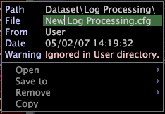

# Creating New Dataset Include Files{#creating-new-dataset-include-files}

Steps to create a new dataset include file.

You should create a new dataset include file to perform any of the following dataset configuration tasks:

* Specifying new fields of data to be passed from log processing to transformation. 
* Defining transformations that do either of the following:

    * Update existing log fields. 
    * Produce new fields that are to be passed from log processing to transformation or that are used to define extended dimensions.

      For information about the available transformation types, see [Data Transformations](../../../../home/c-dataset-const-proc/c-data-trans/c-data-trans.md#concept-99c6f5e6e5194adb9e98afdc0e91cf38).

      >[!NOTE]
      >
      >If you are defining transformations in a new dataset include file, be sure to keep the order of the inputs and outputs in mind. For information about the ordering of transformations, see [Conventions for Constructing Transformations](../../../../home/c-dataset-const-proc/c-data-trans/c-con-transf.md#concept-01998eebb7e347c58255fb442f2613b6).

* Creating extended dimensions. For information about the available dimension types, see [Extended Dimensions](../../../../home/c-dataset-const-proc/c-ex-dim/c-ex-dim.md#concept-79b9e2b3f5794833b8b73b003f06ddca).

1. While working in your dataset profile, open the [!DNL Profile Manager] and click **[!UICONTROL Dataset]** to view the existing dataset include files.

    * To view the [!DNL Log Processing Dataset Include] files, click **[!UICONTROL Log Processing]**. 
    
    * To view the [!DNL Transformation Dataset Include] files, click **[!UICONTROL Transformation]**.

1. Create a new [!DNL Log Processing] or [!DNL Transformation Dataset Include] files by performing one of the following steps:

    * In the [!DNL User] column for the Log Processing directory, click **[!UICONTROL Create]** > **[!UICONTROL New Log Processing]**. A file named [!DNL New Log Processing.cfg] appears in the directory. 
    
    * In the [!DNL User] column for the Transformation directory, click **[!UICONTROL Create]** > **[!UICONTROL New Transformation]**. A file named [!DNL New Transformation.cfg] appears in the directory.

1. Rename the new file by right-clicking its check mark in the [!DNL User] column and typing the new name in the File parameter.

   

1. Right-click the check mark for the renamed file and click **[!UICONTROL Open]** > **[!UICONTROL from the workbench]**. The configuration window appears.
1. Edit the parameters in the configuration file as appropriate. See [Log Processing Dataset Include Files](../../../../home/c-dataset-const-proc/c-dataset-inc-files/c-types-dataset-inc-files/c-log-proc-dataset-inc-files/c-log-proc-dataset-inc-files.md#concept-999475a22519432e98844622ca95b6ab) or [Transformation Dataset Include Files](../../../../home/c-dataset-const-proc/c-dataset-inc-files/c-types-dataset-inc-files/c-trans-dataset-inc-files.md#concept-c64aa78ed9ce40b8a0f4932c82ff5ace) for descriptions of the available parameters.
1. To save your changes, right-click **[!UICONTROL (modified)]** at the top of the window and click **[!UICONTROL Save]**.
1. To make the locally made changes take effect, in the [!DNL Profile Manager], right-click the check mark for the file in the [!DNL User] column, then click **[!UICONTROL Save to]** > *< **[!UICONTROL profile name]**>*, where profile name is the name of the dataset profile or the inherited profile to which the dataset include file belongs. Reprocessing or retransformation of the data begins after synchronization of the dataset profile.

   >[!NOTE]
   >
   >Do not save the modified configuration file to any of the internal profiles provided by Adobe, as your changes are overwritten when you install updates to these profiles.

To edit a dataset include file that you created, see [Editing Existing Dataset Include Files](../../../../home/c-dataset-const-proc/c-dataset-inc-files/c-work-dataset-inc-files/t-edit-ex-dataset-inc-files.md#task-456c04e38ebc425fb35677a6bb6aa077). 
