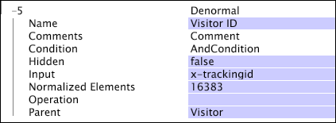

# Denormal Dimensions{#denormal-dimensions}

A denormal dimension has a one-to-one relationship with its parent countable dimension.

 You would define a denormal dimension whenever the desired dimension contains a unique element for each element of its parent. For example, [!DNL EMail Address] is a denormal dimension with a parent of Visitor. Each Visitor has an email address, and each element in the EMail Address dimension is the email address of a single visitor. Even if two visitors have the same email address, the addresses are distinct elements of the EMail Address dimension.

You can use denormal dimensions in any table visualization, in detail tables, or to create filters. In addition, you can use denormal dimensions with the data workbench server's segment export functionality to export values of fields (such as [!DNL Tracking ID] or [!DNL EMail Address]) that have lots of values. Because any segment data that you want to export must be defined as a dimension within the profile, you must create a denormal dimension that stores the raw strings of the field's data.

>[!NOTE]
>
>When using a denormal dimension in a table or other visualization that expects a normal dimension, a derived denormal dimension is created automatically. The derived denormal dimension has a one-to-many relationship with the parent dimension.

For information about the detail table visualization and filters, see the Analysis Visualizations chapter in the *Data Workbench User Guide*. For information about segment export, see the Configuring Interface and Analysis Features chapter in the *Data Workbench User Guide*.

>[!NOTE]
>
>Denormal dimensions can be very expensive in query time and disk space. A denormal dimension with parent [!DNL Page View]and a 50-byte average input string could add 25 GB of data to the buffers in a typical, large dataset, equivalent to about 13 simple or numeric page view dimensions, or about 125 session level dimensions. Never add a denormal dimension to a dataset without a careful evaluation of the performance impact.

Denormal dimensions are defined by the following parameters:

<table id="table_532AD791E39B4CF296FFA1C33FB8302E"> 
 <thead> 
  <tr valign="top"> 
   <th colname="col1" class="entry"> Parameter </th> 
   <th colname="col2" class="entry"> Description </th> 
   <th colname="col3" class="entry"> Default </th> 
  </tr> 
 </thead>
 <tbody> 
  <tr valign="top"> 
   <td colname="col1"> Name </td> 
   <td colname="col2"> Descriptive name of the dimension as it appears in data workbench. The dimension name cannot include a hyphen (-). </td> 
   <td colname="col3"> </td> 
  </tr> 
  <tr valign="top"> 
   <td colname="col1"> Comments </td> 
   <td colname="col2"> Optional. Notes about the extended dimension. </td> 
   <td colname="col3"> </td> 
  </tr> 
  <tr valign="top"> 
   <td colname="col1"> Condition </td> 
   <td colname="col2"> The conditions under which the relationship between the Parent and the input field's value should be created. </td> 
   <td colname="col3"> </td> 
  </tr> 
  <tr valign="top"> 
   <td colname="col1"> Hidden </td> 
   <td colname="col2"> Determines whether the dimension appears in the data workbench interface. By default, this parameter is set to false. If, for example, the dimension is to be used only as the basis of a metric, you can set this parameter to true to hide the dimension from the data workbench display. </td> 
   <td colname="col3"> true </td> 
  </tr> 
  <tr valign="top"> 
   <td colname="col1"> Input </td> 
   <td colname="col2"> The value that is related to the parent dimension (Parent). </td> 
   <td colname="col3"> </td> 
  </tr> 
  <tr valign="top"> 
   <td colname="col1"> Normalized Elements </td> 
   <td colname="col2"> A performance tuning parameter that specifies the number of dimension elements whose names are to be stored in system memory. Setting this parameter to a higher value causes a denormal dimension to use more RAM but results in faster queries. The default value is 16383. </td> 
   <td colname="col3"> </td> 
  </tr> 
  <tr valign="top"> 
   <td colname="col1"> Operation </td> 
   <td colname="col2"> 
Available operations are as follows: 
 
 
     <ul id="ul_CCDC45838A3941BD949B6D21EA0492B3"> 
      <li id="li_F33898192A82437692B5C15684EFCF64"> FIRST NONBLANK: The first non-blank input value is used, regardless of whether it comes from the first log entry. If  Input is a vector field, the first row in the vector for the relevant log entry is used. </li> 
      <li id="li_4ADD0A368BB74B64AD29126C8E7B333F"> FIRST ROW: The value for the first log entry related to the parent dimension element is used, even if the input is blank. If  Input is a vector field, the first row in the vector for the relevant log entry is used. If this value is blank or not a number, or if the relevant log entry does not meet the dimension's Condition, no value is used. </li> 
      <li id="li_C93CA22ADA634F21A6488BB3BEE7CB23"> LAST NONBLANK: The last non-blank input value is used, regardless of whether it comes from the last log entry. If  Input is a vector field, the first row in the vector for the relevant log entry is used. </li> 
      <li id="li_2FFE585521B14FE5ABBF66AAC47F22C4"> LAST ROW: The value for the last log entry related to the parent dimension element is used, even if the input is blank. If  Input is a vector field, the first row in the vector for the relevant log entry is used. If this value is blank or not a number, or if the relevant log entry does not meet the dimension's Condition, no value is used. </li> 
     </ul> 
 
 
Note:  If Operation yields no value, a blank value ("") is used. 
 
 
 You should specify an operation to ensure that the dimension is defined as intended. 
 </td> 
   <td colname="col3"> </td> 
  </tr> 
  <tr valign="top"> 
   <td colname="col1"> Parent </td> 
   <td colname="col2"> The name of the parent dimension. Any countable dimension can be a parent dimension. </td> 
   <td colname="col3"> </td> 
  </tr> 
 </tbody> 
</table>

The denormal dimension shown in this example takes all of the data in the field x-trackingid as input and includes it in a dimension named Visitor ID. For a segment of visitors that you have created, you can export the data in the Visitor ID dimension (as well as any other defined dimension).

