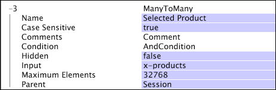

# Many-to-Many Dimensions{#many-to-many-dimensions}

A many-to-many dimension has a many-to-many relationship with its parent countable dimension.

You can think of a many-to-many dimension as a representation of a set of values for each element in its parent dimension. For example, the many-to-many dimension Search Phrase is a Session-level dimension (it has a parent of Session). It represents the set of search phrases associated with each session in the Session dimension. A single search phrase can be used in any number of sessions, and a single session can include zero or more search phrases. Therefore, the Search Phrase dimension has a many-to-many relationship with the Session dimension.

Many-to-many dimensions are defined by the following parameters:

<table id="table_A6D495008DFF4DD28A3ECD718D775E54"> 
 <thead> 
  <tr> 
   <th colname="col1" class="entry"> Parameter </th> 
   <th colname="col2" class="entry"> Description </th> 
   <th colname="col3" class="entry"> Default </th> 
  </tr> 
 </thead>
 <tbody> 
  <tr> 
   <td colname="col1"> Name </td> 
   <td colname="col2"> Descriptive name of the dimension as it appears to the user in data workbench. The dimension name cannot include a hyphen (-). </td> 
   <td colname="col3"> </td> 
  </tr> 
  <tr> 
   <td colname="col1"> Comments </td> 
   <td colname="col2"> Optional. Notes about the extended dimension. </td> 
   <td colname="col3"> </td> 
  </tr> 
  <tr> 
   <td colname="col1"> Condition </td> 
   <td colname="col2"> The conditions under which the relationship between the parent and the input field's value should be created. </td> 
   <td colname="col3"> </td> 
  </tr> 
  <tr> 
   <td colname="col1"> Hidden </td> 
   <td colname="col2"> Determines whether the dimension appears in the data workbench interface. By default, this parameter is set to false. If, for example, the dimension is to be used only as the basis of a metric, you can set this parameter to true to hide the dimension from the data workbench display. </td> 
   <td colname="col3"> false </td> 
  </tr> 
  <tr> 
   <td colname="col1"> Input </td> 
   <td colname="col2"> 
The value that is related to the parent dimension (Parent). If this field is a vector of strings, then each element of the vector has its own relationship with the parent. 
 
 
Note:  If the input value for every log entry for an element of the parent dimension is empty, no element of the many-to-many dimension will relate to that element of the parent dimension. 
 
 </td> 
   <td colname="col3"> </td> 
  </tr> 
  <tr> 
   <td colname="col1"> Parent </td> 
   <td colname="col2"> The name of the parent dimension. Any countable dimension can be a parent dimension. </td> 
   <td colname="col3"> </td> 
  </tr> 
 </tbody> 
</table>

This example illustrates the definition of a many-to-many dimension using event data collected from website traffic. This many-to-many dimension, named "Selected Product," relates sessions to the products purchased by the visitor during that session. The x-products field contains a vector of values, each of which is associated with a page view, which, in turn, is associated with a session.

By creating such a transformation, you can create a visualization in data workbench that depicts the relationship between the selected product dimension and the number of sessions that involve each of the products. 
