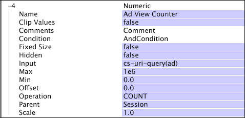

# Numeric Dimensions{#numeric-dimensions}

A numeric dimension consists of ordered, numerical elements and has a one-to-many relationship with its parent countable dimension.

 You can think of a numeric dimension as a representation of the numeric properties of the parent dimension's elements. For example, if you are working with web data, you could define the numeric dimension Session Revenue, which defines an amount of revenue, in dollars, for each session in the Session dimension. Each session has a single amount of associated revenue, but several sessions can have the same amount of associated revenue. Therefore, the Session Revenue dimension has a one-to-many relationship with the Session dimension.

Numeric dimensions are often used to define metrics that sum values, count occurrences of a condition, or locate a minimum or maximum value. For example, a metric named "Revenue" might be defined using the Session Revenue dimension: sum(Session_Revenue, Session). Defined this way, the Revenue metric would give the total amount of revenue for the selected sessions.

Numeric dimensions cannot be parents of other dimensions.

Numeric dimensions are defined by the following parameters:

<table id="table_15B849DD0BFC4D57AD6CF28898901324"> 
 <thead> 
  <tr> 
   <th colname="col1" class="entry"> Parameter </th> 
   <th colname="col2" class="entry"> Description </th> 
   <th colname="col3" class="entry"> Default </th> 
  </tr> 
 </thead>
 <tbody> 
  <tr> 
   <td colname="col1"> Name </td> 
   <td colname="col2"> Descriptive name of the dimension as it appears in data workbench. The dimension name cannot include a hyphen (-). </td> 
   <td colname="col3"> </td> 
  </tr> 
  <tr> 
   <td colname="col1"> Clip Values </td> 
   <td colname="col2"> True or false. Specifies whether the input value (after Operation ) is to be clipped to be between the values of Min and Max. If Clip Values is true, the value is clipped to that range. If Clip Values is false, no value is returned for the element of the parent dimension. </td> 
   <td colname="col3"> </td> 
  </tr> 
  <tr> 
   <td colname="col1"> Comments </td> 
   <td colname="col2"> Optional. Notes about the extended dimension. </td> 
   <td colname="col3"> </td> 
  </tr> 
  <tr> 
   <td colname="col1"> Condition </td> 
   <td colname="col2"> The conditions under which the input field contributes to the creation of the numeric dimension. </td> 
   <td colname="col3"> </td> 
  </tr> 
  <tr> 
   <td colname="col1"> Fixed Size </td> 
   <td colname="col2"> True or false. Controls the number of elements in a dimension (cardinality). If true, all elements from Min to Max are included in the dimension. If false, the dimension's size grows as values are added. </td> 
   <td colname="col3"> false </td> 
  </tr> 
  <tr> 
   <td colname="col1"> Hidden </td> 
   <td colname="col2"> Determines whether the dimension appears in the data workbench interface. By default, this parameter is set to false. If, for example, the dimension is to be used only as the basis of a metric, you can set this parameter to true to hide the dimension from the data workbench display. </td> 
   <td colname="col3"> false </td> 
  </tr> 
  <tr> 
   <td colname="col1"> Input </td> 
   <td colname="col2"> 
The value to use with the specified Operation or the input value for which you want to count occurrences. 
 
 If this field is a vector of strings, the evaluation occurs for each element in the vector. So for example, a vector with length 3 and an Operation of COUNT adds 3 to the count. 
 </td> 
   <td colname="col3"> </td> 
  </tr> 
  <tr> 
   <td colname="col1"> Min </td> 
   <td colname="col2"> Lower limit on the final dimension result. </td> 
   <td colname="col3"> 0 </td> 
  </tr> 
  <tr> 
   <td colname="col1"> Max </td> 
   <td colname="col2"> Upper limit on the final dimension result. </td> 
   <td colname="col3"> 1e6 </td> 
  </tr> 
  <tr> 
   <td colname="col1"> Offset </td> 
   <td colname="col2"> See Scale in this table. </td> 
   <td colname="col3"> 0 </td> 
  </tr> 
  <tr> 
   <td colname="col1"> Operation </td> 
   <td colname="col2"> 
Available operations are as follows: 
 
 
     <ul id="ul_E04733E5E8824A2BAAB90D9356078D99"> 
      <li id="li_CAEE9167D45540BEAC538345F250B509"> COUNT: The total number of nonblank values in the  Input field across all log entries that meet the dimension's Condition is used. If the  Input field is a vector field, the total number of nonblank values in each log entry is counted. </li> 
      <li id="li_64A4D671E78642BD9A9334F8098450B9"> FIRST NONBLANK: The first non-blank input value is used, regardless of whether it comes from the first log entry. If  Input is a vector field, the first row in the vector for the relevant log entry is used. If the value is not a number, no value is used. </li> 
      <li id="li_C967964729BD4A638FF78D8883CE513F"> FIRST ROW: The value for the first log entry related to the parent dimension element is used, even if the input is blank. If  Input is a vector field, the first row in the vector for the relevant log entry is used. If this value is blank or not a number, or if the relevant log entry does not meet the dimension's Condition, no value is used. </li> 
      <li id="li_74171B17F480478B8547E1A361B22DA4"> LAST NONBLANK: The last non-blank input value is used, regardless of whether it comes from the last log entry. If  Input is a vector field, the first row in the vector for the relevant log entry is used. If the value is not a number, no value is used. </li> 
      <li id="li_1253ECF507BD4BBF97CBB2FA12915045"> LAST ROW: The value for the last log entry related to the parent dimension element is used, even if the input is blank. If  Input is a vector field, the first row in the vector for the relevant log entry is used. If this value is blank or not a number, or if the relevant log entry does not meet the dimension's Condition, no value is used. </li> 
      <li id="li_20819E3944544F98853D6A02814F47B2"> SUM: The total of all the numeric values in the  Input field across all log entries that meet the dimension's Condition is used. If there are no such log entries or no numeric values found, the numeric value 0 is used. </li> 
      <li id="li_086C2E57604B4645A9203A984C6F9A04">MIN or MAX: The minimum or maximum numeric value found in the  Input field across all log entries that meet the dimension's Condition is used. If there are no such log entries or no numeric values, no value is used. </li> 
     </ul> 
 
 
Note:  You should specify an operation to ensure that the dimension is defined as intended. 
 
 </td> 
   <td colname="col3"> </td> 
  </tr> 
  <tr> 
   <td colname="col1"> Parent </td> 
   <td colname="col2"> The name of the parent dimension. Any countable dimension can be a parent dimension. </td> 
   <td colname="col3"> </td> 
  </tr> 
  <tr> 
   <td colname="col1"> Scale </td> 
   <td colname="col2"> 
To yield the ordinal value of the dimension, the result of Operation is transformed as follows: 
 
 (scale * input) + offset 
 </td> 
   <td colname="col3"> 1.0 </td> 
  </tr> 
 </tbody> 
</table>

>[!NOTE]
>
>If [!DNL Operation] yields no value, or [!DNL Clip Values] is false and the value is not between [!DNL Min] and [!DNL Max], no element of the numeric dimension is related to the element of the parent dimension.

This example illustrates the definition of a numeric dimension using event data collected from website traffic. This numeric dimension, named "Ad View Counter," counts the number of times that the visitor sees an advertisement during a given session. The assumption is that all advertisement resources are requested from the web server with ad= as part of the cs-uri-query. In the example, the number of times (COUNT) that the visitor is presented with an advertisement is the value of interest, not the actual value in the field.

