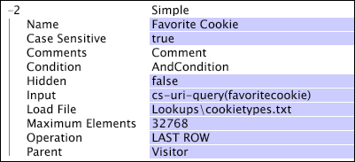

# Simple Dimensions{#simple-dimensions}

A simple dimension has a one-to-many relationship with its parent countable dimension.

 A simple dimension is always a child of a countable dimension. You can think of a simple dimension as a representation of a property of the elements in its parent dimension. For example, if you are working with web data, you could define the Visitor Referrer dimension, which is a simple dimension with a parent dimension of Visitor. It represents the first HTTP referrer for each visitor in the Visitor dimension. Each visitor in the Visitor dimension has only one visitor referrer, but many visitors can have the same visitor referrer. Therefore, the Visitor Referrer dimension has a one-to-many relationship with the Visitor dimension.

Simple dimensions are defined by the following parameters:

<table id="table_E6F729DFA226459DBFC1776CE8CB81F8"> 
 <thead> 
  <tr valign="top"> 
   <th colname="col1" class="entry"> Parameter </th> 
   <th colname="col2" class="entry"> Description </th> 
   <th colname="col3" class="entry"> Default </th> 
  </tr> 
 </thead>
 <tbody> 
  <tr valign="top"> 
   <td colname="col1"> Name </td> 
   <td colname="col2"> Descriptive name of the dimension as it appears in data workbench. The dimension name cannot include a hyphen (-). </td> 
   <td colname="col3"> </td> 
  </tr> 
  <tr valign="top"> 
   <td colname="col1"> Comments </td> 
   <td colname="col2"> Optional. Notes about the extended dimension. </td> 
   <td colname="col3"> </td> 
  </tr> 
  <tr valign="top"> 
   <td colname="col1"> Condition </td> 
   <td colname="col2"> The conditions under which the relationship between the Parent and the input field's value should be created. </td> 
   <td colname="col3"> </td> 
  </tr> 
  <tr valign="top"> 
   <td colname="col1"> Hidden </td> 
   <td colname="col2"> Determines whether the dimension appears in the data workbench interface. By default, this parameter is set to false. If, for example, the dimension is to be used only as the basis of a metric, you can set this parameter to true to hide the dimension from the data workbench display. </td> 
   <td colname="col3"> false </td> 
  </tr> 
  <tr valign="top"> 
   <td colname="col1"> Input </td> 
   <td colname="col2"> The field of values that is related to the parent dimension (Parent). </td> 
   <td colname="col3"> </td> 
  </tr> 
  <tr valign="top"> 
   <td colname="col1"> Load File </td> 
   <td colname="col2"> 
Optional. A file of available values for the relationship. You use a load file when either of the following applies: 
 
 
     <ul id="ul_056C4A8E46AA479397DC63173C035D5C"> 
      <li id="li_C26EB5A4AB3C4BEB8EB3A217A5A2377E"> The values have a specific sort order that you want to preserve in the data workbench display. For example, you might want to create a Quarter dimension whose elements (the quarters of the year) always display in chronological order. </li> 
      <li id="li_5D4DF56BC6124D038A7260131B1F3DB3"> You want to create place holders for values that may not be found in the data but need to appear in the data workbench display. </li> 
     </ul> 
 
 If a value is encountered that is not present in the file, it is added to the end of the values when viewed in data workbench. 
 </td> 
   <td colname="col3"> </td> 
  </tr> 
  <tr valign="top"> 
   <td colname="col1"> Operation </td> 
   <td colname="col2"> 
Available operations are as follows: 
 
 
     <ul id="ul_88AE4279413C42609D8B53EC64B5E913"> 
      <li id="li_DD9623D006844BC28B2AAA8E12AA04E1"> FIRST NONBLANK: The first non-blank input value is used, regardless of whether it comes from the first log entry. If Input is a vector field, the first row in the vector for the relevant log entry is used. </li> 
      <li id="li_0FBE7F0B7B9744D994ECEDAA08F0045C"> FIRST ROW: The value for the first log entry related to the parent dimension element is used, even if the input is blank. If Input is a vector field, the first row in the vector for the relevant log entry is used. If this value is blank or not a number, or if the relevant log entry does not meet the dimension's Condition, no value is used. </li> 
      <li id="li_C17190BC699D4A099DC5326C07D1044D"> LAST NONBLANK: The last non-blank input value is used, regardless of whether it comes from the last log entry. If Input is a vector field, the first row in the vector for the relevant log entry is used. </li> 
      <li id="li_00BAE86F12004C098F6A455908DB7062"> LAST ROW: The value for the last log entry related to the parent dimension element is used, even if the input is blank. If Input is a vector field, the first row in the vector for the relevant log entry is used. If this value is blank or not a number, or if the relevant log entry does not meet the dimension's Condition, no value is used. </li> 
     </ul> 
 
 
Note:  If Operation yields no value or a blank value for a particular log entry, the corresponding element of the parent dimension will relate to the "None" element of the simple dimension. 
 
 
 You should specify an operation to ensure that the dimension is defined as intended. 
 </td> 
   <td colname="col3"> </td> 
  </tr> 
  <tr> 
   <td colname="col1"> Parent </td> 
   <td colname="col2"> The name of the parent dimension. Any countable dimension can be a parent dimension. </td> 
   <td colname="col3"> </td> 
  </tr> 
 </tbody> 
</table>

This example illustrates the definition of a simple dimension using event data collected from website traffic and a load file.

Consider the example of a poll of site visitors' favorite Girl Scout cookies. A web page captures this vote and returns it to the web server in the name-value pair favoritecookie. Only one vote per visitor is counted, but visitors can change their minds and vote again if desired. This is a one-to-many relationship: one visitor can have many votes, but each vote is associated with only one visitor. Therefore, the parent of the dimension is visitors (only one vote per visitor) and the operation is LAST ROW (so that they can change their minds and vote again).

Placeholders must exist for all types of cookies so that cookie types receiving no votes appears in the data workbench display. For these reasons, a load file has been defined that contains the list of cookie types that may be selected. This file's contents, saved in a file named [!DNL cookietypes.txt], looks something like the following:

Animal Treasures

Caramel Delights

Lemon Pastry Creams

Peanut Butter Patties

Shortbreads

Thin Mints

The final dimension is defined as shown here:

