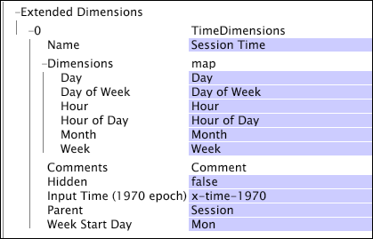

# Time Dimensions{#time-dimensions}

A time dimension enables you to create a set of periodic or absolute local time dimensions (such as Day, Day of Week, Hour of Day, Reservation Time, and so on) based on any timestamp field that you specify for the Input Time (1970 epoch) parameter.

 When defining time dimensions, you also can choose a day other than Monday to be used as the start of a week by specifying the Week Start Day parameter. You can define more than one set of time dimensions in your dataset as long as the dimensions have different names.

Time dimensions are defined by the following parameters:

<table id="table_9734F6CD7ABA4661A2F9A5FB948A7282"> 
 <thead> 
  <tr valign="top"> 
   <th colname="col1" class="entry"> Parameter </th> 
   <th colname="col2" class="entry"> Description </th> 
   <th colname="col3" class="entry"> Default </th> 
  </tr> 
 </thead>
 <tbody> 
  <tr valign="top"> 
   <td colname="col1"> Name </td> 
   <td colname="col2"> Descriptive name of the dimension as it appears in data workbench. The dimension name cannot include a hyphen (-). </td> 
   <td colname="col3"> </td> 
  </tr> 
  <tr valign="top"> 
   <td colname="col1"> Comments </td> 
   <td colname="col2"> Optional. Notes about the extended dimension. </td> 
   <td colname="col3"> </td> 
  </tr> 
  <tr valign="top"> 
   <td colname="col1"> Dimensions </td> 
   <td colname="col2"> 
You can specify dimension names for any of the following periods: 
 
 
     <ul id="ul_EB0837DD66BE4004A615A6029EEF4CD5"> 
      <li id="li_2E46E6DB004E443C8CC831DCEE743D60"> Day </li> 
      <li id="li_F59A27779EBE4E2A84E0972EE8BCDFA7"> Day of Week </li> 
      <li id="li_7D74CD547ED1449091EF7B2E0E8C46DE"> Hour </li> 
      <li id="li_706AF9D385CB44C098DEBACA3BA2CD4B"> Hour of Day </li> 
      <li id="li_76FBF69B25954885A0192D308A155E41"> Month </li> 
      <li id="li_3C16955BE5C54291A25E25CD31259661"> Week </li> 
     </ul> 
 
 The names that you enter here are the names that appear in dimension menus and in visualizations in data workbench. If you leave the name of a time dimension blank, the dimension is not created in the dataset. 
 </td> 
   <td colname="col3"> </td> 
  </tr> 
  <tr valign="top"> 
   <td colname="col1"> Hidden </td> 
   <td colname="col2"> Determines whether the dimension appears in the data workbench interface. By default, this parameter is set to false. If, for example, the dimension is to be used only as the basis of a metric, you can set this parameter to true to hide the dimension from the data workbench display. </td> 
   <td colname="col3"> true </td> 
  </tr> 
  <tr valign="top"> 
   <td colname="col1"> Input Time (1970 epoch) </td> 
   <td colname="col2"> 
The name of the timestamp field to use as input. 
 
 
Note:  The field's values must represent the number of seconds since January 1st, 1970, at 00:00:01. If the input time is not a valid time (1970 to 2037), the transformation process will fail, and the data workbench server will generate an error. 
 
 </td> 
   <td colname="col3"> </td> 
  </tr> 
  <tr valign="top"> 
   <td colname="col1"> Parent </td> 
   <td colname="col2"> The name of the parent dimension. Any countable dimension can be a parent dimension. For web data, the parent is Session. </td> 
   <td colname="col3"> </td> 
  </tr> 
  <tr valign="top"> 
   <td colname="col1"> Week Start Day </td> 
   <td colname="col2"> 
The day to use as the first day of a week. 
 
 This parameter affects the Week dimension, the Day of Week dimension, and any reporting time dimensions defined in terms of weeks. 
 </td> 
   <td colname="col3"> Mon </td> 
  </tr> 
 </tbody> 
</table>

This example creates a set of time dimensions based on the user-defined input field x-time-1970. The set of time dimensions is named "Session Time." Because the parent of each dimension is the Session dimension, each element of the time dimensions corresponds to the time at which a session began. The Week Start Day parameter specifies that each week of the Week dimension starts on Monday.

