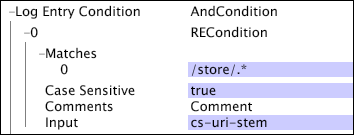

# Log Processing Parameters{#log-processing-parameters}

Links to additional information about specific parameters in the Log Processing.cfg file.

<!--
c_data_filters.xml
-->

## Data filters {#data-filters}

The filters defined in the [!DNL Log Processing.cfg] file include the following:

* End Time 
* Hash Threshold 
* Start Time

The filtering defined by these parameters occurs after log entries leave the decoders and after transformations but before their evaluation by the [!DNL Log Entry Condition]. In general, changing any of these parameters results in changes to the composition of the dataset.

The recommended technique for using [!DNL Sensor] data sources to construct a dataset that covers a specific period of time is to use the Start Time and End Time parameters for the dataset.

Using the Start Time and End Time parameters is preferred to other techniques, such as moving log files to separate them by directory. By setting the start and end times for the dataset, the data workbench server automatically uses only those log entries that occurred within the given interval. Assuming that the End Time is in the past, the data workbench server typically updates the dataset using the same set of log entries, even if the dataset is updated by, for example, adding a new transformation.

<!--
c_log_entry_con.xml
-->

## Log entry

In essence, it is a filtering process on the available log entries. If the [!DNL Log Entry Condition] returns a value of false, the log entry is filtered out of the available set of log entries.

The [!DNL Log Entry Condition] is described through the use of condition operations (see [Conditions](../../../home/c-dataset-const-proc/c-conditions/c-conditions.md#concept-9a576a00d5db48e7a599016c441e39e0)) and can use any of the input fields collected by [!DNL Sensor] (see the *Data Workbench [!DNL Sensor] Guide* ) or any extended fields produced by transformations contained within the [!DNL Log Processing.cfg] file to define the test conditions. [!DNL Log Entry] conditions are applied during log processing and optionally can be applied during transformation.

This example demonstrates the use of the [!DNL log entry condition] for website data. You can use the [!DNL Log Entry Condition] to create datasets that focus on a specific portion of the website or visitors performing some specific action on the site.

The [!DNL Log Entry Condition] in this example creates a dataset that includes only those log entries that are part of the site's store. By using the [!DNL RECondition test] with the matching pattern [!DNL "/store/.*"] and the [!DNL cs-uri-stem] field as input to the regular expression, only web pages that start with the string [!DNL "/store/"] are included in the dataset.

<!--
c_key_split.xml
-->

## Key split {#key-split}

The number of tracking IDs in the dataset is artificially increased, but the total number of log entries processed by the data workbench server is not artificially increased, thereby preserving the total number of countable events in the dataset. After the data for a single element is split, the data is forever associated with two different tracking IDs and cannot be related.

For example, if you are working with web data, each tracking ID represents a unique visitor. If you enable key splitting, the visitors in your dataset with large amounts of event data are split into multiple visitors. While the number of visitors in the dataset is artificially increased, the total number of countable events such as page views or bookings is not artificially increased. After splitting occurs, the data for the sub-visitors cannot be related.

Key splitting uses a probabilistic algorithm. As a result, there is a trade-off between memory usage, the failure probability, the key splitting threshold ( [!DNL Split Key Bytes]), and the dataset size. With the recommended settings (as listed below), the failure rate is low. Of those elements whose event data exceeds the key splitting threshold, approximately 1 in 22,000 (usually less than 1 per dataset) will have some of their data truncated rather than split.

The recommended values for each parameter (without and with key splitting) are shown in the following table.

|  Parameter  | No Key Splitting  | Key Splitting  |
|---|---|---|
|  Group Maximum Key Bytes  | 1e6  | 2e6  |
|  Split Key Bucket Space  | 6e6  | 6e6  |
|  Split Key Bytes  | 0  | 1e6  |
|  Split Key Space Ratio  | 10  | 10  |

[!DNL Group Maximum Key Bytes] specifies the maximum amount of event data that can be processed for a single tracking ID. Data exceeding this limit is filtered from the dataset construction process. [!DNL Split Key Bytes] represents the number of bytes at which a single tracking ID is split into multiple elements. Elements are split at approximately this number of bytes according to a probability distribution. [!DNL Split Key Space Ratio] and [!DNL Split Key Bucket Space] control the memory utilization and failure rate of key splitting.

>[!NOTE]
>
>[!DNL Group Maximum Key Bytes], [!DNL Split Key Bytes], [!DNL Split Key Space Ratio], and [!DNL Split Key Bucket Space] all must be declared for key splitting to work properly. Do not change the values of these parameters without consulting Adobe.

