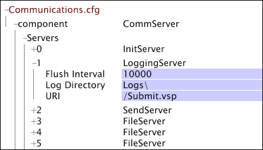
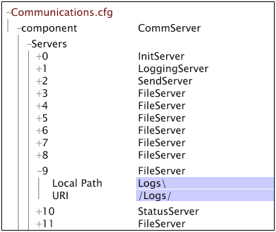
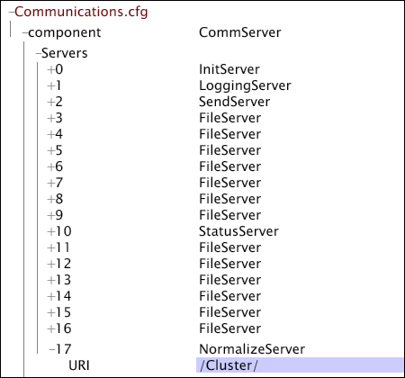

# Configuring a Data Workbench Server File Server Unit{#configuring-a-data-workbench-server-file-server-unit}

Information about Insight Server file server units and the file server configuration process.

<!--
c_abt_file_svr_units.xml
-->

You can configure the data workbench server (InsightServer64.exe) to run as a File Server Unit (FSU) by completing the parameters in the **[!UICONTROL Log Sources]** > **[!UICONTROL Log Server]** node of the [!DNL Log Processing.cfg] file. When the data workbench server is configured to run as an FSU, it stores source files ( [!DNL .vsl] files, text files, or XML files) that can be accessed quickly by multiple processing servers (DPUs). When the DPUs in a data workbench server cluster accesses the FSU to read the log files, they divide the log files among them and guarantee that the same file is not processed more than once.

>[!NOTE]
>
>When setting up an FSU that serves a data workbench server cluster consisting of five to ten DPUs, you should make the cluster's master server the FSU.

For information about installing a data workbench server cluster, see the *Server Products Installation and Administration Guide*.

<!--
c_file_svr_config_proc.xml
-->

If the location is a remote location, the data workbench server machine that is processing the data connects to the designated remote machine to read the logs.

On the data workbench server machine designated to run as an FSU, the [!DNL Access Control.cfg] file lets the DPUs connect to the FSU, and the [!DNL Communications.cfg] file maps the location of the remote data files. The process steps to configure an FSU are as follows:

1. In the [!DNL Log Processing.cfg] file on your master data workbench server, specify the type of data source and the location of the source. See [Specifying the Data Source](../../../home/c-dataset-const-proc/c-log-proc-config-file/c-ins-svr-file-svr-unit.md#section-d2b545db7ab142ffb4be32e040395383). 

1. In the [!DNL Access Control.cfg] file on the FSU, edit the permissions to allow the DPUs to connect to the FSU to read the log data. See [Editing the Permissions on the File Server Unit](../../../home/c-dataset-const-proc/c-log-proc-config-file/c-ins-svr-file-svr-unit.md#section-b4a54b591b4e4435a728a67f194057ef). 

1. In the [!DNL Communications.cfg] file on the FSU, edit the settings for the [!DNL LoggingServer] and [!DNL FileServer] entries to specify the location of the log files. See [Specifying the Location of the Log Files](../../../home/c-dataset-const-proc/c-log-proc-config-file/c-ins-svr-file-svr-unit.md#section-f9a649bf1b2544feb10ad8820384edb0). 

1. If you are configuring your dataset profile to run on a data workbench server cluster, you also must make the cluster's FSU the server where all of the profile's dimensions are constructed: 
   (For data workbench server clusters only) In the [!DNL Communications.cfg] and [!DNL cluster.cfg] files on the FSU, add entries for a "normalize server" to make the FSU the server within the cluster where all dimensions are constructed. See [Creating a Centralized Normalization Server for a Cluster](../../../home/c-dataset-const-proc/c-log-proc-config-file/c-ins-svr-file-svr-unit.md#section-2c1f57b683f94cc193bc069e886bba28).

For instructions to configure a dataset profile to be processed by a data workbench server cluster, see the *Server Products Installation and Administration Guide*.

>[!NOTE]
>
>The following instructions assume that all of the log files reside in the default directory. If you want to store logs in another directory or create multiple log paths, contact Adobe Consulting Services to discuss your specific configuration.

## Specifying the Data Source {#section-d2b545db7ab142ffb4be32e040395383}

When specifying remote data sources for a dataset, you must specify the type of data source and the location of the log files on your master data workbench server.

**To specify the data source and its location**

1. Open the [!DNL Log Processing.cfg] file. See [Editing the Log Processing Configuration File](../../../home/c-dataset-const-proc/c-log-proc-config-file/t-edit-log-proc-config-file.md#task-6a2fa1b735cb4eefad730f0a3a7858e5). 

1. Add a [!DNL Sensor], log file, or XML data source. See [Log Files](../../../home/c-dataset-const-proc/c-log-proc-config-file/c-log-sources.md#concept-3d4fb817c057447d90f166b1183b461e). 

1. Complete the Log Paths parameter. See [Sensor Files](../../../home/c-dataset-const-proc/c-log-proc-config-file/c-log-sources.md#concept-b25f11c477b54032a15b6117b3bf9009), [Log Files](../../../home/c-dataset-const-proc/c-log-proc-config-file/c-log-sources.md#concept-3d4fb817c057447d90f166b1183b461e), or [XML Log Sources](../../../home/c-dataset-const-proc/c-log-proc-config-file/c-log-sources.md#concept-c7b154e93748447b986e97f6ef688887). Be sure to specify a valid URI. 

1. Complete the Log Server parameters defined in the following table:

<table id="table_5881B8DEFF984BC7A620CEEA3A637912"> 
 <thead> 
  <tr> 
   <th colname="col1" class="entry"> Parameter </th> 
   <th colname="col2" class="entry"> Description </th> 
  </tr> 
 </thead>
 <tbody> 
  <tr> 
   <td colname="col1"> Name </td> 
   <td colname="col2"> Name identifying the remote file server. </td> 
  </tr> 
  <tr> 
   <td colname="col1"> SSL Server Common Name </td> 
   <td colname="col2"> 
  Server Common Name listed on the file server's SSL certificate. 
 
 This parameter is optional if  Use SSL is set to false. 
 </td> 
  </tr> 
  <tr> 
   <td colname="col1"> Address </td> 
   <td colname="col2"> 
Address of the file server machine. Can be left blank if  Name matches  SSL Server Common Name. 
 
 For example:  visual.mycompany.com or 192.168.1.90. 
 </td> 
  </tr> 
  <tr> 
   <td colname="col1"> Port </td> 
   <td colname="col2"> Port through which the data workbench server machine communicates with the file server. </td> 
  </tr> 
  <tr> 
   <td colname="col1"> SSL Client Certificate </td> 
   <td colname="col2"> Name of the  SSL certificate file for the data workbench server ( server_cert.pem). </td> 
  </tr> 
  <tr> 
   <td colname="col1"> Use SSL </td> 
   <td colname="col2"> True or false. True indicates that the file server uses  SSL. </td> 
  </tr> 
 </tbody> 
</table>

If a proxy server is required for the DPUs to connect to the FSU, you need to complete the following parameters:

|  Parameter  | Description  |
|---|---|
|  Proxy Address  | The address of a proxy server that the data workbench server must use to access the file server.  |
|  Proxy Password  | Optional. The password to the proxy server.  |
|  Proxy Port  | The port of the proxy server. The default is 8080.  |
|  Proxy User Name  | Optional. The user name for the proxy server.  |

Following is an example of a defined [!DNL Log Server] in the [!DNL Log Processing.cfg] file. Log Source #1 is a LogFile source that points to a directory called Logs (note the URI specified in the Log Paths parameter) on the machine named FSU01.

## Editing the Permissions on the File Server Unit {#section-b4a54b591b4e4435a728a67f194057ef}

In the previous process, you configured a profile for a given dataset to read log files from an FSU. Now you must edit the permissions on the FSU to allow connections from the DPUs that are running the profile. The following steps walk you through editing the permissions file [!DNL Access Control.cfg].

**To edit permissions on the FSU**

1. Open the [!DNL Server Files Manager] for the data workbench server machine that you are setting up as your FSU and click **[!UICONTROL Access Control]** to show its contents.

   For information about opening and working with the [!DNL Server Files Manager], see the *Data Workbench User Guide*. 

1. In the [!DNL Server Files Manager] window, click **[!UICONTROL Access Control]** to show its contents. The [!DNL Access Control.cfg] file is located within this directory. 

1. Right-click the check mark in the server name column for [!DNL Access Control.cfg], then click **[!UICONTROL Make Local]**. A check mark appears in the [!DNL Temp] column for [!DNL Access Control.cfg]. 

1. Right-click the newly created check mark under the [!DNL Temp] column and click **[!UICONTROL Open]** > **[!UICONTROL in Workstation]**. 

1. In the [!DNL Access Control] window, click **[!UICONTROL Access Control Groups]** to show its contents. 

1. Right-click the numeric label for the final [!DNL AccessGroup] in the list and click **[!UICONTROL Add new]** > **[!UICONTROL Group]**. 

1. Enter a [!DNL Name] for the new [!DNL AccessGroup]. Example: Connecting Servers. 

1. Right-click **[!UICONTROL Member]** under the new [!DNL AccessGroup], then click **[!UICONTROL Add new]** > **[!UICONTROL Member]**. 

1. Enter the IP address for the data workbench server's DPU that connects to this file server. 
1. Repeat steps 4 and 5 for any other data workbench server DPUs that connect to this FSU, including the data workbench server DPUs in a cluster that must access the log files. 
1. Right-click **[!UICONTROL Read-Only Access]** under the new [!DNL AccessGroup], then click **[!UICONTROL Add new]** > **[!UICONTROL URI]**. 

1. Enter the location of the stored log files on the file server machine. Use forward slashes (/) in the path specification. The default location is /Logs/. 
1. Right-click **[!UICONTROL (modified)]** at the top of the window, then click **[!UICONTROL Save]**. 

1. In the [!DNL Server Files Manager] window, right-click the check mark for [!DNL Access Control.cfg] in the [!DNL Temp] column, then click **[!UICONTROL Save to]** > **[!UICONTROL server name]** to save the locally made changes to the data workbench server's FSU.

## Specifying the Location of the Log Files {#section-f9a649bf1b2544feb10ad8820384edb0}

You must edit the [!DNL Communications.cfg] file on the FSU to specify the location of the log files.

**To specify the location of the log files**

1. In the [!DNL Server Files Manager] window, click **[!UICONTROL Components]** to show its contents. The [!DNL Communications.cfg] file is located within this directory. 

1. Right-click the check mark in the server name column for [!DNL Communications.cfg], then click **[!UICONTROL Make Local]**. A check mark appears in the [!DNL Temp] column for [!DNL Communications.cfg]. 

1. Right-click the newly created check mark under the [!DNL Temp] column and click **[!UICONTROL Open]** > **[!UICONTROL in Workstation.]**. 

1. In the [!DNL Communications.cfg] window, click **[!UICONTROL component]** to show its contents. 

1. In the [!DNL Communications.cfg] window, click **[!UICONTROL Servers]** to show its contents. Several servers may appear: File Servers, Logging Servers, Init Servers, Status Servers, Send Servers, or Replicate Servers. 

1. (For [!DNL Sensor] log sources only) Find the [!DNL LoggingServer], which is where [!DNL Sensor] writes its log files to be processed by the data workbench server, then click its number to view the menu. Edit the Log Directory parameter to reflect the desired location of the log files. The default log directory is the Logs folder within the data workbench server's installation directory.

   Do not modify any other parameters for the [!DNL LoggingServer].

   

1. Find the FileServer that specifies the location of log files. There may be several File Servers listed under Servers, so you may need to view the contents for many of them (by clicking the server number) to find the desired server. 
1. Edit the [!DNL Local Path] and URI parameters for the FileServer to reflect the location of the log files. The following example shows that the log files reside in the Logs folder within the data workbench server's installation directory:

   

   >[!NOTE]
   >
   >If the [!DNL Local Path] and URI parameters are populated as shown, you can access the log files on the FSU from any data workbench server by clicking [!DNL Logs] in the [!DNL Server Files Manager].

1. Right-click **[!UICONTROL (modified)]** at the top of the configuration window, then click **[!UICONTROL Save]**. 

1. In the [!DNL Server Files Manager] window, right-click the check mark for [!DNL Communications.cfg] in the [!DNL Temp] column, then click **[!UICONTROL Save to]** > *< **[!UICONTROL server name]**>* to save the locally made changes to the data workbench server's FSU.

## Creating a Centralized Normalization Server for a Cluster {#section-2c1f57b683f94cc193bc069e886bba28}

If you are configuring your dataset profile to run on a data workbench server cluster, then you should make the cluster's FSU the server where all of the profile's dimensions are constructed.

Adobe strongly recommends that the cluster's FSU serves as the cluster's master server and its centralized normalization server.

To make the FSU the centralized normalization server, you must open and edit the [!DNL Communications.cfg] and [!DNL Cluster.cfg] files on the FSU.

**To make the FSU the centralized normalization server**

1. Add a [!DNL NormalizeServer] entry to the [!DNL Communications.cfg] file on the FSU.

   >[!NOTE]
   >
   >If you have installed the complete release package for data workbench server v5.0 or later, the [!DNL Communications.cfg] file on your FSU should have a [!DNL NormalizeServer] entry already. You can follow the steps below to confirm that the entry exists.

    1. Open the [!DNL Communications.cfg] file in data workbench as described in [Specifying the Location of the Log Files](#section-f9a649bf1b2544feb10ad8820384edb0).
    
    1. Click **[!UICONTROL component]** to show its contents. 
    1. Right-click **[!UICONTROL Servers]** and click **[!UICONTROL Add New]** > **[!UICONTROL Centralized Normalization Server]**. 
    
    1. In the URI parameter for the [!DNL NormalizeServer], type [!DNL /Cluster/].

       

    1. Right-click **[!UICONTROL (modified)]** at the top of the window, and click **[!UICONTROL Save]**. 
    
    1. In the [!DNL Server Files Manager] window, right-click the check mark for [!DNL Communications.cfg] in the [!DNL Temp] column, then click **[!UICONTROL Save to]** > *< **[!UICONTROL server]**>* name to save the locally made changes to the data workbench server FSU.

1. Define the centralized normalization server in the [!DNL Cluster.cfg] file on the master server in your data workbench Server cluster.

   >[!NOTE]
   >
   >If the FSU on which you are setting up your centralized normalization server is not the master data workbench Server in your cluster, you must add the IP addresses of the DPUs in the cluster to the [!DNL Cluster Servers] access group in the FSU's [!DNL Access Control.cfg] file. For instructions to add servers to the [!DNL Cluster Servers] group, see Updating the Access Control File for a Cluster section in the *Server Products Installation and Administration Guide.*

    1. Open the [!DNL Profile Manager] within your dataset profile, then click **[!UICONTROL Dataset]** to show its contents. The [!DNL Cluster.cfg] file is located within this directory. 
    
    1. Right-click the check mark next to [!DNL Cluster.cfg], then click **[!UICONTROL Make Local]**. A check mark for this file appears in the [!DNL User] column. 
    
    1. Right-click the newly created check mark and click **[!UICONTROL Open]** > **[!UICONTROL in Notepad]**. 
    
    1. Add the text that is highlighted in the following file fragment:

       [!DNL Cluster = ClusterConfig:]
 
       [!DNL Normalize Server = serverInfo:]
 
       [!DNL Address = string:]
 
       [!DNL Port = int: 80]
 
       [!DNL SSL Server Common Name = string: server common name]
 
       [!DNL Use SSL = bool: false]

       >[!NOTE]
       >
       >When you enter the common name of FSU for the SSL Server Common Name parameter, the FSU uses its [!DNL .address] file to resolve the common name. For information about the [!DNL .address] file, see the *Server Products Installation and Administration Guide*.

    1. Save the file. 
    1. In the [!DNL Profile Manager], right-click the check mark for [!DNL Cluster.cfg] in the [!DNL User] column, then click **[!UICONTROL Save to]** > ***[!UICONTROL dataset profile name]*** to save the locally made changes to the dataset profile.
