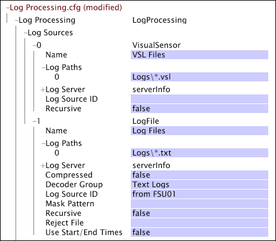

# Log Sources{#log-sources}

Log sources are files that contain the data to be used to build a dataset.

The data available in the log sources is called event data because each data record represents a transaction record or a single instance of an event. The data workbench server can process log sources that are derived from data collected by [!DNL Sensors] or extracted from other data sources.

* **Data Collected by [!DNL Sensors]: ** Data collected by [!DNL Sensors] from HTTP and application servers is transmitted to data workbench servers, which convert the data into highly compressed log ( [!DNL .vsl]) files. See [Sensor Files](../../../home/c-dataset-const-proc/c-log-proc-config-file/c-log-sources.md#concept-b25f11c477b54032a15b6117b3bf9009). 

* **Data Extracted by Insight Server:** The data workbench server reads event data contained in flat files, XML files, or ODBC-compliant databases, and uses its decoders to extract the desired elements of the data. Such event data does not have to be memory-resident, but the records that contain the data must include a tracking ID. See [Log Files](../../../home/c-dataset-const-proc/c-log-proc-config-file/c-log-sources.md#concept-3d4fb817c057447d90f166b1183b461e), [XML Log Sources](../../../home/c-dataset-const-proc/c-log-proc-config-file/c-log-sources.md#concept-c7b154e93748447b986e97f6ef688887), and [ODBC Data Sources](../../../home/c-dataset-const-proc/c-log-proc-config-file/c-odbc-data-sources.md#concept-5f2cf635081d44beab826ef5ec8cf4e3).

**To add a log source**

1. Open [!DNL Log Processing.cfg] in data workbench. 
1. Right-click **[!UICONTROL Log Sources]**, then click **[!UICONTROL Add New]**. 

1. Select one of the following:

    * **[!UICONTROL Sensor]** 
    * **[!UICONTROL Log File]** 
    * **[!UICONTROL XML Log Source]** 
    * **[!UICONTROL ODBC Data Source]**

1. The specific parameters used to define a dataset vary based on the type of log source to be used in the dataset's configuration process. Specify the parameters as indicated in the section corresponding to the appropriate log source:

    * [Sensor Files](../../../home/c-dataset-const-proc/c-log-proc-config-file/c-log-sources.md#concept-b25f11c477b54032a15b6117b3bf9009) 
    * [Log Files](../../../home/c-dataset-const-proc/c-log-proc-config-file/c-log-sources.md#concept-3d4fb817c057447d90f166b1183b461e) 
    * [XML Log Sources](../../../home/c-dataset-const-proc/c-log-proc-config-file/c-log-sources.md#concept-c7b154e93748447b986e97f6ef688887) 
    * [ODBC Data Sources](../../../home/c-dataset-const-proc/c-log-proc-config-file/c-odbc-data-sources.md#concept-5f2cf635081d44beab826ef5ec8cf4e3)

1. After you have defined your log source (and made changes to other parameters) in the [!DNL Log Processing.cfg] file, save the file locally and save it to your dataset profile on the data workbench server.

   >[!NOTE]
   >
   >A data workbench server [!DNL File Server Unit] can receive and store [!DNL Sensor] files, log files, and XML files and serve them to the data workbench server's [!DNL Data Processing Units] that construct the dataset. See [Configuring an Insight Server File Server Unit](../../../home/c-dataset-const-proc/c-log-proc-config-file/c-ins-svr-file-svr-unit.md#concept-995abff3fce34e439fb3f7f47191c80d).

   You can open the configuration of any log source from a [!DNL Transformation Dependency Map]. For information about [!DNL Transformation Dependency Map], see [Dataset Configuration Tools](../../../home/c-dataset-const-proc/c-dataset-config-tools/c-dataset-config-tools.md#concept-6e058b7691834cf79dcfd1573f78d4f5).

<!--
c_sensor_files.xml
-->

## Requirements {#section-d5901a4872774ad5bd01a18db114f1f2}

Event data collected by [!DNL Sensors] from HTTP and application servers is transmitted to data workbench servers, which convert the data into highly compressed log ( [!DNL .vsl]) files. The [!DNL .vsl] file format is managed by the data workbench server, and each file has a name of the format:

YYYYMMDD-*SENSORID*.VSL

where YYYYMMDD is the date of the file, and *SENSORID* is the name (assigned by your organization) that indicates which [!DNL Sensor] collected and transmitted the data to the data workbench server.

## Parameters {#section-5c3f1e341c284486aeba3452057da7f3}

For [!DNL Sensor] files, the following parameters are available:

<table id="table_F583B475600041AFA3B9399AE0592146"> 
 <desc> 
  <b>Log Processing.cfg:  Sensor Files </b> 
 </desc> 
 <thead> 
  <tr> 
   <th colname="col1" class="entry"> Parameter </th> 
   <th colname="col2" class="entry"> Description </th> 
  </tr> 
 </thead>
 <tbody> 
  <tr> 
   <td colname="col1"> Log Paths </td> 
   <td colname="col2"> 
The directories where the  .vsl files are stored. The default location is the Logs directory. A relative path refers to the installation directory of the data workbench server. 
 
You can use wildcard characters to specify which  .vsl files to process: 
     <ul id="ul_AE144ED0FAB94FE8B32599A058659DE1"> 
      <li id="li_1E4E4CFD72C34B5EB71A3C59877950A9"> * matches any number of characters </li> 
      <li id="li_4664400FC12E44B39B28438B85D20ED8"> ? matches a single character </li> 
     </ul> 
 
 For example, the log path  Logs\*.vsl matches any file in the Logs directory ending in  .vsl. The log path  Logs\*-SENSOR?.vsl matches files in the Logs directory with any date (YYYYMMDD) and a single character after SENSOR, as in SENSOR1. 
 
 If you want to search all subdirectories of the specified path, you must set the Recursive parameter to true. 
 
 
Note: If the files are to be read from a data workbench server's  File Server Unit, then you must enter the appropriate URI(s) in the Log Paths parameter. For example, the  URI /Logs/*-*.vsl matches any  .vsl file in the Logs directory. See <a href="../../../home/c-dataset-const-proc/c-log-proc-config-file/c-ins-svr-file-svr-unit.md#concept-995abff3fce34e439fb3f7f47191c80d"> Configuring an Insight Server File Server Unit</a>. 
 
 </td> 
  </tr> 
  <tr> 
   <td colname="col1"> Log Server </td> 
   <td colname="col2">Information (Address, Name, Port, and so on) necessary to connect to a file server. If there is an entry in the Log Server parameter, the  Log Paths are interpreted as URIs. Otherwise, they are interpreted as local paths. See <a href="../../../home/c-dataset-const-proc/c-log-proc-config-file/c-ins-svr-file-svr-unit.md#concept-995abff3fce34e439fb3f7f47191c80d"> Configuring an Insight Server File Server Unit</a>. </td> 
  </tr> 
  <tr> 
   <td colname="col1"> Log Source ID </td> 
   <td colname="col2"> 
This parameter's value can be any string. If a value is specified, this parameter enables you to differentiate log entries from different log sources for source identification or targeted processing. The x-log-source-id field is populated with a value identifying the log source for each log entry. For example, if you want to identify log entries from a  Sensor named VSensor01, you could type  from VSensor01, and that string would be passed to the x-log-source-id field for every log entry from that source. 
 
 For information about the x-log-source-id field, see <a href="../../../home/c-dataset-const-proc/c-ev-data-rec-fields.md#concept-06bda4be1a4649a2905a4422e9e6c42f"> Event Data Record Fields</a>. 
 </td> 
  </tr> 
  <tr> 
   <td colname="col1"> Recursive </td> 
   <td colname="col2"> True or false. If set to true, all subdirectories of each path specified in  Log Paths are searched for files matching the specified file name or wildcard pattern. The default value is false. </td> 
  </tr> 
  <tr> 
   <td colname="col1"> Use Start/End Times </td> 
   <td colname="col2"> 
True or false. If set to true and Start Time or End Time is specified, then all files for this log source must have file names starting with dates in ISO format (YYYYMMDD). It is assumed that each file contains data for one GMT day (for example, the time range starting at 0000 GMT on one day and ending at 0000 GMT the following day). If the log sources files contain data that do not correspond to a GMT day, then this parameter must be set to false to avoid incorrect results. 
 
 
Note: By default,  .vsl files containing data collected by  Sensor automatically meet the naming and time range requirements described above. If you set this parameter to true, the data workbench server always processes data from files whose names include ISO dates that fall between the specified Start Time and End Time. If you set this parameter to false, the data workbench server reads all of the  .vsl files during log processing to determine which files contain data within the Start Time and End Time range. 
 
 
 For information about the Start Time and End Time parameters, see <a href="../../../home/c-dataset-const-proc/c-log-proc-config-file/c-info-log-proc-param.md#concept-41bd49bf6b64442d91c232ec67529a3d"> Data Filters</a>. 
 </td> 
  </tr> 
 </tbody> 
</table>

>[!NOTE]
>
>Do not use the configuration parameters for [!DNL Sensor] data sources to determine which log entries within a log file should be included in a dataset. Instead, set up the data source to point to all of the log files within a directory. Then use the Start Time and End Time parameters of [!DNL Log Processing.cfg] to determine which log entries should be used in constructing the dataset. See [Data Filters](../../../home/c-dataset-const-proc/c-log-proc-config-file/c-info-log-proc-param.md#concept-41bd49bf6b64442d91c232ec67529a3d).

<!--
c_log_files.xml
-->

The file containing the event data must meet the following requirements:

* Each event data record in the file must be represented by one line. 
* The fields within a record must be separated, whether empty or not, by an ASCII delimiter. The data workbench server does not require you to use a specific delimiter. You may use any character that is not a line-ending character and does not appear anywhere within the event data itself. 
* Each record in the file must contain:

    * A tracking ID 
    * A time stamp

* To specify start and end times for data processing, each file name must be of the form:

    * [!DNL YYYYMMDD-SOURCE.log]

  where *YYYYMMDD* is the Greenwich Mean Time (GMT) day of all of the data in the file, and *SOURCE* is a variable identifying the source of the data contained in the file.

  >[!NOTE]
  >
  >Please contact Adobe Consulting Services for a review of the log files that you plan to incorporate into the dataset.

## Parameters {#section-83a861ac24954d54bbb9530e4d8bf23c}

For log files log sources, the parameters in the following table are available.

>[!NOTE]
>
>The processing of log file log sources requires additional parameters that are defined in a [!DNL Log Processing Dataset Include] file, which contains a subset of the parameters included in a [!DNL Log Processing.cfg] file as well as special parameters for defining decoders for extracting data from the log file. For information about defining decoders for log file log sources, see [Text File Decoder Groups](../../../home/c-dataset-const-proc/c-dataset-inc-files/c-types-dataset-inc-files/c-log-proc-dataset-inc-files/c-text-file-dec-groups.md#concept-0db34988e17c41bfb1797f1d8e78aabd).

<table id="table_F33735B5B90A48B0B21FA02D9198CCA9"> 
 <desc> 
  <b>Log Processing.cfg: Log Files </b> 
 </desc> 
 <thead> 
  <tr> 
   <th colname="col1" class="entry"> Parameter </th> 
   <th colname="col2" class="entry"> Description </th> 
  </tr> 
 </thead>
 <tbody> 
  <tr> 
   <td colname="col1"> Name </td> 
   <td colname="col2"> The identifier for the log file source. </td> 
  </tr> 
  <tr> 
   <td colname="col1"> Log Paths </td> 
   <td colname="col2"> 
The directories where the log files are stored. The default location is the Logs directory. A relative path refers to the installation directory of the data workbench server. 
 
 You can use wildcard characters to specify which log files to process: 
     <ul id="ul_1F02D26A08D846E2A3114E5C33F60ECF"> 
      <li id="li_ECAE1C03A1C448A1B86AE00B3A955708"> * matches any number of characters. </li> 
      <li id="li_24FDB500C5934CAAA4124C435DF4B290"> ? matches a single character. </li> 
     </ul> 
 
 For example, the log path  Logs\*.log matches any file in the Logs directory ending in  .log. 
 
 If you want to search all subdirectories of the specified path, then you must set the Recursive parameter to true. 
 
 If the files are to be read from a data workbench server's  File Server Unit, then you must enter the appropriate URI(s) in the Log Paths parameter. For example, the  URI/Logs/*.log matches any  .log file in the Logs directory. See <a href="../../../home/c-dataset-const-proc/c-log-proc-config-file/c-ins-svr-file-svr-unit.md#concept-995abff3fce34e439fb3f7f47191c80d"> Configuring an Insight Server File Server Unit</a>. 
 </td> 
  </tr> 
  <tr> 
   <td colname="col1"> Log Server </td> 
   <td colname="col2"> Information (Address, Name, Port, and so on) necessary to connect to a file server. If there is an entry in the Log Server parameter, the  Log Paths are interpreted as URIs. Otherwise, they are interpreted as local paths. See <a href="../../../home/c-dataset-const-proc/c-log-proc-config-file/c-ins-svr-file-svr-unit.md#concept-995abff3fce34e439fb3f7f47191c80d"> Configuring an Insight Server File Server Unit</a>. </td> 
  </tr> 
  <tr> 
   <td colname="col1"> Compressed </td> 
   <td colname="col2"> True or false. This value should be set to true if the log files to be read by the data workbench server are compressed gzip files. </td> 
  </tr> 
  <tr> 
   <td colname="col1"> Decoder Group </td> 
   <td colname="col2"> The name of the text file decoder group to be applied to the log file log source. This name must match exactly the name of the corresponding text file decoder group specified in the  Log Processing Dataset Include file. See <a href="../../../home/c-dataset-const-proc/c-dataset-inc-files/c-types-dataset-inc-files/c-log-proc-dataset-inc-files/c-text-file-dec-groups.md#concept-0db34988e17c41bfb1797f1d8e78aabd"> Text File Decoder Groups</a>. </td> 
  </tr> 
  <tr> 
   <td colname="col1"> Log Source ID </td> 
   <td colname="col2"> 
This parameter's value can be any string. If a value is specified, this parameter enables you to differentiate log entries from different log sources for source identification or targeted processing. The x-log-source-id field is populated with a value identifying the log source for each log entry. For example, if you want to identify log entries from a log file source named LogFile01, you could type  from LogFile01, and that string would be passed to the x-log-source-id field for every log entry from that source. 
 
 For information about the x-log-source-id field, see <a href="../../../home/c-dataset-const-proc/c-ev-data-rec-fields.md#concept-06bda4be1a4649a2905a4422e9e6c42f"> Event Data Record Fields</a>. 
 </td> 
  </tr> 
  <tr> 
   <td colname="col1"> Mask Pattern </td> 
   <td colname="col2"> 
A regular expression with a single capturing subpattern that extracts a consistent name used to identify the source of a series of log files. Only the file name is considered. The path and extension are not considered for the regular expression matching. If you do not specify a  mask pattern, then a mask is generated automatically. 
 
 For the files  Logs\010105server1.log and  Logs\010105server2.log, the  mask pattern would be [0-9]{6}(.*). This pattern extracts the string "server1" or "server2" from the file names above. 
 
 See <a href="../../../home/c-dataset-const-proc/c-reg-exp.md#concept-070077baa419475094ef0469e92c5b9c"> Regular Expressions</a>. 
 </td> 
  </tr> 
  <tr> 
   <td colname="col1"> Recursive </td> 
   <td colname="col2"> True or false. If this parameter is set to true, all subdirectories of each path specified in  Log Paths are searched for files matching the specified file name or wildcard pattern. The default value is false. </td> 
  </tr> 
  <tr> 
   <td colname="col1"> Reject File </td> 
   <td colname="col2"> The path and file name of the file containing the log entries that do not meet the conditions of the decoder. </td> 
  </tr> 
  <tr> 
   <td colname="col1"> Use Start/End Times </td> 
   <td colname="col2"> 
True or false. If this parameter is set to true and Start Time or End Time is specified, then all files for this log source must have file names starting with dates in ISO format (YYYYMMDD). It is assumed that each file contains data for one GMT day (for example, the time range starting at 0000 GMT on one day and ending at 0000 GMT the following day). If the log sources file names do not begin with ISO dates, or if the files contain data that do not correspond to a GMT day, then this parameter must be set to false to avoid incorrect results. 
 
 
Note:  If the naming and time range requirements described above are satisfied for the log files and you set this parameter to true, the specified text file decoder group limits the files read to those whose names have ISO dates that fall between the specified Start Time and End Time. If you set this parameter to false, the data workbench server reads all of the log files during log processing to determine which files contain data within the Start Time and End Time range. 
 
 
 For information about the Start Time and End Time parameters, see <a href="../../../home/c-dataset-const-proc/c-log-proc-config-file/c-info-log-proc-param.md#concept-41bd49bf6b64442d91c232ec67529a3d"> Data Filters</a>. 
 </td> 
  </tr> 
 </tbody> 
</table>

In this example, the dataset is constructed from two types of log sources.

Log Source 0 specifies log files generated from event data captured by [!DNL Sensor]. This data source points to a directory called Logs and to all of the files in that directory with a [!DNL .vsl] file name extension.

Log Source 1 points to all of the files in the Logs directory with a [!DNL .txt] file name extension. The decoder group for this log source is called “Text Logs.”

You should not delete or move log files after the data sources for a dataset have been defined. Only newly created log files should be added to the directory for the data sources.

<!--
c_xml_log_sources.xml
-->

The file containing the event data must meet the following requirements:

* Event data must be included in a properly formatted XML file with appropriate parent-child relationships. 
* A unique decoder group must exist for each XML file format. For information about constructing a decoder group, see [XML Decoder Groups](../../../home/c-dataset-const-proc/c-dataset-inc-files/c-types-dataset-inc-files/c-log-proc-dataset-inc-files/c-xml-dec-grps.md#concept-5eda5ab253724674832f6951e2a0d1c3). 
* Each visitor record in the file must contain:

    * A tracking ID 
    * A time stamp

* To specify start and end times for data processing, each file name must be of the form

[!DNL YYYYMMDD-SOURCE.log]

  where *YYYYMMDD* is the Greenwich Mean Time (GMT) day of all of the data in the file, and *SOURCE* is a variable identifying the source of the data contained in the file.

For an example of an XML file that meets these requirements, see [XML Decoder Groups](../../../home/c-dataset-const-proc/c-dataset-inc-files/c-types-dataset-inc-files/c-log-proc-dataset-inc-files/c-xml-dec-grps.md#concept-5eda5ab253724674832f6951e2a0d1c3).

>[!NOTE]
>
>Please contact Adobe Consulting Services for a review of the XML log files that you plan to incorporate into the dataset.

## Parameters {#section-d07b96d7f6ad4affb9cc0a0bc1b88c4d}

For XML log sources, the parameters in the following table are available.

>[!NOTE]
>
>The processing of XML log sources requires additional parameters that are defined in a [!DNL Log Processing Dataset Include] file, which contains a subset of the parameters included in a [!DNL Log Processing.cfg] file as well as special parameters for defining decoders for extracting data from the XML file. For information about defining decoders for XML log sources, see [XML Decoder Groups](../../../home/c-dataset-const-proc/c-dataset-inc-files/c-types-dataset-inc-files/c-log-proc-dataset-inc-files/c-xml-dec-grps.md#concept-5eda5ab253724674832f6951e2a0d1c3).

<table id="table_86B849F379CF4FEBA9294ACEF8F55184"> 
 <desc> 
  <b> <b> Log Processing.cfg: XML Log Sources</b> </b> 
 </desc> 
 <thead> 
  <tr> 
   <th colname="col1" class="entry"> Field </th> 
   <th colname="col2" class="entry"> Description </th> 
  </tr> 
 </thead>
 <tbody> 
  <tr> 
   <td colname="col1"> Name </td> 
   <td colname="col2"> The identifier for the XML log source. </td> 
  </tr> 
  <tr> 
   <td colname="col1"> Log Paths </td> 
   <td colname="col2"> 
The directories where the XML log sources are stored. The default location is the Logs directory. A relative path refers to the installation directory of the data workbench server. 
 
 You can use wildcard characters to specify which XML log sources to process: 
     <ul id="ul_0AE5D0ADE0F64CFAA856492A49239F58"> 
      <li id="li_4CBC0D1733F04258B3A55CC6FA714538 "> * matches any number of characters </li> 
      <li id="li_81B597436A1241FF94E73C18A0ABBFA1"> ? matches a single character </li> 
     </ul> 
 
For example, the log path  Logs\*.xml matches any file in the Logs directory ending in  .xml. 
 
 If you want to search all subdirectories of the specified path, you must set the  Recursive field to true. 
 
 
Note: If the files are to be read from a data workbench server's  File Server Unit, you must enter the appropriate URI(s) in the  Log Paths field. For example, the  URI/Logs/*.xml matches any  .xml file in the Logs directory. See <a href="../../../home/c-dataset-const-proc/c-log-proc-config-file/c-ins-svr-file-svr-unit.md#concept-995abff3fce34e439fb3f7f47191c80d"> Configuring an Insight Server File Server Unit</a>. 
 
 </td> 
  </tr> 
  <tr> 
   <td colname="col1"> Log Server </td> 
   <td colname="col2"> Information (Address, Name, Port, and so on) necessary to connect to a file server. If there is an entry in the  Log Server field, the  Log Paths are interpreted as URIs. Otherwise, they are interpreted as local paths. See <a href="../../../home/c-dataset-const-proc/c-log-proc-config-file/c-ins-svr-file-svr-unit.md#concept-995abff3fce34e439fb3f7f47191c80d"> Configuring an Insight Server File Server Unit</a>. </td> 
  </tr> 
  <tr> 
   <td colname="col1"> Compressed </td> 
   <td colname="col2"> True or false. This value should be set to true if the XML log sources to be read by the data workbench server are compressed gzip files. </td> 
  </tr> 
  <tr> 
   <td colname="col1"> Decoder Group </td> 
   <td colname="col2"> The name of the XML decoder group to be applied to the XML log source. This name must match exactly the name of the corresponding XML decoder group specified in the  Log Processing Dataset Include file. See <a href="../../../home/c-dataset-const-proc/c-dataset-inc-files/c-types-dataset-inc-files/c-log-proc-dataset-inc-files/c-xml-dec-grps.md#concept-5eda5ab253724674832f6951e2a0d1c3"> XML Decoder Groups</a>. </td> 
  </tr> 
  <tr> 
   <td colname="col1"> Log Source ID </td> 
   <td colname="col2"> 
This field's value can be any string. If a value is specified, this field enables you to differentiate log entries from different log sources for source identification or targeted processing. The x-log-source-id field is populated with a value identifying the log source for each log entry. For example, if you want to identify log entries from a log file source named XMLFile01, you could type  from XMLFile01, and that string would be passed to the x-log-source-id field for every log entry from that source. 
 
 For information about the x-log-source-id field, see <a href="../../../home/c-dataset-const-proc/c-ev-data-rec-fields.md#concept-06bda4be1a4649a2905a4422e9e6c42f"> Event Data Record Fields</a>. 
 </td> 
  </tr> 
  <tr> 
   <td colname="col1"> Mask Pattern </td> 
   <td colname="col2"> 
A regular expression with a single capturing subpattern that extracts a consistent name used to identify the source of a series of log files. Only the file name is considered. The path and extension are not considered for the regular expression matching. If you do not specify a  mask pattern, then a mask is generated automatically. 
 
 For the files  Logs\010105server1.xml and  Logs\010105server2.xml, the mask pattern would be [0-9]{6}(.*). This pattern extracts the string "server1" or "server2" from the file names above. 
 
 See <a href="../../../home/c-dataset-const-proc/c-reg-exp.md#concept-070077baa419475094ef0469e92c5b9c"> Regular Expressions</a>. 
 </td> 
  </tr> 
  <tr> 
   <td colname="col1"> Recursive </td> 
   <td colname="col2"> True or false. If this parameter is set to true, all subdirectories of each path specified in  Log Paths are searched for files matching the specified file name or wildcard pattern. The default value is false. </td> 
  </tr> 
  <tr> 
   <td colname="col1"> Reject File </td> 
   <td colname="col2"> The path and file name of the file containing the log entries that do not meet the conditions of the decoder. </td> 
  </tr> 
  <tr> 
   <td colname="col1"> Use Start/End Times </td> 
   <td colname="col2"> 
True or false. If this parameter is set to true and Start Time or End Time is specified, then all files for this log source must have file names starting with dates in ISO format (YYYYMMDD). It is assumed that each file contains data for one GMT day (for example, the time range starting at 0000 GMT on one day and ending at 0000 GMT the following day). If the log sources file names do not begin with ISO dates, or if the files contain data that do not correspond to a GMT day, then this parameter must be set to false to avoid incorrect results. 
 
 
Note:  If the naming and time range requirements described above are satisfied for the XML files and you set this parameter to true, the specified XML decoder group limits the files read to those whose names have ISO dates that fall between the specified Start Time and End Time. If you set this parameter to false, the data workbench server reads all of the XML files during log processing to determine which files contain data within the Start Time and End Time range. 
 
 
 For information about the Start Time and End Time parameters, see <a href="../../../home/c-dataset-const-proc/c-log-proc-config-file/c-info-log-proc-param.md#concept-41bd49bf6b64442d91c232ec67529a3d"> Data Filters</a>. 
 </td> 
  </tr> 
 </tbody> 
</table>

>[!NOTE]
>
>You should not delete or move XML log sources after the data sources for a dataset have been defined. Only newly created XML files should be added to the directory for the data sources.

<!--
AVRO-log-file.xml
-->

The Avro data feed provides a more efficient way to integrate data into Data Workbench:

<!--  -->

* Avro provides a single-source format for traffic and commerce data. 
* The Avro feed is compressed data of multiple source chunks provided per day. It provisions only populated fields and provides monitoring and notification features, access to historical data, and auto-recovery. 
* The schema, a self-defining layout of Avro log files, is included at the beginning of each file. 
* New fields are added with supporting information to ingest Data Workbench data without any changes required to the decoder. These include:

    * Evars: 1-250 (previously 1-75) 
    * Custom Events: 1-1000 (versus 1-100) 
    * Access to solution variables for mobile, social, and video data

>[!NOTE]
>
>In addition, using the Avro feed allows immediate access to any new fields in the feed without a shutdown, allowing the fields to be updated with no service hour requirements.

The Avro data feed is set up in separate files:

* An **Avro Log file**: This is the Avro log format generated from the decoder to format traffic and commerce data. 
* An **Avro Decoder file**: This file lets you map values into the new Avro format. You can set up the decoder using the Avro Decoder Wizard.

## Avro Decoder Wizard {#section-9a824b4c3d5549e7952a7111232035b2}

This wizard sets up the Avro decoder log file.

To open, right-click in a workspace and select **Admin** > **Wizards** > **Avro Decoder Wizard**.

**Step 1:** **Select an Avro Log File**.

In this step, you can select a source file for the Avro schema. Schemas can be accessed from a log file (.log) or an existing decoder file (.avro). Schemas can be pulled from either file.  

| **Avro Log File ** | Click to open a log (.log) file to view the schema at the top of the log file and generate decoder file.  |
|---|---|
| **Avro Decoder File** | Click to open and edit the schema of an existing decoder (.avro) file.  |

**Step 2: Select Input Fields**.

Select the input fields to be used in the data set to pass through log processing. All fields in the file will be displayed, allowing you to select fields for the feed.  

>[!NOTE]
>
>A [!DNL x-product(Generates row)] field is provided if an array is encountered in the data. This field generates new rows for the nested data in an array as input fields. For example, if you have a Hit row with many Product values in an array, then rows will be generated in the input file for each product.

| **Select Defaults** | Select fields to identify as a standard set of default fields .  |
|---|---|
| **Select All** | Select all fields in the file.  |
| **Deselect All** | Clear all fields in the file.  |

**Step 3: Select fields that get copied to generate rows.**

Because new rows can be created from nested values in an array, every new row created must have a tracking ID and a timestamp. This step allows you to select the fields to be copied to rows from the parent record, such as a tracking ID and timestamp. You can also select other values you want added to each row. 

| **Select Defaults** |Select a standard set of default fields that require new column values added to each row, such as a tracking ID and timestamp. For example, a [!DNL hit_source] field is a default value required to be added to each new row (it is defined as a default value in the list). You can add other column values to each row as needed.  |
|---|---|
| **Select All** | Select all fields in the file.  |
| **Deselect All** | Clear all fields in the file.  |

Use the **Search** box to find values in the list.

**Step 4:Specify the decoder name**

Assign a name for the group of fields and save as a decoder file. The name should match the Decoder group name specified in your log source.

**Step 5: Save the decoder file. **

The file menu will open to name the decoder file and save as a [!DNL .cfg] file in the **Logs** folder. 
