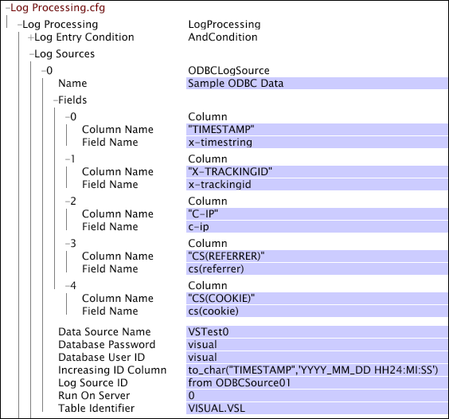

# ODBC Data Sources{#odbc-data-sources}

The data workbench server (InsightServer64.exe) can read event data from any SQL database (for example, Oracle or Microsoft SQL Server) that has an ODBC 3.0 compliant driver.

 The data workbench server's ODBC support is similar to existing support for loading data from Sensors or from log files generated by external processes. There are, however, some additional considerations and limitations:

* The data workbench server's ODBC support is compatible with the clustering capabilities. Data is distributed among all processing servers, and all subsequent processing (including query processing) benefits fully from clustering. 
* ODBC support depends on third-party ODBC drivers. For ODBC support to work, these drivers must be configured on the machine on which the data workbench server runs, using tools external to the Adobe platform. Data workbench machines do not require any additional configuration. 
* The table or view from which data is loaded must have an increasing ID column. For any row, the value in this column (which may be an actual column in the table or any SQL column expression) must not decrease as new rows are inserted into the database. If this constraint is violated, data is lost. For adequate performance, an index is required on this column or column expression.

  >[!NOTE]
  >
  >It is possible for multiple rows to have the same value in the [!DNL Increasing ID] column. One possibility is a timestamp column with less than perfect precision.

* The data workbench server cannot load columns with long data (data above a certain length as determined by the specific database application in use). 
* Retrieving data from a database is slower than reading it from a disk file. Datasets that load data from an ODBC source take much longer to process (particularly when reprocessing) than equivalently sized datasets whose data comes from Sensors or other disk files.

For information about reprocessing your data, see [Reprocessing and Retransformation](../../../home/c-dataset-const-proc/c-reproc-retrans/c-reproc-retrans.md#concept-6d82a173e4ab4111b673e7c2477d0823).

**To configure Insight Server for ODBC [!DNL event data]**

Configuring the data workbench server to load data from an SQL database requires that you first perform the following steps in order:

1. Install the appropriate database client software, including an ODBC driver, on the data workbench server machine on which the dataset is processed.

   >[!NOTE]
   >
   >If you are loading ODBC event data for processing on a data workbench server cluster, you must install the database client software on all of the processing servers in the cluster. For information about specifying processing servers in a cluster, see the *Server Products Installation and Administration Guide*.

1. Configure a Data Source using the ODBC Data Source Administrator for Windows.

   It is important to note that the data workbench server (InsightServer64.exe) runs as a Windows service. Therefore, the Data Source ordinarily must be configured as a System DSN rather than a User DSN for the data workbench server to be able to use it. You can find more information about this configuration step in the documentation for your database software.

After installing the database client software on the appropriate data workbench server machine, you can configure the dataset to use the ODBC data source by editing the appropriate parameters in the [!DNL Log Processing] configuration file for the desired profile.

## Parameters {#section-15c0218d93364693a565f2609a12f73e}

For data from databases using the Open Database Connectivity (ODBC) standard, the following parameters are available: 

<table id="table_606D8A90DA4A43C29F2C6130F8C753F8"> 
 <desc> 
  <b>Log Processing.cfg: ODBC Data Sources </b> 
 </desc> 
 <thead> 
  <tr valign="top"> 
   <th colname="col1" class="entry"> Parameter </th> 
   <th colname="col2" class="entry"> Description </th> 
  </tr> 
 </thead>
 <tbody> 
  <tr valign="top"> 
   <td colname="col1"> Name </td> 
   <td colname="col2"> The identifier for the ODBC source. </td> 
  </tr> 
  <tr valign="top"> 
   <td colname="col1"> Data Source Name </td> 
   <td colname="col2"> A DSN, as provided by an administrator of the data workbench server machine on which the dataset is processed, that refers to the database from which data is to be loaded. </td> 
  </tr> 
  <tr valign="top"> 
   <td colname="col1"> Database Password </td> 
   <td colname="col2"> The password to be used when connecting to the database. If a password has been configured for the DSN in the  Data Source Administrator, this may be left blank. Any password supplied here overrides the password configured for the DSN in the  Data Source Administrator. </td> 
  </tr> 
  <tr valign="top"> 
   <td colname="col1"> Database User ID </td> 
   <td colname="col2"> The user ID to be used when connecting to the database. If a user ID has been configured for the DSN in the  Data Source Administrator, this may be left blank. Any user ID supplied here overrides the user ID configured for the DSN in the  Data Source Administrator. </td> 
  </tr> 
  <tr valign="top"> 
   <td colname="col1"> Fields </td> 
   <td colname="col2"> A vector of column objects that specifies a mapping from data columns in the database to data fields in the data workbench server execution engine. Each column has entries  Column Name and  Field Name.  Column Name is an SQL column expression that must be valid in the context of the table identified by  Table Identifier described above. It may be a column name or any SQL expression based on any number of columns in the table. A formatting function may be necessary to convert values of certain data types to strings in a way that does not lose precision. All data is implicitly converted to strings using the database's default formatting method, which may cause data loss for some column data types (such as date/time data types) if explicit formatting expressions are not used. </td> 
  </tr> 
  <tr valign="top"> 
   <td colname="col1"> Increasing ID Column </td> 
   <td colname="col2"> 
A column name or SQL column expression that meets the criterion that it increases (or at least does not decrease) as new rows are added. That is, if Row B is added to the table at a later time than Row A, the value of this column (or column expression) in Row B must be greater (according to the database's native sorting order) than the corresponding value in Row A. 
 
 
     <ul id="ul_EBF6AEE4746B41B3B5BB6CC74194DAED"> 
      <li id="li_A5C9BE52B01649DE9726ECEC68B99828"> The  Increasing ID Column name may be the same as the name of an existing column, but is not required to be. </li> 
      <li id="li_CF69EAB4AFB14F4894F7A5CDCAF06947"> This expression is assumed to have an SQL character data type. If the actual increasing ID column is of some other data type, this value must be a column expression to convert it to a string. Because this usually means comparisons are lexicographic (character by character), it is important to format the value carefully. </li> 
      <li id="li_58977431962E48039C898CFC47C53323"> The expression is used in SQL ORDER BY clauses and compared to in SQL WHERE clauses. It is critically important to have an index built on the exact column expression that is used. </li> 
     </ul> 
 </td> 
  </tr> 
  <tr valign="top"> 
   <td colname="col1"> Log Source ID </td> 
   <td colname="col2"> 
This parameter's value can be any string. If a value is specified, this parameter enables you to differentiate log entries from different log sources for source identification or targeted processing. The x-log-source-id field is populated with a value identifying the log source for each log entry. For example, if you want to identify log entries from an ODBC source named ODBCSource01, you could type  from ODBCSource01. and that string would be passed to the x-log-source-id field for every log entry from that source. 
 
 For information about the x-log-source-id field, see <a href="../../../home/c-dataset-const-proc/c-ev-data-rec-fields.md#concept-06bda4be1a4649a2905a4422e9e6c42f" format="dita" scope="local"> Event Data Record Fields</a>. 
 </td> 
  </tr> 
  <tr valign="top"> 
   <td colname="col1"> Run On Server </td> 
   <td colname="col2"> Index value in the  profile.cfg file of the processing server that makes the ODBC queries to get data from the database. (The Processing Servers parameter in the  profile.cfg file lists all of the processing servers for the dataset, and each server has an index value, the first being 0.) The default value is 0. </td> 
  </tr> 
  <tr valign="top"> 
   <td colname="col1"> Table Identifier </td> 
   <td colname="col2"> An SQL expression that names the table or view from which data is to be loaded. A typical table identifier is of the form SCHEMA.TABLE. </td> 
  </tr> 
 </tbody> 
</table>

This example shows the [!DNL Log Processing] configuration window in data workbench with an ODBC data source. This Data Source takes data from a table called [!DNL VISUAL.VSL] in a database with [!DNL Data Source Name] "VSTestO." Five (5) column objects ( [!DNL Fields]) map data from the data columns in the database to the data workbench server.

