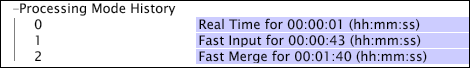

# Preparing for Reprocessing or Retransformation{#preparing-for-reprocessing-or-retransformation}

Steps to ensure that reprocessing or retransformation goes smoothly and finishes in time for data workbench users to get back to work

1. Determine the elapsed time of previous processing or transformation by checking the dataset profile's [!DNL Processing Mode History] in the [!DNL Detailed Status] interface.

    1. While working in your dataset profile, open the [!DNL Detailed Status] interface. 
    1. Click **[!UICONTROL Processing Status]** > *< **[!UICONTROL dataset profile name]**>* > **[!UICONTROL Processing Mode History]** to view the elapsed times of previous processing or transformation.

        * Fast Input is the total time needed for log processing. 
        * Fast Merge is the total time needed for transformation. 
        * The sum of the two times (Fast Input + Fast Merge) is the total time needed for processing the dataset.

       The example below indicates that log processing took approximately 43 seconds, while transformation took less than 2 minutes.

       

       For more information about the [!DNL Detailed Status] interface, see the *Data Workbench User Guide*.

1. Schedule and plan the reprocessing. Because data workbench users do not have access to the data during the log processing phase, ensure that you schedule reprocessing to occur during an appropriate time, such as over the weekend.
1. Monitor the progress of the reprocessing and retransformation using the fields in the [!DNL Processing Legend.] For more information about the [!DNL Processing Legend], see the *Data Workbench User Guide*.
