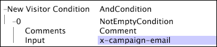

# New Visitor Condition{#new-visitor-condition}

The New Visitor Condition is a Condition Operation that is used with website data to determine which visitors are considered for inclusion in the dataset.

 The [!DNL New Visitor Condition] defines the first log entry (ordered by time) for a visitor that is to be used in the dataset, and all subsequent log entries for this visitor are included in the dataset regardless of whether they meet this condition. Because the [!DNL New Visitor Condition] requires that data is ordered by visitor and time, it is applied only during the transformation phase of dataset construction.

The [!DNL New Visitor Condition] shown in this example creates a dataset that includes only those log entries for visitors who respond to email campaigns. This is accomplished by using the [!DNL NotEmptyCondition] test (see [Not Empty](../../../../home/c-dataset-const-proc/c-conditions/c-test-ops/c-test-op-con.md#section-1decb9d887894073a1b6b3d985729ac8)) and the [!DNL x-campaign-email] field as input to the regular expression. After the new visitors meeting the condition are identified, all log entries for those visitors are captured.

