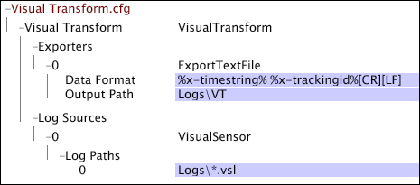
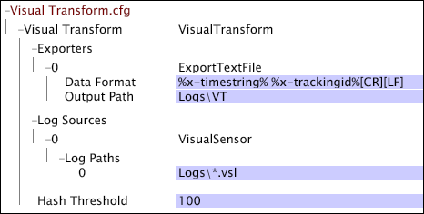
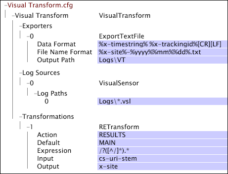

# Sample Data Workbench Transform.cfg Files{#sample-data-workbench-transform-cfg-files}

Information about how to specify parameters in the Transform.cfg file based on the several scenarios.

* [A Simple Insight Transform.cfg File](../../../../../home/c-dataset-const-proc/c-transf-func/c-config-files-transf/t-ins-transf-file/c-sample-transf-files.md#section-b7e83cafa3a947c597bd09d316930190) 
* [Output with Comma-Separated Values](../../../../../home/c-dataset-const-proc/c-transf-func/c-config-files-transf/t-ins-transf-file/c-sample-transf-files.md#section-03916934ad574efc8695abbae54a1816) 
* [Sampled Log Files](../../../../../home/c-dataset-const-proc/c-transf-func/c-config-files-transf/t-ins-transf-file/c-sample-transf-files.md#section-113b3b0c0c7547ea9536bb2f465c0875) 
* [Splitting Log Files by Web Site Section](../../../../../home/c-dataset-const-proc/c-transf-func/c-config-files-transf/t-ins-transf-file/c-sample-transf-files.md#section-2cac205cd3934d31abb6c6ed8780196d)

In each sample, the file is displayed as a [!DNL Transform.cfg] window in data workbench.

## A Simple Data Workbench Transform.cfg File {#section-b7e83cafa3a947c597bd09d316930190}

The following [!DNL Transform.cfg] window provides instructions to read [!DNL .vsl] files from the [!DNL Logs] directory and export the x-timestring and x-trackingid fields to a text file stored in the Logs\VT directory. Because no file rotation period or output file name format is specified, each file contains data for one calendar day and has a name in the default format [!DNL %yyyy%%mm%%dd%-%x-mask%.txt].

## Output with Comma-Separated Values {#section-03916934ad574efc8695abbae54a1816}

The following [!DNL Transform.cfg] window provides instructions to read [!DNL .vsl] files from the Logs directory and export fields 0 through 13 to a comma-delimited ( [!DNL .csv]) file stored in the Logs\VT\CSV directory. Because no file rotation period is specified, each file contains data for one calendar day. The output files are [!DNL .csv] files named in the format [!DNL %yyyy%%mm%%dd%-%x-mask%.csv].

## Sample Log Files {#section-113b3b0c0c7547ea9536bb2f465c0875}

You can configure transformation functionality to create and maintain an up-to-date, compact version of your full log files. Doing so enables you to test your dataset configurations quickly, with reprocessing times of seconds or minutes instead of hours needed to reprocess the entire dataset. The following example provides an example of how to configure transformation functionality to do this.

The following [!DNL Transform.cfg] window provides instructions to read [!DNL .vsl] files from the Logs directory and export the x-timestring and x-trackingid fields to a text file stored in the Logs\VT directory. The specified Hash Threshold filters certain tracking IDs from the dataset, thereby creating a dataset that is sampled by a factor of 100. Because no file rotation period is specified, each file contains data for one calendar day. The names of the output files are in the default format [!DNL %yyyy%%mm%%dd%-%x-mask%.txt].

## Splitting Log Files by Web Site Section {#section-2cac205cd3934d31abb6c6ed8780196d}

The following [!DNL Transform.cfg] window provides instructions to read [!DNL .vsl]files from the Logs directory and export the x-timestring and x-trackingid fields to a text file stored in the Logs\VT directory. The regular expression transformation ( [!DNL RETransform]) takes as its input the cs-uri-stem field and creates a new field (x-site) that defines a section of the site. The x-site field is included in the name of output text files, each of which contain data for one calendar day.

