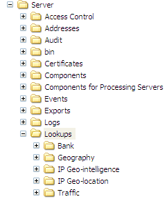

# Installing the Geography Lookup Files{#installing-the-geography-lookup-files}

Steps to install the Geography lookup files on the data workbench server.

The lookup file [!DNL (Lookups\Geography\DMA.txt]) provided with the [!DNL Geography] profile is a two-column tab-delimited text file that lists DMA (designated market area) codes and the corresponding names. 

1. Open the Lookups folder from the [!DNL .zip] file provided to you by Adobe.
1. Copy the Geography folder to the Lookups folder in your data workbench server installation directory. You want to end up with a ...\Lookups\Geography folder on your data workbench server as shown in the following example. The names of the other folders within the Lookups folder may differ from the ones shown.

   

