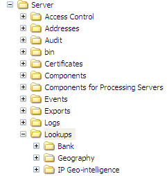

# Installing the Data Service Lookup Files{#installing-the-data-service-lookup-files}

Steps to install the IP Geo-intelligence or IP Geo-location lookup files.

 The lookup file (Lookups\*profile name*\*data file name*) provided with the data service profile is a binary file ( [!DNL .bin]) that contains geographically related data based on IP address. You must replace this file periodically to ensure that you have the most recent geographic data. See [Updating Data Service Files](../../../../home/c-geo-oview/c-wk-data-svcs/c-updt-data-svc-files.md#concept-2b3d11e4cb814fc09add5de58a87045c).

**To install the IP Geo-intelligence or IP Geo-location lookup files**

>[!NOTE]
>
>All of your [!DNL IP Geo-location] or [!DNL IP Geo-intelligence] data files must fit in the available physical memory of your data workbench server.

1. Open the Lookups folder from the [!DNL .zip] file that you received from Adobe.
1. Copy the IP Geo-intelligence or IP Geo-location folder to the Lookups folder in your data workbench server installation directory (you want to end up with a ...\Lookups\IP Geo-intelligence or a ...\Lookups\IP Geo-location folder on your data workbench server as shown in the following example. The names of the other folders within the Lookups folder may differ from the ones shown.

   

   >[!NOTE]
   >
   >Periodically, Adobe sends you files containing updated [!DNL IP Geo-intelligence] or [!DNL IP Geo-location] lookup files. When you receive these files, you need to load them onto your data workbench server as directed by Adobe. For instructions, see the following section.
