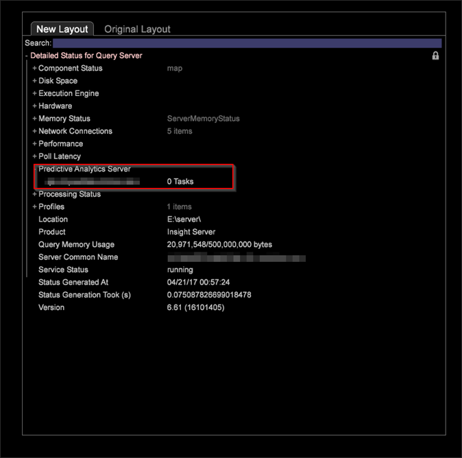

# Visitor Clustering{#visitor-clustering}

Visitor clustering lets you leverage customer characteristics to dynamically categorize visitors and generate cluster sets based on selected data inputs, thus identifying groups that have similar interests and behaviors for customer analysis and targeting.

 **Clustering process**

The clustering process requires you to identify metrics and dimension elements to use as inputs, and allows you to choose a specific target population to apply these elements to create specified clusters. When you run the clustering process, the system uses the metric and dimension inputs to determine appropriate initial centers for the specified number of clusters. These centers are then used as a starting point to apply the K-Means algorithm. 

* The initial centers are intelligently chosen via a Canopy Clustering pass.
* Data clusters are created by associating every data point to the nearest center.
* The mean of each of the K clusters becomes the new center.
* The algorithm is repeated in steps 2 and 3 until convergence is reached. This can take multiples passes.

The **[!UICONTROL Maximum Iterations]** in the **[!UICONTROL Options]** menu allows the analyst to specify the maximum number of iterations to be performed by the clustering algorithm. Setting this option may result in faster completion of the clustering process based on the maximum iterations cap at the expense of exact convergence of the cluster centers.

>[!NOTE]
>
>Once the clusters have been defined, the Cluster Dimension can be saved for use just like any other dimension. It can also be loaded into the Cluster Explorer to examine the separation of cluster centers.

In the Cluster Builder, you can select **[!UICONTROL Options]** > **[!UICONTROL Algorithm]** to select algorithms when defining clusters. Currently, there are 3 supported algorithms:

* KMeans 
* Kmeans`++` 
* Expectation Maximization

There are 2 ways to run the clustering process:

* Method 1 - Click **[!UICONTROL Go]** in the cluster visualization window. 
* Method 2 - Click **[!UICONTROL Submit]** in the cluster visualization window, which directly sends the clustering job to the Server. You can track the progress through the "Detailed Status for Query" option.

The algorithm has the following restrictions:

1. If you are using Method 1, you can select any of the supported clustering algorithms. 
1. If you are using Method 2, you can select kmeans or kmeans++. The Expectation Maximization option will not available.

>[!NOTE]
>
>In the [!DNL DPU.cfg] file, the value for 'Query, Memory Limit' is set to 500 MB by default. This value must be increased while running multiple clustering jobs. For instance, if you are running 5 clustering jobs in parallel, increase this value to 1 GB. There is no way to cancel the clustering job without restarting the Server.

**Recommendations**

The number of iterations (number of times the data is scanned) and the convergence threshold that you configure, grossly affects the clustering performance. The following table provides a broader guideline that you can follow:

|  Number of Clusters  | Algorithm  | Iterations  | Convergence Threshold  | Normalization  |
|---|---|---|---|---|
|  6  | Kmeans  | 25,50  | 1e-3  | Min-Max  |
|  6  | Kmeans  | 25,50  | 1e-6  | Min-Max  |
|  6  | Kmeans++  | 50  | 1e-6  | Min-Max  |
