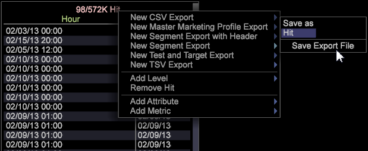

# Master Marketing Profile Export{#master-marketing-profile-export}

Data Workbench lets you export files to integrate with the Master Marketing Profile as part of an integrated Adobe Marketing Cloud.

<a id="section_731922BC8628479198A41EF3EA72F2FF"></a>

The Master Marketing Profile (MMP) is part of the [Visitor ID service](http://marketing.adobe.com/resources/help/en_US/mcvid/?f=mcvid_service), a core service of the [Adobe Marketing Cloud](http://www.adobe.com/solutions/?f=digital-marketing). The MMP allows audiences to be shared across the Marketing Cloud using a unique visitor ID (MCID) that is assigned to every visitor and then used by [Audience Manager](http://marketing.adobe.com/resources/help/en_US/em/). The [!DNL ExportIntegration.exe] application ( [!DNL E:\Server\Scripts]) is employed to generate both MMP and Adobe Target exports.

**Configuring the FSU Server to use the Master Marketing Profile**

1. Access your FSU server. 
1. Open the MMPExport.cfg file. ( [!DNL Server/Admin/Export/MMPExport.cfg]). 
1. Enter values in the all fields as required. For example: 

   >[!NOTE]
   >
   >MMP/AAM integration relies on Amazon's s3 bucket for data transfer. 
   >
   >
   >The s3 information required for MMP (s3) transfer can be obtained from Audience Manager team.

   ```
   <b>Sample MMPExport.cfg</b> 
   MMP Export Configuration = MMPExportConfiguration: 
   s3 Bucket = string: aws_bucket_for_mmp 
   s3 Object Directory = string: test/files/ 
   s3 Region = string: us-east-1 
   s3 Access Key = string: ZZKI62OO5YBA 
   s3 Secret Key = string: ioqwa3OpNE5 
   data Provider Name = string: 895 
   client ID = string: mcprofile2-test 
   client Secret = string: saea1287617212987q 
   username = string: mmptest 
   password = string: pass 
   numRecordsPerChunk = int:  
   numThreads = int:  
   maxRetriesOnSendFailure = unsigned int:
   ```

   >[!NOTE]
   >
   >The [!DNL MMPExport.cfg]file also lets you take all records, split them into sets, and create chunks of records. The chunks of records are then exported to Amazon S3. Three mandatory parameters are required to create chunks of records: [!DNL numRecordsPerChunk], [!DNL numThreads], and [!DNL maxRetriesOnSendFailure].

   **Definition of Parameters ** 

<table id="table_DDEFBC45895A4663973F9C2EB9052FEF"> 
 <thead> 
  <tr> 
   <th colname="col1" class="entry"> Parameter </th> 
   <th colname="col2" class="entry"> Definition </th> 
  </tr> 
 </thead>
 <tbody> 
  <tr> 
   <td colname="col1"> <i>s3 Bucket</i> </td> 
   <td colname="col2"> The AWS S3 bucket where the export is transferred to. </td> 
  </tr> 
  <tr> 
   <td colname="col1"> <i>s3 Object Directory</i> </td> 
   <td colname="col2"> A path to save s3 files. This supports sub-directories. <p> <p>Important:  Space and multibyte characters are not allowed in the path and will create errors in the export. (The hypen is allowed). </p> </p> </td> 
  </tr> 
  <tr> 
   <td colname="col1"> <i>s3 Region</i> </td> 
   <td colname="col2"> The AWS s3 Region where the export is sent to. Ex. us-east-1 </td> 
  </tr> 
  <tr> 
   <td colname="col1"> <i>s3 Access Key</i> </td> 
   <td colname="col2"> AWS s3 Access Key </td> 
  </tr> 
  <tr> 
   <td colname="col1"> <i>s3 Secret Key</i> </td> 
   <td colname="col2"> AWS s3 Secret Key </td> 
  </tr> 
  <tr> 
   <td colname="col1"> <i>data Provider Name</i> </td> 
   <td colname="col2"> This will be the folder name that is used for storing segments and traits in AAM respectively. This should be unique per customer. </td> 
  </tr> 
  <tr> 
   <td colname="col1"> <i>client ID</i> </td> 
   <td colname="col2"> This is a unique client ID provided to a customer when provisioned for MMP. </td> 
  </tr> 
  <tr> 
   <td colname="col1"> <i>client Secret</i> </td> 
   <td colname="col2"> <p><i></i>This is a unique client secret provided to a customer when he/she is provisioned for MMP. </p> </td> 
  </tr> 
  <tr> 
   <td colname="col1"> <i>username</i> </td> 
   <td colname="col2"> MMP username </td> 
  </tr> 
  <tr> 
   <td colname="col1"> <i>password</i> </td> 
   <td colname="col2"> MMP password </td> 
  </tr> 
  <tr> 
   <td colname="col1"> <i>numRecordsPerChunk</i> </td> 
   <td colname="col2"> <p>Determines the chunk size in terms of number of records. </p> <p>The implementation clips the user specified value to min = 1000 records&amp;nbsp;(~50 KB chunks)&amp;nbsp;and max = 50000 records (~2.5 MB chunks).&amp;nbsp;A default value of 10000 is used in case the user does not specify this configuration property. </p> </td> 
  </tr> 
  <tr> 
   <td colname="col1"> <i>numThreads</i> </td> 
   <td colname="col2"> <p>Determines the parallelism of the chunk sending part. It accepts a value between 1 to 24 threads, and its default value is 12 threads. </p> </td> 
  </tr> 
  <tr> 
   <td colname="col1"> <i>maxRetriesOnSendFailure</i> </td> 
   <td colname="col2"> <p>Determines the number of retry attempts to be made in case of chunk send failures. Default value is 0 specifying no retries. </p> <p>Sleep interval of 2 seconds is used between retries. </p> </td> 
  </tr> 
 </tbody> 
</table>

**Generating MMP export from the client**

1. From the client, open a workspace and right-click **[!UICONTROL Tools]**> **[!UICONTROL Detail Table]**. 

1. Add **Level**. 
1. Right-click the header and select **Add Attributes**. 
1. Right-click the header and select **New Master Marketing Profile Export**. 

1. Expand **Query**. 

1. Expand **MMP Configuration**. 
1. (required) Enter the **MMP Segment Name** and **MMP Visitor ID Field**. These parameters cannot be left empty. 

1. The **MMP Segment Name** should match the Segment ID defined in the MMP. 
1. The **MMP Visitor ID** is the attribute column defined in step 4 that corresponds to the **Visitor ID**. 

1. Once these fields are entered, you can save the export by right-clicking the header for the export and choose **Save** as "User\.export". 
1. Open **Admin** > **Profile Manager **and save the export to the profile.

   If all data is entered correctly, this will generate an export file in the FSU ( [!DNL Server/Exports]) and it will also transfer the export to the AWS using the information in [!DNL MMPExport.cfg]. The log for this is provided in [!DNL Server/Trace/]. eg., [!DNL MMP-102014-133651- [Segment Export Name] .log]

```
Query = SegmentExportQuery: 
Command = string: ExportIntegration.exe 
Command Arguments = string: \"%file%.cfg\" \"%file%\" 
Filter = string: 
Level = string: Page View 
MMP Configuration = MMPConfiguration: 
MMP Segment Name = string: 12345 
MMP Visitor ID Field = string: Tracking ID 
Oneshot = bool: true 
Output Fields = vector: 3 items 
0 = ColumnDefinition: 
Column Name = string: 
Field Name = string: Tracking ID 
1 = ColumnDefinition: 
Column Name = string: 
Field Name = string: PID 
2 = ColumnDefinition: 
Column Name = string: 
Field Name = string: SID 
Output File = string: MMPTest.txt 
Output Format = string: %1%\t%2%\t%3%\r\n 
Schedule End Time = string: 
Schedule Every = string: 
Schedule Start Time = string: 
Time Limit (sec) = double: 1800 
```

|  Configuration Details  | Description  |
|---|---|
|  MMP Segment ID  | Required. This is an identifier you would define first in Audience Manager.  |
|  MMP Visitor ID Field  | Map the MCID.  |

