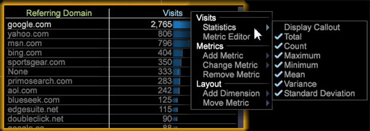

# Statistical Callouts{#statistical-callouts}

Statistical callouts measure meaningful relationships to identify hidden opportunities and variables of interest for more advanced data mining capabilities in audience clustering and visitor response scoring.

Statistical callouts expand the algorithms so that more types of data can be correlated, such as binomial variables (yes/no, 0/1, or purchaser/non-purchaser) correlated with countable metrics (visits, orders, or downloads).

To add statistical callouts:

1. In a table, right-click the metric header. 
1. Select **[!UICONTROL Statistics]** and then select or clear the checkmarks for each required setting. All in the Display Callout are selected as the default setting.

   

The callout can return statistical values factored into the dataset columns. 

<table id="table_B2A4F9D5938D4756A81ACF6F4D77E63D">
 <thead>
  <tr>
   <th colname="col1" align="center" class="entry"> Calculation </th>
   <th colname="col2" align="center" class="entry"> Description </th>
  </tr>
 </thead>
 <tbody>
  <tr>
   <td colname="col1"> Count </td>
   <td colname="col2" valign="middle">
Returns the number of rows in a dataset. 
</td>
  </tr>
  <tr>
   <td colname="col1"> Maximum </td>
   <td colname="col2" valign="middle">
 Identifies the maximum Metric value across all elements of the dimension. 
</td>
  </tr>
  <tr>
   <td colname="col1"> Minimum </td>
   <td colname="col2">
 Identifies the minimum Metric value across all elements of the dimension. 
</td>
  </tr>
  <tr>
   <td colname="col1"> Mean </td>
   <td colname="col2">
 The mean is the arithmetic average of the Metric values of elements in the Dimension, calculated by the total sum divided by the count (sum/count). 
</td>
  </tr>
  <tr>
   <td colname="col1"> Standard Deviation </td>
   <td colname="col2"> The standard deviation shows how much variation exists from the expected mean. A lower standard deviation shows the data points close to the mean. A higher standard deviation shows that the data points are spread across a large range of values. </td>
  </tr>
  <tr>
   <td colname="col1"> Total </td>
   <td colname="col2">
 Returns the total sum of the Metric values. 
</td>
  </tr>
  <tr>
   <td colname="col1"> Variance </td>
   <td colname="col2">
 A measure of the variance of the Metric values from the Metric mean for that dimension. It is equal to the square of the standard deviation. 
</td>
  </tr>
 </tbody>
</table>

