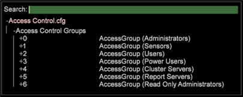

# Understanding Access Levels{#understanding-access-levels}

Access levels describe which URIs on the machine a group of users is permitted to read or modify.

 Follow these guidelines to define access levels as desired for your organization’s users:

* Specific URIs with no trailing slash character restrict access to that URI only. For example, [!DNL /Components/Communications.cfg] provides access to the [!DNL Communications.cfg]file only. 

* A trailing slash (/), specifying a directory, provides group members access to any URI that begins with that string. For example, /Profiles/ provides access to the entire Profiles directory. 
* A trailing dollar sign symbol ($) restricts access to the exact URI only, even if it is a directory. For example, /Profiles/$ provides access to read the main Profiles directory, but not to read any files within that directory.

  For access to specific files, you do not need to use a trailing $.

  For example, [!DNL /Components/Communications.cfg] and [!DNL /Components/Communications.cfg$] provide the same access. 

* A percent symbol (%) can be used with CN (Common Name) to permit access. For example, /Users/%CN%/ allows access to the User directory matching the SSL certificate common name of the [!DNL Insight] user. Note that this syntax can be used only once in a URI.

The URIs in the pre-defined access control groups have been configured as follows: 

<table id="table_8E6FDD741BF24E2DAD96A2919FAE6C7F"> 
 <thead> 
  <tr> 
   <th colname="col1" class="entry"> Group Name </th> 
   <th colname="col2" class="entry"> Read-Only Access </th> 
   <th colname="col3" class="entry"> Read-Write Access </th> 
   <th colname="col4" class="entry"> Description </th> 
  </tr> 
 </thead>
 <tbody> 
  <tr> 
   <td colname="col1"> 
Administrators 
 </td> 
   <td colname="col2"> </td> 
   <td colname="col3"> 
/ 
 </td> 
   <td colname="col4"> 
Read and write access to all  Insight Server directories. 
 </td> 
  </tr> 
  <tr> 
   <td colname="col1"> 
Sensors 
 </td> 
   <td colname="col2"> </td> 
   <td colname="col3"> 
/SensorInit.vsp 
 
/Submit.vsp 
 </td> 
   <td colname="col4"> 
Read and write access to the two files that the  Sensors use to communicate with the  Insight Server. 
 </td> 
  </tr> 
  <tr> 
   <td colname="col1"> 
Users 
 </td> 
   <td colname="col2"> 
/Profiles/ 
 
/Status/ 
 
/Software/ 
 
/Addresses/ 
 
/Users/$ 
 </td> 
   <td colname="col3"> /Users/%CN%/ </td> 
   <td colname="col4"> 
Read and write access to the User directory matching the SSL certificate common name of the  Insight user. 
 </td> 
  </tr> 
  <tr> 
   <td colname="col1"> 
Power Users 
 </td> 
   <td colname="col2"> 
/Profiles/$ 
 
/Status/ 
 
/Software/ 
 
/Addresses/ 
 
/Users/$ 
 </td> 
   <td colname="col3"> 
/Profiles/ 
 
/Users/%CN%/ 
 </td> 
   <td colname="col4"> 
Power Users are allowed the same access as Users, with the added ability to write to the Profiles directory. These users may edit profiles and enable changes to be updated automatically for other  Insight users, such as when distributing newly defined workspaces. 
 </td> 
  </tr> 
  <tr> 
   <td colname="col1"> 
Cluster Servers 
 </td> 
   <td colname="col2"> 
/Components for Processing Servers/ 
 
/Addresses/ 
 
/Profiles/ 
 
/Lookups/ 
 
/Access Control/ 
 
/Bin/ 
 
/Logs/ 
 </td> 
   <td colname="col3"> 
/Cluster/ 
 </td> 
   <td colname="col4"> 
Read and write access to the Cluster directory. 
 </td> 
  </tr> 
  <tr> 
   <td colname="col1"> 
Report Servers 
 </td> 
   <td colname="col2"> 
/Profiles/$ 
 
/Status/ 
 
/Software/ 
 
/Addresses/ 
 
/Users/$ 
 </td> 
   <td colname="col3"> 
/Profiles/ 
 
/Users/%CN%/ 
 
/ReportStatus.vsp 
 </td> 
   <td colname="col4"> 
Report machines are allowed the same access as Power Users, with the added ability to write to the  ReportStatus.vsp file. 
 </td> 
  </tr> 
 </tbody> 
</table>

**To configure Access Control**

When defining access control groups, you need to include all System Administrators, users, cluster servers, and Report Server users that require access to this [!DNL Insight Server] computer. You can grant access using IP address or SSL certificate information, such as the common name or organization.

>[!NOTE]
>
>When the [!DNL Access Control.cfg] file is changed on [!DNL Insight Server], all existing connections are terminated and forced to reconnect. Connections are checked against the permissions in the updated [!DNL Access Control.cfg] file. In the Servers Manager interface, the [!DNL Insight Server] icon turns red temporarily and then green again because connection is terminated and forced to reconnect along with all others.

1. On the [!DNL Admin] > [!DNL Dataset and Profile] tab, click the **[!UICONTROL Servers Manager]** thumbnail to open the Servers Manager workspace. 

1. Right-click the icon of the [!DNL Insight Server] you want to configure and click **[!UICONTROL Files]**. 

1. In the [!DNL Server Files Manager], click **[!UICONTROL Access Control]** to view its contents. The [!DNL Access Control.cfg] file is located within this directory. 

1. Right-click the check mark in the *server name* column for [!DNL Access Control.cfg] and click **[!UICONTROL Make Local]**. A check mark appears in the [!DNL Temp] column for [!DNL Access Control.cfg]. 

1. Right-click the newly created check mark in the [!DNL Temp] column and click **[!UICONTROL Open]** > **[!UICONTROL in Workstation]**. 

1. In the [!DNL Access Control.cfg] window, click **[!UICONTROL Access Control Groups]** to view its contents.

   

1. To add a new access control group:

    1. Right-click **[!UICONTROL Access Control Groups]** and click **[!UICONTROL Add new]** > **[!UICONTROL Group]**. 
    
    1. Right-click **[!UICONTROL Members]** and click **[!UICONTROL Add new]** > **[!UICONTROL Member]**.

       The members for the default groups are not pre-defined. By default, Administrator access is granted to 127.0.0.1 (local host), and [!DNL Sensor] access is granted to IP:&#42;. All other access control group members must be defined. 
    
    1. Complete the parameters.

1. To add new members to an existing access control group:

    1. Right-click **[!UICONTROL Members]** under the appropriate access control group and click **[!UICONTROL Add new]** > **[!UICONTROL Member]**.

1. Save the file by right-clicking **[!UICONTROL (modified)]** at the top of the window and then clicking **[!UICONTROL Save]**. 

1. To save the locally made changes to the [!DNL Insight Server] machine, in the [!DNL Server Files Manager], right-click the check mark for [!DNL Access Control.cfg] in the [!DNL Temp] column, then click **[!UICONTROL Save to]** *< **[!UICONTROL server name]**>*.

