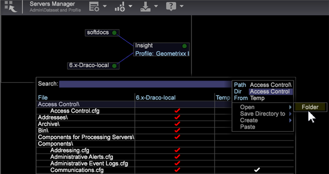
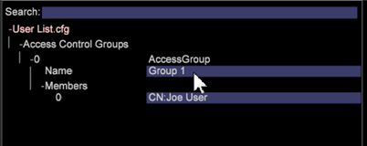
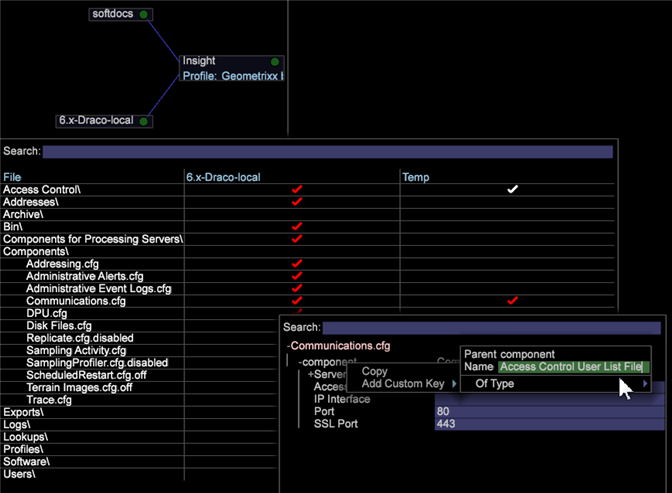
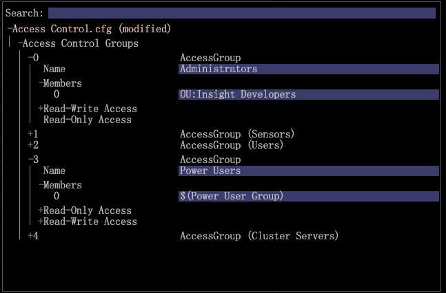

# User Administration of Group Member Access{#user-administration-of-group-member-access}

Administrators can give workstation users the partial ability to manage access control for custom groups.

**Self-administration of group member access** gives rights to non-administrators to add and delete members in a custom group. The administrator creates a **User List** file and sets up group access in the ** [ [!DNL Access Control.cfg] ](https://marketing.adobe.com/resources/help/en_US/insight/svrprod/?f=c_config_acs_ctrl)** file for the new group members.

**Accessing the Servers Manager**

Setting up the ** [!DNL User List]** file and synching it with the ** [!DNL Communications.cfg]** file is done in the **Servers Manager** workspace.

1. On the worktop, click the **Admin** tab > **Dataset and Profile** tab. 

1. Open the **Servers Manager** workspace. 
1. Right-click >*your server name*> in the diagram and select **Files**.

   The server files will open in a table with columns *File*, *<server name>*, and *Temp*. 

1. **Make Local** by right-clicking in the server column of a server file (for this feature ** [!DNL Access Control]** and ** [!DNL Components/Communications.cfg)]**.

   A white checkmark will appear in the **Temp** column. You can edit in the Temp folder. Then right-click the checkmark and **Save To** the server. (It turns red when synched with server).

## Create a User List.cfg file {#section-c25bcaf34f4546e6b8b65f5e7f69ac09}

The administrator needs to create a ** [!DNL User List.cfg]** file in the ** [!DNL Access Control]** folder.

1. Right-click** Access Control** row in the **Temp** column and select **Open** > **Folder**. 

   The Access Control folder in the **Temp** folder will open listing a single ** [!DNL Access Control.cfg]** file.

1. Add another text file to this folder and name it ** [!DNL User List.cfg]** (next to the ** [!DNL Access Control.cfg]**). 

1. Add the following parameters to the ** [!DNL User List.cfg] **file.

The User List file should contain a vector of **AccessGroup** objects, and each **AccessGroup** object should have a name and a vector of strings called **Members**.

```
Access Control Groups = vector: 1 items 
  0 = AccessGroup:  
    Name = string: Group 1 
    Members = vector: 1 items 
      0 = string: CN:Joe User
```

You can then edit and add users this in the Workstation view of the ** [!DNL User List.cfg]**file.



Here's the most basic parameters to add to the ** [!DNL User List.cfg]**file. The Members can then be added in the Workstation view.

```
Access Control Groups = vector: 1 items 
  0 = AccessGroup:  
    Name = string:  
    Members = vector: 0 items
```

>[!IMPORTANT]
>
>As with any ** [!DNL .cfg]** file that you manually edit, make sure to use spaces instead of tabs and to pay close attention to the whitespace and syntax. A mistake in this file will cause *Adobe Insight Server* to ignore the User List file.

The **Name** field in each **Access Group** will be referenced within the [!DNL Access Control.cfg] file.

>[!NOTE]
>
>Only valid members with directory service prefixes, such as **CN:** or **OU:** are accepted, and these cannot contain wildcard character (&#42;).

## Set up the Communications.cfg file {#section-9d6f05ba81c14f15be63e361533459e8}

An administrator first enables this feature by opening the ** [!DNL Components] > [!DNL Communications.cfg] **file and adding a new key with the name ** [!DNL Access Control User List File]**. The string value of this key is the path where this new file will be located.

1. From the server files, click **Components** and right-click the checkmark in the server column. Click **Make Local**.

   A white checkmark will appear in the **Temp** column. 

1. Right-click the checkmark in the **Temp** column and select **Open** > **in Workstation**. 

1. In the **Communication.cfg** file, right-click **component** and select **Add Custom Key.** 

1. Type the **Name** as *Access Control User List File* and set **Of Type** as *String*. 

   >[!NOTE]
   >
   >You cannot create the new list file as a Path. To remedy this, you need to save the file, open it in an editor (Notepad), and change "String" to "Path":

   Before:

   ```
   component = CommServer:  
     Access Control File = Path: Access Control\\Access Control.cfg 
     Access Control User List File =  
<b>string</b>: Access Control\\User List.cfg
   ```

   After:

   ```
   component = CommServer:  
     Access Control File = Path: Access Control\\Access Control.cfg 
     Access Control User List File =  
<b>Path</b>: Access Control\\User List.cfg
   ```

1. Save the ** [!DNL Communications.cfg] **file and (if necessary) save it to the server. This will restart components in the server to make sure you haven't made any mistakes that could prevent the ** [!DNL Communications.cfg] **file from being parsed. 
1. If your system includes processing servers, modify the configuration file in the ** [!DNL Components for Processing Servers.cfg] **file. 
1. Right-click ** [!DNL Communications.cfg]** and save to server.

The Data Workbench administrator can now confirm that the intended user(s) have access to the user list file and allow the users to manage the group. The user(s) will be able to open the User List file, edit it, and add and remove CN or OU members as needed.

## Synch up the Access Control.cfg file {#section-ca6da453dfb4432bb40b86ef15ede872}

The administrator can then edit the ** [!DNL Access Control.cfg]** and insert references to the group(s) defined by the *User List* file.

The references to the group(s) should be inserted just like any other member, but with the following syntax:

```
$(Group Name)
```

Where "Group Name" matches what's defined in the user list file, including white spaces. 

At this point the Data Workbench administrator can confirm that select group users have access to the user list file. The select users can then open the ** [!DNL User List.cfg]** file, edit it, and add and remove CN or OU members as needed. 
