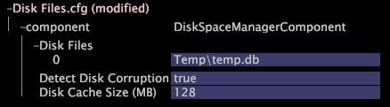

# Monitoring Dataset Data Space{#monitoring-dataset-data-space}

Information about dataset monitoring and adding new locations for dataset data storage.

 **Recommended Frequency:** Every 5-10 minutes

By default, [!DNL Insight Server] writes its dataset to the [!DNL temp.db] file on the same drive as the [!DNL Insight Server] program files on the Data Processing Unit. The amount of dataset data per [!DNL Insight Server] machine is limited to the following, whichever occurs first:

* Five hundred (500) million records of data input to that dataset 
* Five hundred (500) GB of dataset data stored 
* One (1) MB of dataset data stored per any one root-level dimension (for example, 5,000 records per Visitor at an average 200 bytes per record)

If you want [!DNL Insight Server] to maintain the dataset on a different drive, or if the amount of data you expect to collect requires the use of multiple drives, you must update the Disk Files configuration file ( [!DNL Disk Files.cfg]) to specify where you want [!DNL Insight Server] to write the [!DNL temp.db] file(s). The [!DNL Disk Files.cfg] file lists the disk files (a vector of strings) and specifies the location of the dataset data used by [!DNL Insight Server] during reprocessing and operation. There is usually one file per physical drive.

>[!NOTE]
>
>The contents of the [!DNL Disk Files.cfg] file may have been modified while installing [!DNL Insight Server]. For more information, see [Configuring the Location of the Dataset (temp.db)](../../../../home/c-inst-svr/c-install-ins-svr/t-install-proc-inst-svr-dpu/t-cfg-loc-dtst.md#task-f645eefecb154e679acbb480a07c1f0e).

**To add new locations for dataset data storage** 

1. In [!DNL Insight], on the [!DNL Admin] > [!DNL Dataset and Profile] tab, click the **[!UICONTROL Servers Manager]** thumbnail to open the Servers Manager workspace.
1. Right-click the icon of the [!DNL Insight Server] you want to configure and click **[!UICONTROL Server Files]**.
1. In the [!DNL Server Files Manager], click **[!UICONTROL Components]** to view its contents. The [!DNL Disk Files.cfg] file is located within this directory.
1. Right-click the check mark in the *server name* column for [!DNL Disk Files.cfg] and click **[!UICONTROL Make Local]**. A check mark appears in the [!DNL Temp] column for [!DNL Disk Files.cfg].
1. Right-click the newly created check mark in the [!DNL Temp] column and click **[!UICONTROL Open]** > **[!UICONTROL in Insight]**.
1. In the [!DNL Disk Files.cfg] window, click **[!UICONTROL component]** to view its contents.

   

   >[!NOTE]
   >
   >The Detect Disk Corruption parameter is set to true by default. The Disk Cache Size (MB) parameter controls the amount of memory that [!DNL Insight Server] uses to increase disk access speed and is set to 128 by default. Please contact Adobe before changing either of these parameters.

1. To change the disk files on the [!DNL Insight Server] machine, right-click **[!UICONTROL Disk Files]** and click **[!UICONTROL Add new]** > **[!UICONTROL Disk File]**.

   To delete a disk file, right-click the disk file number and click **[!UICONTROL Remove]**. 

1. For the new disk file, enter the directory and name of the file to be used by [!DNL Insight Server] during reprocessing and operation.

   

   >[!NOTE]
   >
   >The Detect Disk Corruption parameter is set to true by default. The Disk Cache Size (MB) parameter controls the amount of memory that [!DNL Insight Server] uses to increase disk access speed and is set to 128 by default. Please contact Adobe before changing either of these parameters.

1. Save your changes to the server by doing the following:

    1. Right-click **[!UICONTROL (modified)]** at the top of the window and click **[!UICONTROL Save]**. 
    
    1. In the [!DNL Server Files Manager], right-click the check mark for the file in the [!DNL Temp] column and select **[!UICONTROL Save to]** > *< **[!UICONTROL server name]**>*.

