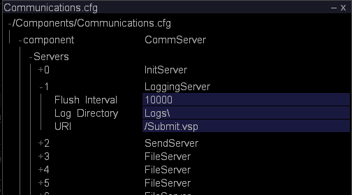
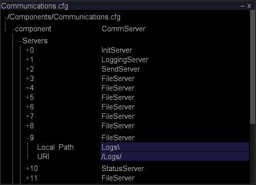

# Monitoring Event Data Space{#monitoring-event-data-space}

Information about monitoring event data space and changing the log directory for Sensor data.

 **Recommended Frequency:** Every 5-10 minutes

[!DNL Insight Server] stores one log file per [!DNL Sensor] per day on either the Data Processing Unit or the File Server Unit, depending on your configuration. The size of the log files and the amount of data storage space required for them depends on many variables, including, for example, the number of websites being logged and the number of requests your web servers receive per second.

A typical installation of [!DNL Insight Server] (or an [!DNL Insight Server] cluster) is capable of storing multiple terabytes of data, assuming that the implementation uses the hardware recommended by Adobe for the [!DNL Insight Server] machine(s).

Typically, all log data remains present on the [!DNL Insight Server] machine. If it becomes necessary to make more data storage space available on the machine, you can move all but the most current day’s log files to another machine or data storage medium (zip drive, tape, and so forth). Moving the data does not require you to stop [!DNL Insight Server], and it does not affect the functionality available in any [!DNL Insights] that may be connected to [!DNL Insight Server] and working with continuous data. Provided that you do not process or reprocess an analysis dataset, you retain access to all previous data and new data continues to be available in [!DNL Insight]. If you process or reprocess an analysis dataset, you can not access the data until processing is complete.

By default, event data produced by [!DNL Sensor] and transmitted to [!DNL Insight Server] is stored in the [!DNL Logs] folder within the [!DNL Insight Server] installation directory. The Communications configuration file, [!DNL Communications.cfg], specifies the location of event data log files that are read by [!DNL Insight Server].

**To change the log directory for [!DNL Sensor] data ** 

1. In [!DNL Insight], on the [!DNL Admin] > [!DNL Dataset and Profile] tab, click the **[!UICONTROL Servers Manager]** thumbnail to open the Servers Manager workspace.
1. Right-click the icon of the [!DNL Insight Server] you want to configure and click **[!UICONTROL Server Files]**.
1. In the [!DNL Server Files Manager], click **[!UICONTROL Components]** to view its contents. The [!DNL Communications.cfg] file is located within this directory.
1. Right-click the check mark in the *server name* column for [!DNL Communications.cfg] and click **[!UICONTROL Make Local]**. A check mark appears in the [!DNL Temp] column for [!DNL Communications.cfg].
1. Right-click the newly created check mark in the [!DNL Temp] column and click **[!UICONTROL Open]** > **[!UICONTROL in Insight]**.
1. In the [!DNL Communications.cfg] window, click **[!UICONTROL component]** to view its contents.
1. In the [!DNL Communications.cfg] window, click **[!UICONTROL Servers]** to view its contents. Several types of servers may appear: File Servers, Logging Servers, Init Servers, Status Servers, Send Servers, or Replicate Servers.
1. Find the LoggingServer, which is where [!DNL Sensor] writes its log files to be processed by [!DNL Insight Server], and click its number to view the menu.

   

   The default log directory is the [!DNL Logs] folder within the [!DNL Insight Server] installation directory. 

1. Edit the Log Directory parameter to reflect the desired location of the log files.

   >[!NOTE]
   >
   >Do not modify any other parameters for the LoggingServer.

   

   Several FileServers may be listed under the Servers node, so you may need to view the contents of many of them (by clicking their numbers in the [!DNL Servers] list) to find the server with a Local Path of Logs\ to be modified. 

1. Edit the Local Path to reflect the desired location of the [!DNL .vsl] files.

   >[!NOTE]
   >
   >Do not modify any other parameters for the FileServer.

   Although the location of the log files has been changed in the [!DNL Communications.cfg] file, you can map these files to the Logs directory of the [!DNL Server Files Manager] by specifying /Logs/ as the URI for the FileServer. 

1. Save your changes to the server by doing the following:

    1. Right-click **[!UICONTROL (modified)]** at the top of the window and click **[!UICONTROL Save]**. 
    
    1. In the [!DNL Server Files Manager], right-click the check mark for the file in the [!DNL Temp] column and select **[!UICONTROL Save to]** > *< **[!UICONTROL server name]**>*.

