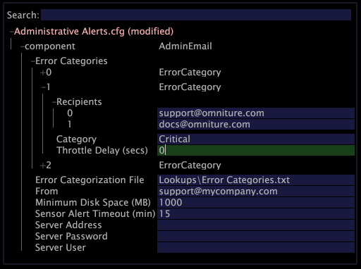

# Configuring Administrative Alerts{#configuring-administrative-alerts}

Administrative alerts send email notifications to the specified email addresses when errors are detected by the Insight Server during the normal course of operation.

 **Recommended Frequency:** Prior to production

>[!NOTE]
>
>The use of administrative alerts requires that [!DNL Insight Server] has access to a forwarding SMTP server to send alerts by email.

The recipients of the email notifications should be key systems administration personnel and primary stakeholders.

The Administrative Alerts file, [!DNL Administrative Alerts.cfg], is used to configure the administrative alerts for [!DNL Insight Server].

>[!NOTE]
>
>If you are running a cluster, you must create or modify alerts on the master [!DNL Insight Server] in the cluster.

**To create or modify an administrative alert** 

1. In [!DNL Insight], on the [!DNL Admin] > [!DNL Dataset and Profile] tab, click the **[!UICONTROL Servers Manager]** thumbnail to open the Servers Manager workspace.
1. Right-click the icon of the [!DNL Insight Server] you want to configure and click **[!UICONTROL Server Files]**.
1. In the [!DNL Server Files Manager], click **[!UICONTROL Components]** to view its contents. The [!DNL Administrative Alerts.cfg] file is located within this directory.
1. Right-click the check mark in the *server name *column for [!DNL Administrative Alerts.cfg] and click **[!UICONTROL Make Local]**. A check mark appears in the [!DNL Temp] column for [!DNL Administrative Alerts.cfg].
1. Right-click the newly created check mark in the [!DNL Temp] column and click **[!UICONTROL Open]** > **[!UICONTROL in Insight]**.
1. In the [!DNL Administrative Alerts.cfg] window, click **[!UICONTROL component]** to view its contents.
1. Fill out the parameters as desired. For a list of the parameters available in this file, see [Administrative Alerts Configuration Settings](../../../home/c-inst-svr/c-cfg-stgs-ref/c-admin-alts-cfg-stgs.md#concept-14c3c3ed797f47c5900ec04cae2fc491).

   

1. Save your changes to the server by doing the following:

    1. Right-click **[!UICONTROL (modified)]** at the top of the window and click **[!UICONTROL Save]**. 
    
    1. In the [!DNL Server Files Manager], right-click the check mark for the file in the [!DNL Temp] column and select **[!UICONTROL Save to]** > *< **[!UICONTROL server name]**>*.

1. (Optional) If you are working in a cluster and you want the same administrative alerts applied to each Data Processing Unit, you must copy and paste the updated [!DNL Administrative Alerts.cfg] file into the [!DNL Components for Processing Servers] folder within the master [!DNL Insight Server] installation directory.
