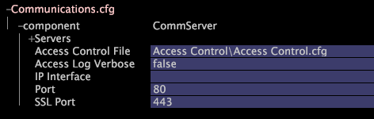

# Configuring Communications{#configuring-communications}

The Communications configuration file, Communications.cfg, contains Insight Server network settings and the path to the Access Control.cfg file.

 These settings help you to connect to [!DNL Insight Server].

**Recommended Frequency:** Only when necessary

**To view and modify communications settings in [!DNL Insight]** 

1. In [!DNL Insight], on the [!DNL Admin] > [!DNL Dataset and Profile] tab, click the **[!UICONTROL Servers Manager]** thumbnail to open the Servers Manager workspace.
1. Right-click the icon of the [!DNL Insight Server] you want to configure and click **[!UICONTROL Server Files]**.
1. In the [!DNL Server Files Manager], click **[!UICONTROL Components]** to view its contents. The [!DNL Communications.cfg] file is located within this directory.
1. Right-click the check mark in the *server name* column for [!DNL Communications.cfg] and click **[!UICONTROL Make Local]**. A check mark appears in the [!DNL Temp] column for [!DNL Communications.cfg].
1. Right-click the newly created check mark in the [!DNL Temp] column and click **[!UICONTROL Open]** > **[!UICONTROL in Insight]**.
1. In the [!DNL Communications.cfg] window, click **[!UICONTROL component]** to view its contents.
1. Change the settings, as necessary. For information about the parameters available in this file, see [Communications Configuration Settings](../../../home/c-inst-svr/c-cfg-stgs-ref/c-comm-cfg-stgs.md#concept-aed00587c7a1432fb487bd154aaea6b1).

   

1. Save your changes to the server by doing the following:

    1. Right-click **[!UICONTROL (modified)]** at the top of the window and click **[!UICONTROL Save]**. 
    
    1. In the [!DNL Server Files Manager], right-click the check mark for the file in the [!DNL Temp] column and select **[!UICONTROL Save to]** > *< **[!UICONTROL server name]**>*.

