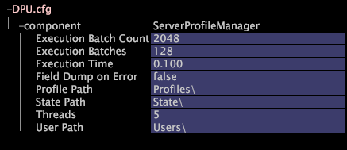

# Configuring DPU.cfg{#configuring-dpu-cfg}

The DPU configuration file, DPU.cfg, specifies various performance parameters for Insight Server.

 How you set these parameters depends on your dataset size and many other factors. Please contact Adobe Consulting Services for help with performance tuning.

**Recommended Frequency:** Only when necessary

**To change [!DNL Insight Server] DPU performance settings** 

1. In [!DNL Insight], on the [!DNL Admin] > [!DNL Dataset and Profile] tab, click the **[!UICONTROL Servers Manager]** thumbnail to open the Servers Manager workspace.
1. Right-click the icon of the [!DNL Insight Server] you want to configure and click **[!UICONTROL Server Files]**.
1. In the [!DNL Server Files Manager], click **[!UICONTROL Components]** to view its contents. The [!DNL DPU.cfg] file is located within this directory.
1. Right-click the check mark in the *server name* column for [!DNL DPU.cfg] and click **[!UICONTROL Make Local]**. A check mark appears in the [!DNL Temp] column for [!DNL DPU.cfg].
1. Right-click the newly created check mark in the [!DNL Temp] column and click **[!UICONTROL Open]** > **[!UICONTROL in Insight]**.
1. In the [!DNL DPU.cfg] window, click component to view its contents.
1. Change performance and path settings, as necessary. For a list of the parameters available in this file, see [DPU Performance Settings](../../../home/c-inst-svr/c-cfg-stgs-ref/c-dpu-perf-stgs.md#concept-477c4c526de44bda84176e62266c3df1).

   >[!NOTE]
   >
   >Please contact Adobe before changing any of the parameters in this file.

   

1. Save your changes to the server by doing the following:

    1. Right-click **[!UICONTROL (modified)]** at the top of the window and click **[!UICONTROL Save]**. 
    
    1. In the [!DNL Server Files Manager], right-click the check mark for the file in the [!DNL Temp] column and select **[!UICONTROL Save to]** > *< **[!UICONTROL server name]**>*.
