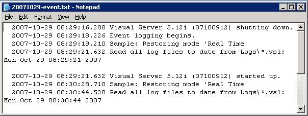
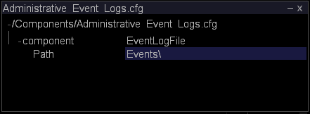

# Monitoring Administrative Events{#monitoring-administrative-events}

You should regularly monitor your event log files to track Insight Server system event messages, which are logged to the <YYYYMMDD>-event.txt files located by default in the Events folder within the Insight Server installation directory.

 **Recommended Frequency:** Every 5-10 minutes

You can monitor these events using the [!DNL Server Files Manager] in [!DNL Insight], your automated management tool, the [!DNL *-event.txt] files, or the Windows Event Viewer.

>[!NOTE]
>
>The Administrative Event Logs are completely separate from your Windows Events Log, but contains some of the same events. The Administrative Event Logs contain information only about [!DNL Insight Server] events.

**To view events.txt files through the [!DNL Server Files Manager]** 

1. In [!DNL Insight], on the [!DNL Admin] > [!DNL Dataset and Profile] tab, click the **[!UICONTROL Servers Manager]** thumbnail to open the Servers Manager workspace.
1. Right-click the icon of an active [!DNL Insight Server] and click **[!UICONTROL Server Files]**.
1. In the [!DNL Server Files Manager], click **[!UICONTROL Events]** to view its contents.
1. Right-click the check mark in the *server name* column next to the desired file and click **[!UICONTROL Make Local]**. A check mark appears next to the file name in the [!DNL Temp] column.
1. Right-click the check mark in the [!DNL Temp] column and click **[!UICONTROL Open]** > **[!UICONTROL in Notepad]**. The event file appears in a new Microsoft Windows Notepad window.

   

   The [!DNL Server.log] file in the [!DNL Trace] folder within the [!DNL Insight Server] installation directory contains more detailed logging information. 

**To view Events through the Windows Event Viewer**

* Click **[!UICONTROL Start]** > **[!UICONTROL Control Panel]** > **[!UICONTROL Administrative Tools]** > **[!UICONTROL Event Viewer]**.

**To change the Administrative Events Log directory**

The Administrative Event Logs configuration file, [!DNL Administrative Events Log.cfg], specifies the directory to which event logging is output.

1. In [!DNL Insight], on the [!DNL Admin] > [!DNL Dataset and Profile] tab, click the **[!UICONTROL Servers Manager]** thumbnail to open the Servers Manager workspace. 

1. Right-click the icon of the [!DNL Insight Server] you want to configure and click **[!UICONTROL Server Files]**. 

1. In the [!DNL Server Files Manager], click **[!UICONTROL Components]** to view its contents. The [!DNL Administrative Event Logs.cfg] file is located within this directory. 

1. Right-click the check mark in the *server name* column for [!DNL Administrative Event Logs.cfg] and click **[!UICONTROL Make Local]**. A check mark appears in the [!DNL Temp] column for [!DNL Administrative Event Logs.cfg]. 

1. Right-click the newly created check mark in the [!DNL Temp] column and click **[!UICONTROL Open]** > **[!UICONTROL in Insight]**. 

1. In the [!DNL Administrative Event Logs.cfg] window, click **[!UICONTROL component]** to view its contents. The default path is the [!DNL Events] folder within the [!DNL Insight Server] installation directory.

   

1. In the Path parameter, type the name of the directory to which you want to output event logging data. 
1. Save your changes to the server by doing the following:

    1. Right-click **[!UICONTROL (modified)]** at the top of the window and click **[!UICONTROL Save]**. 
    
    1. In the [!DNL Server Files Manager], right-click the check mark for the file in the [!DNL Temp] column and select **[!UICONTROL Save to]** > *< **[!UICONTROL server name]**>*.

