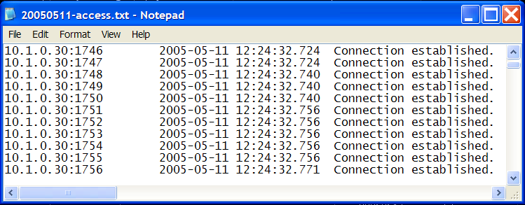

# Monitoring Audit Logs{#monitoring-audit-logs}

Audit log files track all attempted connections to and disconnections from Insight Server, each of which is logged in the `<YYYYMMDD>-access.txt` files located by default in the Audit folder within the Insight Server installation directory.

 **Recommended Frequency:** Daily or as needed for troubleshooting

Audit logs can be very helpful when troubleshooting issues connecting to [!DNL Insight Server]. You can monitor these logs using your automated management tool or by viewing the [!DNL access.txt] files directly.

**To view access.txt files through the [!DNL Server Files Manager]** 

1. In [!DNL Insight], on the [!DNL Admin] > [!DNL Dataset and Profile] tab, click the **[!UICONTROL Servers Manager]** thumbnail to open the Servers Manager workspace.
1. Right-click the icon of an active [!DNL Insight Server] and click **[!UICONTROL Server Files]**.
1. In the [!DNL Server Files Manager], click **[!UICONTROL Audit]** to view its contents.
1. Right-click the check mark in the *server name* column next to the desired file and click **[!UICONTROL Make Local]**. A check mark appears next to the file name in the [!DNL Temp] column.
1. Right-click the new check mark in the [!DNL Temp] column and click **[!UICONTROL Open]** > **[!UICONTROL in Notepad]**. The audit log appears in a new Microsoft Windows Notepad window.

   

