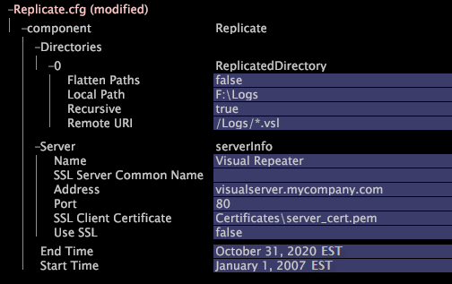

# Configuring the Replication Service{#configuring-the-replication-service}

You must configure the target Insight Server(s) to retrieve data from the Repeater on which the original event data is stored.

To configure the retrieval of data from a [!DNL Repeater] to a target [!DNL Insight Server], you must edit the [!DNL Replicate.cfg] file provided in the [!DNL Components] folder on the target [!DNL Insight Server(s)] as described in the following procedure:

**To configure the [!DNL Replication Service] on the target machine** 

1. In [!DNL Insight], on the [!DNL Admin] > [!DNL Dataset and Profile] tab, click the **[!UICONTROL Servers Manager]** thumbnail to open the Servers Manager workspace.
1. Right-click the icon of the target [!DNL Insight Server] you want to configure and click **[!UICONTROL Server Files]**.
1. In the [!DNL Server Files Manager], click **[!UICONTROL Components]** to view its contents. The [!DNL Replicate.cfg] file is located within this directory.
1. Right-click the check mark in the *server name* column for [!DNL Replicate.cfg] and click **[!UICONTROL Make Local]**. A check mark appears in the [!DNL Temp] column for [!DNL Replicate.cfg].
1. Right-click the newly created check mark in the [!DNL Temp] column and click **[!UICONTROL Open]** > **[!UICONTROL in Insight]**. The [!DNL Replicate.cfg] window opens.
1. In the [!DNL Replicate.cfg] window, click **[!UICONTROL Replicate.cfg]**, then **[!UICONTROL component]** to view its contents.
1. Edit the parameters using the following example and table as guides:

       

    <table id="table_F32D4BFA2D834BBB81DF8F84417CA969"> 
 <thead> 
  <tr valign="top"> 
   <th colname="col1" class="entry"> For this parameter... </th> 
   <th colname="col2" class="entry"> Specify... </th> 
  </tr> 
 </thead>
 <tbody> 
  <tr valign="top"> 
   <td colname="col1"> Directories </td> 
   <td colname="col2"> 
The directories on the  Repeater that are to be copied (replicated) to the target  Insight Server. The  Replication Service allows the replication of multiple directories from a single  Repeater. 
 
To add a new directory, right-click  Directories and click  Add new &gt;  Directory. 
 </td> 
  </tr> 
  <tr valign="top"> 
   <td colname="col1"> Flatten Paths </td> 
   <td colname="col2"> 
True or false. The action defined by this parameter’s setting depends on the setting of the Recursive parameter in this file: 
     <ul id="ul_D4BF3C22FBEF41C290ED938EB57E0F27">
      <li id="li_CB85E5AF9E1B4441AA38C2DB8D4F1800">If Recursive is false, Flatten Paths has no effect. Only the files at the top level of the directory specified by the Remote URI parameter are replicated. </li>
      <li id="li_8FDB351102344E3995035557445354BB">If Recursive is true and Flatten Paths is false, the directory structure of the remote ( Repeater) directory is duplicated exactly in the local path on the target  Insight Server. </li>
      <li id="li_3114B191C73744658799E112C61AB004">If both Recursive and Flatten Paths are true, no subdirectories are created in the local path. Instead, all files from the remote directory tree are placed in the top level of the local directory. </li>
     </ul>
 
 
Note: If both Flatten Paths and Recursive are true and files in the various subdirectories on the remote machine share the same name(s), the  Replication Service may stop or other undefined behavior may occur. 
 
 </td> 
  </tr> 
  <tr valign="top"> 
   <td colname="col1"> Local Path </td> 
   <td colname="col2">The storage location for the files retrieved from  Repeater. The path is relative to the  Insight Server installation directory. </td> 
  </tr> 
  <tr valign="top"> 
   <td colname="col1"> Recursive </td> 
   <td colname="col2"> True or false. If false, only the files at the top level of the directory specified by the Remote URI parameter are replicated. See Flatten Paths in this table. </td> 
  </tr> 
  <tr valign="top"> 
   <td colname="col1"> Remote URI </td> 
   <td colname="col2">The URI, including a file mask, to access the  Repeater’s file store. The  Communications.cfg file on the  Repeater should be configured so that the event data can be accessed using this URI. See <a href="../../../home/c-inst-svr/c-admin-inst-svr/c-mntr-disk-spc/t-mntr-evt-data-spc.md#task-a54d4bd16b96437f943cd09e5d848440" format="dita" scope="local"> Monitoring Event Data Space</a>. </td> 
  </tr> 
  <tr valign="top"> 
   <td colname="col1"> Server </td> 
   <td colname="col2">Parameters for the  Repeater from which the target  Insight Server retrieves event data files. </td> 
  </tr> 
  <tr valign="top"> 
   <td colname="col1"> Name </td> 
   <td colname="col2">Optional. The name to identify the  Repeater. </td> 
  </tr> 
  <tr valign="top"> 
   <td colname="col1"> SSL Server Common Name </td> 
   <td colname="col2">Required only if Use SSL is set to true. Common name of the  Repeater on which the event data is stored. This name must match the common name listed in the communications certificate for the machine. </td> 
  </tr> 
  <tr valign="top"> 
   <td colname="col1"> Address </td> 
   <td colname="col2">Host name or numeric IP address of the  Repeater on which the event data is stored. The server’s common name is not a valid entry. </td> 
  </tr> 
  <tr valign="top"> 
   <td colname="col1"> Port </td> 
   <td colname="col2"> Port used for data transmission. The default port is 80. </td> 
  </tr> 
  <tr valign="top"> 
   <td colname="col1"> SSL Client Certificate </td> 
   <td colname="col2">Required only if Use SSL is set to true. Name of the license certificate used to connect to the  Repeater. </td> 
  </tr> 
  <tr valign="top"> 
   <td colname="col1"> Use SSL </td> 
   <td colname="col2"> 
Determines whether SSL is used for the data transmission. The options are true or false, and the default value is false. 
 
 
Note: Using SSL is not recommended because it can negatively affect performance. Note that SSL is not required unless the network connecting the  Repeater to the target machines is insecure. 
 
 </td> 
  </tr> 
  <tr valign="top"> 
   <td colname="col1"> End Time, Start Time </td> 
   <td colname="col2"> 
(Optional) Limits the set of event data files copied to the target  Insight Server to those that contain data in the range defined by Start Time and End Time. If Start Time is set, event data files in which all log entries are from earlier than the specified start time are not copied. If End Time is set, event data files in which all log entries from the time specified or later are not copied. If only part of the data in a file is in the specified range, then the entire file is copied to the target machine. 
 
Adobe recommends using one of the following formats for the time: 
     <ul id="ul_AE15A159A4C043398B37AD56FDFD9DCA">
      <li id="li_4DEF0F13D13E43E39CBD1A0F32765F32">January 1 2013 HH:MM:SS EDT </li>
      <li id="li_E3275312E93D4C1FAA028543DC21B51A">Jan 1 2013 HH:MM:SS GMT </li>
     </ul>
 
 
Note: You must specify a time zone. The time zone does not default to system time if not specified. If you wish to implement Daylight Saving Time or a similar clock-shifting policy, you must save the  .dst file containing the appropriate rules in the Base\Dataset\Timezone directory on the  Insight Server machine. For a list of supported time zone abbreviations and information about implementing Daylight Saving Time, see <a href="../../../home/c-inst-svr/c-time-zn-cds.md#concept-eed5ba32d5d347cf94b76db83b29f211" format="dita" scope="local"> Time Zone Codes</a>. 
 
 
 
Note:  To use these settings, the names of the event data files must begin with an ISO date (YYYYMMDD), and each file must contain data for the 24-hour period starting at 12 AM GMT on that date. 
 
 </td> 
  </tr> 
 </tbody> 
</table>

1. Save your changes to the server by doing the following:

    1. Right-click **[!UICONTROL (modified)]** at the top of the window and click **[!UICONTROL Save]**. 
    
    1. In the [!DNL Server Files Manager], right-click the check mark for the file in the [!DNL Temp] column and select **[!UICONTROL Save to]** > *< **[!UICONTROL server name]**>*.

This example illustrates how files are copied if both the Flatten Paths and Recursive parameters are set to true.

Suppose Remote URI is [!DNL /RemoteRoot/] and Local Path is [!DNL E:\LocalRoot\]. On the remote ( [!DNL Repeater]) machine, the files are organized as follows:

* [!DNL /RemoteRoot/fileA.txt]
* [!DNL /RemoteRoot/Dir1/fileB.txt]
* [!DNL /RemoteRoot/Dir2/Subdir3/fileC.txt]

When replication is complete, the local directory has the following files:

* [!DNL E:\LocalRoot\fileA.txt] 
* [!DNL E:\LocalRoot\fileB.txt] 
* [!DNL E:\LocalRoot\fileC.txt]

In the local directory, no subdirectories are created, and all files from the remote directory tree are placed in the top level of the local directory.

>[!NOTE]
>
>If files in the various subdirectories on the remote machine share the same name(s), the [!DNL Replication Service] may stop or other undefined behavior may occur.

