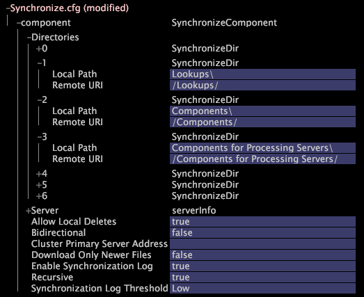

# Adding an Insight Server FSU to an Existing Cluster{#adding-an-insight-server-fsu-to-an-existing-cluster}

You may want to add an Insight Server FSU to an existing cluster if you want to store source data on an additional file server or if you want to set up a back up for your master Insight Server.

 To add an [!DNL Insight Server] FSU to an existing cluster, you must perform the following procedures:

1. [Updating the Configuration Files on the Master Server](../../../../../home/c-inst-svr/c-install-ins-svr/c-ins-svr-clstrs/c-add-ins-svrs-ex-clstr/c-add-fsu-ex-clstr.md#section-b5f21f2edb35493da4475de2cdeefca1) 
1. [Installing the New Insight Server FSU](../../../../../home/c-inst-svr/c-install-ins-svr/c-ins-svr-clstrs/c-add-ins-svrs-ex-clstr/c-add-fsu-ex-clstr.md#section-dddad299dd8642aa91cbe19a395ef3f4) 
1. [Configuring the New Insight Server FSU](../../../../../home/c-inst-svr/c-install-ins-svr/c-ins-svr-clstrs/c-add-ins-svrs-ex-clstr/c-add-fsu-ex-clstr.md#section-c39334c5bd754d5b98d41ad094333108)

## Updating the Configuration Files on the Master Server {#section-b5f21f2edb35493da4475de2cdeefca1}

In [!DNL Insight], open up the [!DNL Server Files Manager] for your master [!DNL Insight Server] (usually an [!DNL Insight Server] FSU) and do the following for each FSU that you want to add to the cluster:

1. Edit the address file on the master [!DNL Insight Server] to include the name and address of the new FSU as described in [Adding the Processing Insight Servers to the Address File](../../../../../home/c-inst-svr/c-install-ins-svr/c-ins-svr-clstrs/c-inst-ins-svr-clstr/c-inst-proc-clstr/c-config-mstr-ins-svr-clstr.md#section-2fe5298180164e8dbaa59ea6b6ff682d). Add the name and address of the new FSU to the group in which your cluster’s current [!DNL Insight Servers] are listed. 

1. Edit the access control file on the master [!DNL Insight Server] to include the IP address of the new FSU as described in [Updating the Access Control File for a Cluster](../../../../../home/c-inst-svr/c-install-ins-svr/c-ins-svr-clstrs/c-inst-ins-svr-clstr/c-inst-proc-clstr/c-config-mstr-ins-svr-clstr.md#section-fce1367d92a445168c35e9ca506e7d6b).

## Installing the New Insight Server FSU {#section-dddad299dd8642aa91cbe19a395ef3f4}

1. On your current FSU, make a zip file of the [!DNL Insight Server] installation directory and copy the file to the new FSU. 
1. Unzip the file to the location where you wish to place the [!DNL Insight Server] software. 
1. Download and install the digital certificate for the new FSU as described in [Downloading and Installing the Digital Certificates](../../../../../home/c-inst-svr/c-install-ins-svr/t-install-proc-inst-svr-dpu/c-dnld-dgtl-cert/c-dnld-dgtl-cert.md#concept-4f79c240492f4e52b6375b4b3bbefa17). 
1. Set the Windows memory utilization parameters on the new FSU. 
1. Change the name of the [!DNL .address] file to reflect the name of the FSU as described in [Defining the Server's Network Location](../../../../../home/c-inst-svr/c-install-ins-svr/t-install-proc-inst-svr-dpu/c-svrs-ntwk-loc/c-svrs-ntwk-loc.md#concept-87dd2aa3448c415ca1285bc445a8c649). 

1. If the drive structure on the new FSU is different than that on the primary FSU, you need to edit the [!DNL Disk Files.cfg] file.

    1. Open the [!DNL Disk Files.cfg] file on the new FSU. 
    1. Update the settings to match the drives of the primary FSU as described in [Monitoring Dataset Data Space](../../../../../home/c-inst-svr/c-admin-inst-svr/c-mntr-disk-spc/t-mntr-dtst-data-spc.md#task-6223fa2c718845678824a0a96df96a03). 
    1. Save the file locally and to the server.

1. Register [!DNL Insight Server] as a Windows service on the new FSU machine as described in [Registering Insight Server as a Windows Service](../../../../../home/c-inst-svr/c-install-ins-svr/t-install-proc-inst-svr-dpu/c-reg-wdws-svc.md#concept-f2c7aa891d544a2595aa01d0d796a540). 

1. Repeat steps 1 through 6 for each additional FSU that you are adding to the cluster.

## Configuring the New Insight Server FSU {#section-c39334c5bd754d5b98d41ad094333108}

The following procedures provide instructions for specific configuration tasks. Follow the instructions that are appropriate to your implementation of the new FSU.

**To configure the FSU for source data storage**

If the new FSU stores additional source data for the dataset running on the cluster, you must complete the file server configuration process as described in Configuring an [!DNL Insight Server] File Server Unit in the Log Processing Configuration File chapter of the *Dataset Configuration Guide*.

**To make to new FSU the backup for the master [!DNL Insight Server] FSU**

If you wish to make the new FSU the backup for the master [!DNL Insight Server] (which serves as an FSU for the cluster), you must modify the synchronization file on the new (backup) FSU so that it synchronizes with the master FSU.

1. On the backup [!DNL Insight Server] FSU, use the [!DNL Server Files Manager] to copy the [!DNL Synchronize.cfg] file in the [!DNL Components for Processing Servers] folder to the [!DNL Components] folder. 

1. Open the [!DNL Synchronize.cfg] file (in the [!DNL Components] folder) in [!DNL Insight]. 

1. Find the SynchronizeDir that specifies the location of the Components directory. There may be several synchronize directories listed under Directories, so you may need to view the contents for many of them (by clicking the server number) to find the desired server). 
1. Edit the SynchronizeDir entry and add a second SynchronizeDir entry as shown in the example below.

   

1. Save the modified file with a new name such as [!DNL FSU_Synchronize.cfg] so that you do not confuse it with the [!DNL Synchronize.cfg] files on the DPUs in the cluster. 

1. Use the [!DNL Server Files Manager] to save the local copy of the renamed file to the server. The backup FSU downloads the files in the identified directories from the master [!DNL Insight Server] FSU and dynamically retrieves updated copies of these files from the master [!DNL Insight Server] FSU when they change.

