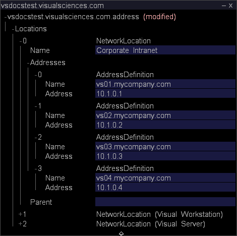
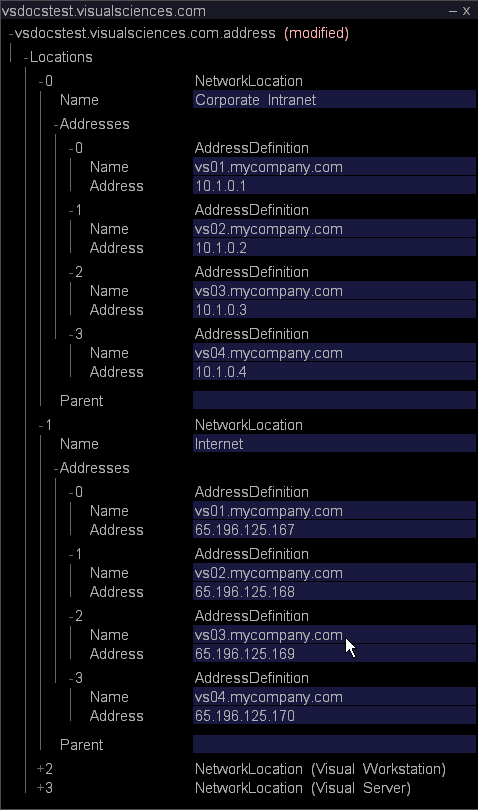
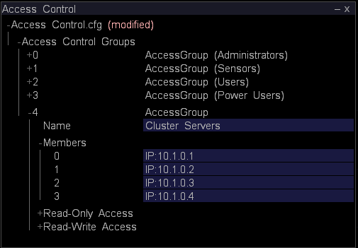
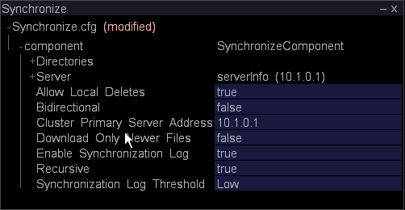
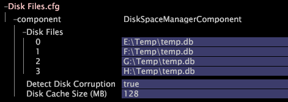

# Configuring the Master Insight Server for Clustering{#configuring-the-master-insight-server-for-clustering}

Information about configuring the cluster on the Master Insight Server, updating the access control file for a cluster, and more.

To configure the cluster, perform the following steps on the master [!DNL Insight Server]:

* Add the processing [!DNL Insight Servers’] common names and addresses to the address file. 
* Add all of the [!DNL Insight Servers] to the Cluster Servers group in the [!DNL Access Control.cfg] file. 

* Update the [!DNL Synchronize.cfg] file in the Components for Processing Servers directory to point to the master [!DNL Insight Server]. 

* If necessary, modify the [!DNL Disk Files.cfg] file in the Components for Processing Servers directory to specify the location of the [!DNL temp.db] file on the processing [!DNL Insight Servers].

To complete these steps, you need to know the common names (as specified on the digital certificates for the individual [!DNL Insight Server]) and the IP addresses of each [!DNL Insight Server] in the cluster. If you do not already have this information, obtain it before you proceed.

>[!NOTE]
>
>The procedures described in this section require [!DNL Insight]. If you have not installed [!DNL Insight], follow the instructions in the **[!DNL Insight] User Guide** before proceeding.

## Adding the Processing Insight Servers to the Address File {#section-2fe5298180164e8dbaa59ea6b6ff682d}

Use the following procedure to add the processing [!DNL Insight Servers’] common names and IP addresses to the address file on the master [!DNL Insight Server]. (Although the address file is maintained and administered on the master [!DNL Insight Server], it is used by all the [!DNL Insight Servers] in the cluster.)

>[!NOTE]
>
>The following assumes that the address file has already been configured for the master [!DNL Insight Server]. If you have not already added the master [!DNL Insight Server’s] IP address(es) to the address file, complete the procedure described in [Defining the Server's Network Location](../../../../../../home/c-inst-svr/c-install-ins-svr/t-install-proc-inst-svr-dpu/c-svrs-ntwk-loc/c-svrs-ntwk-loc.md#concept-87dd2aa3448c415ca1285bc445a8c649) before you begin.

**To add the processing [!DNL Insight Servers] to the address file**

1. Start [!DNL Insight] and load the Configuration profile (if it is not already open) by right-clicking the title bar and clicking **[!UICONTROL Switch Profile]** > **[!UICONTROL Configuration]**. 

1. In [!DNL Insight], on the [!DNL Admin] > [!DNL Dataset and Profile] tab, click the **[!UICONTROL Servers Manager]** thumbnail to open the Servers Manager workspace. 

1. Right-click the icon of the master **[!UICONTROL Insight Server]** and click **[!UICONTROL Server Files]**. 

1. In the [!DNL Server Files Manager], open the Addresses directory and do the following to open the [!DNL Insight Server’s] address file:

    1. Right-click the check mark in the *server name* column and click **[!UICONTROL Make Local]**. 
    
    1. Right-click the check mark in the [!DNL Temp] column and click **[!UICONTROL Open]** > **[!UICONTROL in Insight]**.

1. Expand the contents of the [!DNL Locations] structure, then expand NetworkLocation 0, Addresses, and AddressDefinition. 
1. Do the following to add an AddressDefinition to NetworkLocation 0 for each processing [!DNL Insight Server] in the cluster:

    1. Right-click **[!UICONTROL AddressDefinition]** and click **[!UICONTROL Add New]** > **[!UICONTROL Address Definition]**. 
    
    1. In the Name parameter, specify the processing [!DNL Insight Server’s] common name. 
    1. In the Address parameter, specify the processing [!DNL Insight Server’s] IP address.

       You can use an asterisk as a wildcard in the Address field, such as 10.10.116.&#42;, to simplify clustering. See [Understanding Access Levels](../../../../../../home/c-inst-svr/c-admin-inst-svr/c-config-acs-ctrl/c-undst-acc-lvls.md#concept-6b292edf79214750a8d0525097b8795a).

       The following example defines a cluster containing two [!DNL Insight Servers]:

       

1. If the servers are connected to multiple networks, repeat Step 6 to add the processing [!DNL Insight Servers] to the NetworkLocations for those networks.

   The following example shows a cluster of four [!DNL Insight Servers] attached to two networks (“Corporate Intranet” and “Internet”).

   

1. Save your changes to the server by doing the following:

    1. Right-click **[!UICONTROL (modified)]** at the top of the window and click **[!UICONTROL Save]**. 
    
    1. In the [!DNL Server Files Manager], right-click the check mark for the file in the [!DNL Temp] column and select **[!UICONTROL Save to]** > *< **[!UICONTROL server name]**>*.

## Updating the Access Control File for a Cluster {#section-fce1367d92a445168c35e9ca506e7d6b}

To use [!DNL Insight Servers] in a cluster, each [!DNL Insight Server] in the cluster (including the master [!DNL Insight Server]) must belong to the Cluster Servers access control group. The Cluster Servers group identifies the servers (by IP address) that are allowed to participate in the cluster. Although this file is maintained and administered on the master [!DNL Insight Server], it is used by all of the [!DNL Insight Servers] in the cluster.

**To edit the access control file**

1. In [!DNL Insight], on the [!DNL Admin] > [!DNL Dataset and Profile] tab, click the **[!UICONTROL Servers Manager]** thumbnail to open the Servers Manager workspace. 

1. Right-click the icon of the master [!DNL Insight Server] and click **[!UICONTROL Server Files]**. 

1. In the [!DNL Server Files Manager], open the Access Control directory. 
1. Do the following to open the [!DNL Access Control.cfg] file:

    1. Right-click the check mark in the *server name* column and click **[!UICONTROL Make Local]**. 
    
    1. Right-click the check mark in the [!DNL Temp] column and click **[!UICONTROL Open]** > **[!UICONTROL in Insight]**.

1. Expand the Access Control Groups structure, then expand AccessGroup (Cluster Servers). 
1. For each [!DNL Insight Server] in the cluster (including the master [!DNL Insight Server]), do the following:

    1. Right-click **[!UICONTROL Members]** and click **[!UICONTROL Add New]** > **[!UICONTROL New Member]**. 
    
    1. Specify the [!DNL Insight Server’s] IP address (its numeric IP address, not its name). If the [!DNL Insight Servers] are connected to multiple networks, this AccessGroup should contain only the internal addresses that the [!DNL Insight Servers] use for inter-server communication within the cluster.

       The following shows the AccessGroup (Cluster Servers) for a cluster of four [!DNL Insight Servers].

       

1. Save your changes to the server by doing the following:

    1. Right-click **[!UICONTROL (modified)]** at the top of the window and click **[!UICONTROL Save]**. 
    
    1. In the [!DNL Server Files Manager], right-click the check mark for the file in the [!DNL Temp] column and click **[!UICONTROL Save to]** > *< **[!UICONTROL server name]**>*.

## Configuring the Synchronization File {#section-d23e751771c84da6bab6a34a8db867bc}

You can use the following procedure to configure the central copy of the [!DNL Synchronize.cfg] file. The central copy of this file is maintained on the master [!DNL Insight Server]. The processing [!DNL Insight Servers] in the cluster initiate communication with the master [!DNL Insight Server] to retrieve an updated copy of this file.

The [!DNL Synchronize.cfg] file specifies the location of the master [!DNL Insight Server]. It also identifies the set of administrative files that each of the processing [!DNL Insight Servers] in the cluster retrieves from the master [!DNL Insight Server]. The processing [!DNL Insight Servers] automatically download these files from the master [!DNL Insight Server] when they start. They also dynamically retrieve updated copies of these files from the master [!DNL Insight Server] when the files change.

>[!NOTE]
>
>Although you configure the [!DNL Synchronize.cfg] file on the master [!DNL Insight Server], the master [!DNL Insight Server] itself does not use this file. You update this file on the master [!DNL Insight Server] so that it is properly configured when the processing [!DNL Insight Servers] retrieve the file.

**To update the Synchronize.cfg file on the master [!DNL Insight Server]**

1. In [!DNL Insight], on the [!DNL Admin] > [!DNL Dataset and Profile] tab, click the **[!UICONTROL Servers Manager]** thumbnail to open the Servers Manager workspace. 

1. Right-click the icon of the master [!DNL Insight Server] and click **[!UICONTROL Server Files]**. 

1. In [!DNL Server Files Manager], open the **[!UICONTROL Components]** for Processing Servers directory. 

1. Do the following to open [!DNL Synchronize.cfg]:

    1. Right-click the check mark in the *server name* column and click **[!UICONTROL Make Local]**. 
    
    1. Right-click the [!DNL Temp] check mark and click **[!UICONTROL Open]** > **[!UICONTROL in Insight]**.

1. Expand the component structure. 
1. In the Cluster Primary Server Address parameter, specify the IP address of the master (primary) **[!UICONTROL Insight Server]**.

   

   To create a log that records each time synchronization occurs between the master [!DNL Insight Server] and the processing [!DNL Insight Servers], make sure that the Enable Synchronization Log parameter is set to “true.” 

1. Save your changes to the server by doing the following:

    1. Right-click **[!UICONTROL (modified)]** at the top of the window and click **[!UICONTROL Save]**. 
    
    1. In [!DNL Server Files Manager], right-click the check mark for the file in the [!DNL Temp] column and click **[!UICONTROL Save to]** > *< **[!UICONTROL server name]**>*.

## Configuring the Location of the Dataset (temp.db) {#section-5ec257a4b4c64fb58baec1f12119a822}

Perform the following procedure if you want the processing [!DNL Insight Servers] to maintain [!DNL temp.db] (the dataset) in a directory or drive different than the default location or if you want to distribute [!DNL temp.db] across multiple drives.

>[!NOTE]
>
>Because the processing [!DNL Insight Servers] all share the same [!DNL Disk Files.cfg], they all must support the file location(s) you specify in this file. For example, if you assign [!DNL temp.db] to the E: drive, every processing [!DNL Insight Server] in the cluster must have an E: drive.

**To configure the location of temp.db**

1. In [!DNL Insight], on the [!DNL Admin] > [!DNL Dataset and Profile] tab, click the **[!UICONTROL Servers Manager]** thumbnail to open the Servers Manager workspace. 

1. Right-click the icon of the master [!DNL Insight Server] and click **[!UICONTROL Server Files]**. 

1. In the [!DNL Server Files Manager], open the **[!UICONTROL Components for Processing Servers]** directory. 

1. Do the following to open [!DNL Disk Files.cfg]:

    1. Right-click the check mark in the *server name* column and click **[!UICONTROL Make Local]**. 
    
    1. Right-click the check mark in the [!DNL Temp]column and click **[!UICONTROL Open]** > **[!UICONTROL in Insight]**.

1. Expand the DiskSpaceManagerComponent structure, then expand the Disk Files list. 
1. Edit entry 0 to change the location of the [!DNL temp.db] file. 
1. If you want to distribute [!DNL temp.db] across multiple drives, use the steps below to create an additional entry for each additional drive.

    1. Right-click **[!UICONTROL Disk Files]** and click **[!UICONTROL Add New]** > **[!UICONTROL Disk File]**. 
    
    1. In the new entry, specify the location where you want [!DNL temp.db] written.

   The following shows [!DNL temp.db] written across four drives.

   

1. Save your changes to the server by doing the following:

    1. Right-click **[!UICONTROL (modified)]** at the top of the window and click **[!UICONTROL Save]**. 
    
    1. In [!DNL Server Files Manager], right-click the check mark for the file in the [!DNL Temp] column and click **[!UICONTROL Save to]** > *< **[!UICONTROL server name]**>*.

