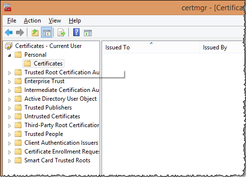
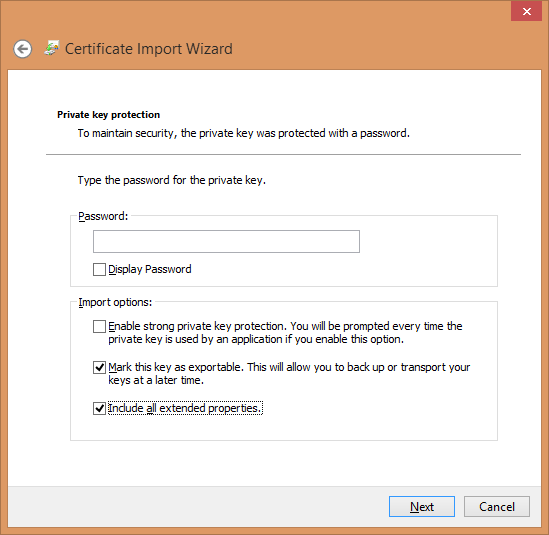

# Windows Certificate Store{#windows-certificate-store}

The Windows Certificate Store fallows you to store the client's certificate and private key in the Windows Certificate Store for SSL communication with servers.

The Windows Certificate Store for the Client is a new feature that allows you to store the SSL communication certificate and private key in the Windows Certificate Store rather than in `Insight/Certificates/<CertName>.pem` file. Using the Windows Certificate Store may be preferable if you use the certificate store for other applications and wish to do certificate management in one place, or for users that enjoy the additional Windows audit logging that the Windows Certificate store provides.

>[!NOTE]
>
>Licensing with the license server is still maintained using the existing `<Common Name>.pem` file, and that the certificate obtained from the certificate store will only be used for communication to the servers that you specify.

## Prerequisites {#section-69b18600052145ff8e5299b7123e69c5}

1. You must have access to the [!DNL certmgr.msc] file with the ability to import a certificate and key into the **Personal** store. (This should be true by default for most Windows users.) 

1. The user doing the configuration must have a copy of the **OpenSSL** command-line tool. 
1. The server and client must already be configured to use a custom SSL certificate, as described in [Using Custom Certificates](../../../../../home/c-inst-svr/c-install-ins-svr/t-install-proc-inst-svr-dpu/c-dnld-dgtl-cert/using-custom-certificates-dwb.md#concept-ee6a9b5015f84a0ba64a11428b0a72dd), giving instructions to store the client certificate in the Windows certificate store rather than storing it in the **Certificates** directory.

## Configuring the Windows Certificate Store {#section-3629802122e947d4b4f63e8b732cfe27}

The Windows Certificate Store for Clients is enabled following these steps:

**Step 1: Import the user's SSL certificate and private key into the Windows Certificate Store.**

In [Using Custom Certificates](../../../../../home/c-inst-svr/c-install-ins-svr/t-install-proc-inst-svr-dpu/c-dnld-dgtl-cert/using-custom-certificates-dwb.md#concept-ee6a9b5015f84a0ba64a11428b0a72dd) you are directed to put the SSL certificate and key in the following directory: 

```
< 
<filepath>
  DWB Install folder 
</filepath>>\Certificates\
```

The certificate's name is `<Common Name>.pem` (such as [!DNL Analytics Server 1.pem](not the [!DNL trust_ca_cert.pem] file.)

Before the certificate and private key can be imported, they must be converted from . [!DNL pem] format to a [!DNL .pfx] format, such as [!DNL pkcs12.pfx] ).

1. Open a command prompt or terminal and navigate to the directory: 

   ```
   <CommonName>.pem c: cd \<DWB Install folder \Certificates
   ```

1. Run [!DNL openssl] with the following arguments (with the actual [!DNL .pem] file name): 

   ```
   openssl pkcs12 -in "<Common Name>.pem" -export -out "<Common Name>.pfx"
   ```

   If prompted, hit **Enter** to skip entering an export password. 

1. Run [!DNL certmgr.msc] from the run prompt, start menu, or command line. 
1. Open the **Personal** certificate store for the current user.

   

1. Right-click **Certificates** and click **All Tasks** > **Import**.

   Make sure the **Current User** option is selected, then click **Next**.

   

1. Click **Browse** and select the `<CommonName>.pfx` file you created previously. You will have to change the file extension dropdown box from an X.509 Certificate to either **Personal Information Exchange** or to **All Files** in order to see it.

   Select the file and click **Open**, and then **Next**. 

1. Do not enter a password, and make sure that only the options **Mark this key as exportable** and **Include all extended properties** are selected.

   

   Click **Next**. 

1. Make sure that **Place all certificates in the following store** is selected, and that the certificate store listed is **Personal**. (If you're an advanced user, you can select another store at this point, but you'll have to change the configuration later.) 

1. Click **Next** and then click **Finish**. You should see a dialog box telling you that the import was successful and see your certificate in the Certificates folder of the store. 

   >[!NOTE]
   >
   >Pay particular attention to the **Issued To** and **Issued By** fields. You'll need these in the next step.

**Step 2: Edit the Insight.cfg file.**

The [!DNL Insight.cfg] file must be edited in order to direct Data Workbench to use the Windows Certificate Store feature. Each server entry in this file must have some additional parameters specified. If the parameters are omitted, the workstation will default to using the existing certificate configuration. If the parameters are specified but have incorrect values, the workstation will enter an error state and you will have to refer to the log file for error information.

1. Open the **Insight.cfg** file (located in the **Insight** installation directory). 

1. Scroll down to the server entry that you wish to configure. If you wish to use the Windows Certificate store for every server, you have to make these modifications to every entry in the vector of [!DNL serverInfo] objects. 
1. Add these parameters to their [!DNL Insight.cfg] file. You can do this from the workstation, or manually by adding the following parameters to the [!DNL serverInfo] object. (Be sure to use spaces instead of tab characters, and don't make other typographical or syntax errors in this file. ) 

   ```
   SSL Use CryptoAPI = bool: true  
   SSL CryptoAPI Cert Name = string: <Common Name>  
   SSL CryptoAPI Cert Issuer Name = string: Visual Sciences,LLC  
   SSL CryptoAPI Cert Store Name = string: My 
   ```

   The boolean enables or disables the feature. The certificate name matches **Issuer To** in the certificate manager. The certificate issuer name matches **Issued By**, and the **Store Name** must match the certificate store name. 

   >[!NOTE]
   >
   >The name "Personal" in the Certificate Manager (certmgr.msc) actually refers to the certificate store named **My.** Consequently, if you import your SSL communication certificate and key (.PFX) into the **Personal** certificate store as recommended, you must set the **SSL CryptoAPI Cert Store Name** string to "My". Setting this parameter to "Personal" will not work. This is a peculiarity of the Windows certificate store.

   A full list of the predefined system stores can be obtained here: [https://msdn.microsoft.com/en-us/library/windows/desktop/aa388136(v=vs.85).aspx](https://msdn.microsoft.com/en-us/library/windows/desktop/aa388136%28v=vs.85%29.aspx). Your system might have additional certificate stores. If you wish to use a store other than "Personal" (such as **My**), you must obtain the canonical name of the certificate store and provide it in the [!DNL Insight.cfg] file. (The system store name "My" is inconsistently referred to as "My" and "MY" by the Windows documentation. The parameter does not appear to be case sensitive.) 

1. After you have added these parameters and verified that the values match the list in the Windows Certificate Manager, save the [!DNL Insight.cfg] file.

You can now start the workstation (or disconnect/reconnect to the server). Data Workbench should load your certificate and key from the certificate store and connect normally.

## Log output {#section-a7ef8c9e90ef4bbabaa3cd51a2aca3ab}

When a certificate is not found or is invalid, this error message is thrown to the [!DNL HTTP.log] file.

```
ERROR Fatal error: the cert could not be found!
```

>[!NOTE]
>
>The L4 logging framework can be enabled by setting up the [!DNL L4.cfg] file (see your account manager to set this up).
