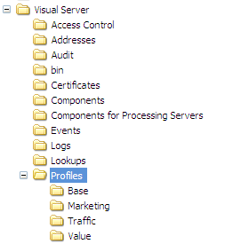
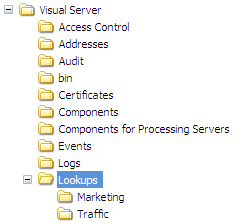

# Installing Profiles and Lookup Files{#installing-profiles-and-lookup-files}

The profiles and lookup files that Adobe has developed for your particular application are internal profiles that provide the metrics, dimensions, and workspaces that enable the analysis of your dataset.

As with all other internal profiles provided by Adobe, these profiles should not be changed. All customization must occur in your dataset or role-specific profiles or other profiles that you create.

Adobe distributes the profile and lookup files for your application as a [!DNL .zip] file. Each zip file is named for the application whose profile and lookup files that it contains. (For example, [!DNL Site52.zip] contains the profile files for Site v5.2.) The [!DNL .zip] file contains two folders ( [!DNL Lookups] and [!DNL Profiles]).

>[!NOTE]
>
>If you do not already have the installation file containing the profiles and lookup files for your application, download them from the Adobe FTP site before you begin.

You must install the profile and its lookup files on the [!DNL Insight Server] machine on which you process and run your dataset profile. If you are running an [!DNL Insight Server] cluster, you must install the files on the master server. For information about dataset profiles, see the *Dataset Configuration Guide*.

**To install profiles for your Adobe application**

1. Open the [!DNL Profiles] folder from the [!DNL .zip] file provided to you by Adobe. 

1. Copy all of the folders within the [!DNL Profiles] folder in the [!DNL .zip] file to the [!DNL Profiles] folder in your [!DNL Insight Server] installation directory. You want to end up with [!DNL ...\Profiles\]*< [!DNL internal profile name]>* folders on your [!DNL Insight Server] as shown in the following example. Your actual profile names may differ.

   

1. Navigate to the [!DNL Profiles\]*< [!DNL dataset profile name]>* folder in the directory where you installed [!DNL Insight Server] and locate the [!DNL profile.cfg] file in this directory.

   >[!NOTE]
   >
   >If you are installing profiles for the first time, you can use the provided Sample profile as your dataset profile. You can find the [!DNL profile.cfg] file (it might be named something like [!DNL profile.cfg.offline]) for the Sample profile within the [!DNL Profiles\Sample] folder in your [!DNL Insight Server] installation directory.

1. Open the [!DNL profile.cfg] file using a text editor such as Notepad and do the following:

    1. Add entries for the internal profiles in the Directories vector. The profile names correspond to the names of the directories that you copied to the [!DNL Profiles] folder on the [!DNL Insight Server] machine. 
    
    1. Update the number of directories as appropriate. 
    1. Add the common name of the server to the Common Name line in this file, as highlighted below:     
    
       ```    
       Profile = profileInfo: 
       Directories = vector: n+1 items
         0 = string: Base\\
         1 = string: internal profile name 1\\
         2 = string: internal profile name 2\\
       . . .
         n = string: internal profile name n\\
       Processing Servers = vector: 1 items
         0 = ProfileServerInfo: 
           Common Name = string: serverCommonName
           Server = string: 
       ```

       >[!NOTE]
       >
       >The *serverCommonName* that you specify for the Common Name in the [!DNL profile.cfg] file corresponds the server common name for the [!DNL Insight Server] machine on which you are processing and running the dataset profile. For instructions to update [!DNL profile.cfg] so that the dataset profile runs on an [!DNL Insight Server] cluster, see [Insight Server Clusters](../../../../home/c-inst-svr/c-install-ins-svr/c-ins-svr-clstrs/c-ins-svr-clstrs.md#concept-7990434e7d8f42bab089d3024b96586b).

1. Save the file. Be sure to save the file as [!DNL profile.cfg] if it was named differently.

**To install the lookup files for your Adobe application**

1. Open the [!DNL Lookups] folder from the [!DNL .zip] file provided to you by Adobe. 

1. Copy all of the folders within the [!DNL Lookups] folder in the [!DNL .zip] file to the [!DNL Lookups] folder in your [!DNL Insight Server] installation directory. You want to end up with [!DNL ...\Lookups\]*< [!DNL internal profile name]>* folders on your [!DNL Insight Server] as shown in the following example. Your actual profile names may differ.

   

