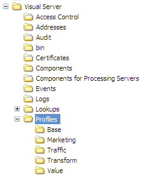

# Configuring Transform{#configuring-transform}

Transform functionality runs on an Insight Server FSU machine to enable the export of log source data for use by other applications.

 [!DNL Transform] can read [!DNL .vsl] files, log files, XML files, and ODBC data and export the data as [!DNL .vsl] files, text files, or delimited text files that can be used by data warehouse loading routines, auditing agencies, or other targets. The data extraction and transformation can be performed on a continuous or other scheduled basis. Each [!DNL Insight Server] FSU that provides output of altered event data must run [!DNL Transform].

>[!NOTE]
>
>Typically, [!DNL Transform] is installed on an [!DNL Insight Server] FSU. However, your implementation may require installation on an [!DNL Insight Server] DPU. For more information, contact Adobe.

For information about the system requirements for installing, configuring, and operating [!DNL Transform], see the *Minimum System Requirements* document.

Adobe distributes the [!DNL Transform] functionality as a profile within the [!DNL .zip] file for the [!DNL Insight Server] release package. The [!DNL Transform] profile is an internal profile that provides additional functionality to [!DNL Insight Server]. As with all other internal profiles provided by Adobe, the profile should not be changed. All customization must occur in your dataset or role-specific profiles or other profiles that you create.

The profile consists of the following files:

* [!DNL Log Processing.cfg]
* [!DNL [!DNL Insight] Transform.cfg]
* [!DNL [!DNL Insight] Transform Mode.cfg]
* a log processing dataset include file

All of these files are located in the [!DNL Dataset] folder for the profile.

**To install the [!DNL Transform] profile on [!DNL Insight Server]**

>[!NOTE]
>
>The following installation instructions assume that you have installed [!DNL Insight] and established a connection between [!DNL Insight] and the [!DNL Insight Server] on which you are installing [!DNL Transform]. If you have not done so, see the * [!DNL Insight] User Guide*.

1. Open the [!DNL .zip] file for the [!DNL Insight Server] release package, and open the [!DNL Profiles] folder within that [!DNL .zip] file.
1. Copy the [!DNL Transform] folder to the [!DNL Profiles] folder in your [!DNL Insight Server] installation directory. You want to end up with a [!DNL ...\Profiles\Transform] folder on your [!DNL Insight Server] as shown in the following example.

   

   >[!NOTE]
   >
   >If you followed all of the steps for installing [!DNL Insight Server] (see [Insight Server](../../../home/c-inst-svr/c-inst-svr.md#concept-c5c7e4288dcf44c8b2a61e40fae891c0)), you already may have a [!DNL Transform] folder in the Profiles directory.

1. Use the following steps to update the [!DNL profile.cfg] file for the profile with which you want to use [!DNL Transform]. The dataset reprocesses upon completion of these steps.

    1. Open the [!DNL Profile Manager]. 
    1. Right-click the check mark next to [!DNL profile.cfg] and click **[!UICONTROL Make Local]**. A check mark for this file appears in the [!DNL User] column. 
    
    1. Right-click the newly created check mark and click **[!UICONTROL Open]** > **[!UICONTROL in Insight]**. The [!DNL profile.cfg] window appears. 
    
    1. In the [!DNL profile.cfg]window, right-click **[!UICONTROL Directories]** and click **[!UICONTROL Add new]** > **[!UICONTROL Directory]**.

       To add the new directory to the end of the list of directories, right-click the number or name of the last directory in the list and click **[!UICONTROL Add new]** > **[!UICONTROL Directory]**. 
    
    1. Type the name of the new directory: [!DNL Transform]
    1. Right-click **[!UICONTROL (modified)]** at the top of the window and click **[!UICONTROL Save]**. 
    
    1. In the [!DNL Profile Manager], right-click the check mark for [!DNL profile.cfg] in the [!DNL User] column, then click **[!UICONTROL Save to]** > *< **[!UICONTROL profile name]**>*.

       >[!NOTE]
       >
       >Do not save the modified configuration file to any of the internal profiles provided by Adobe (including the profile), as your changes are overwritten when you install updates to these profiles.

