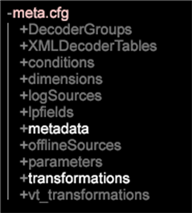

# DWB Server upgrade: 6.2 to 6.3{#dwb-server-upgrade-to}

Upgrading server components for Data Workbench 6.3.

**Upgrade Server**

If you have customized profiles that take precedence over the default files provided in the [!DNL Base] package, then you will need to update these customized files:

* **Update the Meta.cfg file** ( [!DNL E:\..\Profiles\<your custom profile>\Context\meta.cfg)]to set updated password encryption for the File System Unit (FSU server), and to add entries for the Name Value Pair tranformations to take advantage of [Query String groupings](../../../../home/c-inst-svr/c-upgrd-uninst-sftwr/c-upgrd-sftwr/c-6-2-to-6-3-upgrade.md#concept-42f74911b5714219a359b719badac8e0).

  1. Open the [!DNL meta.cfg] file on the FSU. 
  1. Change the data type for **[!UICONTROL Proxy Password]** from " [!DNL string"] to " [!DNL EncryptedString]" in the *Workstation Configuration* section.

     ```    
       Proxy User Name = string: 
       Proxy Password = EncryptedString:   ( 
       from Proxy Password = String) 
       Use Address File = bool: true
     ```

  1. Add new entries to enable the new Name Value Pair transformations: *BuildNameValuePair* and *ExtractNameValuePairs*.

     Open a workspace and right-click **Admin** > **Profile Manager**.

     Under **Context**, click the **meta.cfg** file in the **Base** column and then click **Make Local**. From the User table column, right-click and select **Open** > **in Workstation**.

     

     * In the new window, click **metadata** and add acceptable children templates.

       

     * Open **transformation** and add new templates.

       

* **Update for Fast Merge improvements**. Add parameters or change values to the following configuration files to take advantage of speed improvements in Data Workbench during a transformation.

    * **Communications.cfg** ( [!DNL E:\Server\Components\Communications.cfg])

      ```    
      18 = SourceListServer:  
          URI = string: /SourceListServer/ 
          Listing Interval = int: 10 ( 
      <new>)
      ```

    * **Disk Files.cfg** (at [!DNL E:\Server\Components] and [!DNL E:\Server\Components for Processing Servers])

      ```    
      Disk Cache Size (MB) = double: 1024  
      <(from double: 256)> 
      Disk Cache Read Limit (MB) = double: 768  
      <(new)>
      ```

    * **Log Processing Mode.cfg** ( [!DNL E:\Server\Profiles\<your profile>\Dataset\Log Processing Mode.cfg])

      ```    
      <(changed) 
      Batch Bytes = int: 268435456 
      Cloud Bytes = int: 268435456 
      Real Time FIFO Bytes = int: 268435456
      ```

      ```    
      ( 
      <new>) 
      Cache Bytes = int: 32000000 
      Fast Input Decision Ratio = double: 200 
      Fast Input FIFO Bytes = int: 268435456 
      FIFO Hash Mask = int: 16383 
      Fast Merge Buffer Bytes = int: 536870912 
      Slow Merge Buffer Bytes = int: 268435456 
      Fast Merge Fan In = int: 64 
      Key Cache Size Logarithm = int: 21 
      Max Seeks = int: 512 
      Output Old Buffer Bytes = int: 536870912 
      Overflow FIFO Bytes = int: 67108864 
      Paused = bool: false
      ```

  >[!NOTE]
  >
  >To take advantage of the Fast Merge improvements, make sure you have at least 8 GBs of RAM per DPU.

* **Adobe Target with DWB integration update**. A new export file, [!DNL ExportIntegration.exe], replaces the existing [!DNL TnTSend.exe] file on the Insight Server (`E:\Server\Scripts\TnTSend.exe`). This new export file supports both [Adobe Target](https://www.adobe.com/marketing/target.html) integration and coordination with the new Master Marketing Profile (MMP) and [Adobe Audience Manager](https://www.adobe.com/analytics/audience-manager.html).

  You will need to update the following commands for Adobe Target exports.

  `Command = string: TnTSend.exe`

  to

  ```
  <filepath>
  Command = string: ExportIntegration.exe 
  </filepath>
  ```

  >[!NOTE]
  >
  >This will only affect exports created prior to version 6.3.

  You can also try the following to employ the old export process:

    * Create a new Test And Target Export in the workstation. 
    * Modify the old Test and Target export found in [!DNL Server/Profiles/`<your profile>`/Export.]

* **Update the Adobe SC profile.** Changes to the [!DNL Exclude Hit.cfg] file require a field to be declared in the associated [!DNL Decoding Instructions.cfg] file.

  >[!NOTE]
  >
  >If your Adobe SC profile includes a customized [!DNL Decoding Instructions.cfg] file, you will need to include a [!DNL DelimitedDecoder] parameter to your customized file.

  ```
  0 = DelimitedDecoder: 
     Delimiter = string: \t 
     Fields = vector: x items 
     …  
        5 = string: 
  Changed to: 
         
  5 = string: x-hit_source
  ```

  Adding the [!DNL DelimitedDecoder] field allows you to take advantage of feature updates and to avoid possible Log Processing problems resulting from these updates.
