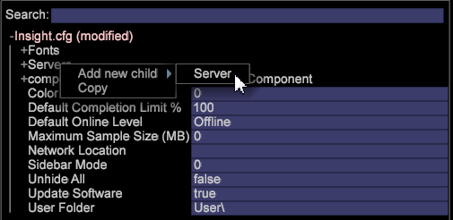
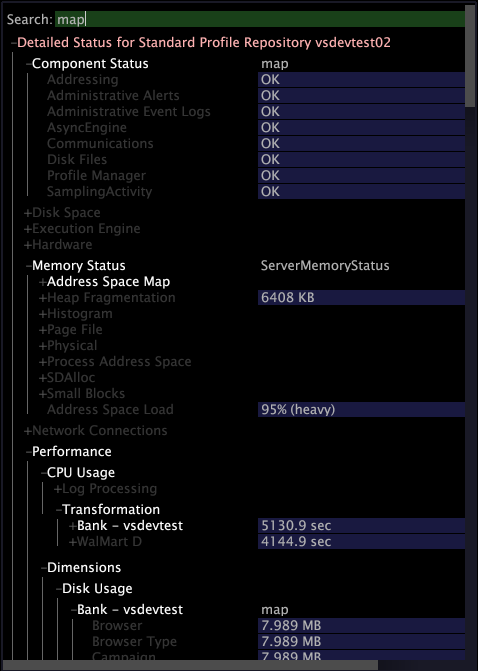

# Configuring the Connection to Insight Server{#configuring-the-connection-to-insight-server}

After you have installed your Insight software and digital certificate, you must start Insight and configure its connection to Insight Server.

>[!NOTE]
>
>In some cases, the connection to Insight Server may have been pre-configured by Adobe Consulting Services or your system administrator. If so, you do not need to complete this task.

When you start Insight for the first time, it automatically connects to the Adobe License Server to register your digital certificate. To complete the registration process successfully, your computer must be connected to the Internet when you execute the following steps.

>[!NOTE]
>
>If you have already requested, downloaded, and installed a pre-locked certificate as described in [Downloading and Installing the Digital Certificate](../../../home/c-install-insight/install-setup/c-dgtl-crtf.md#topic-fed3b44e472c4e4ca6dd5852af14cdb9), Insight will not attempt to connect to the License Server and you will not receive an error.

**To configure the connection to Insight Server**

When working in a clustered environment, Insight should be configured to access the master Insight Server to avoid synchronization issues. In Insight you can view information about the processing [!DNL Insight Servers] in your cluster using the [!DNL Related Servers] menu item in the [Servers Manager](https://experienceleague.adobe.com/docs/data-workbench/using/client/admin-ui/c-svrs-mgr.html).

1. Launch Insight. 
1. On the [!DNL Worktop], click **[!UICONTROL Admin]**, then **[!UICONTROL First Steps]**. 

1. Click the **[!UICONTROL Configure Connection to Servers]** thumbnail.

   The [!DNL Servers Manager], the [!DNL Insight.cfg] file, and instructions for configuring your [!DNL Insight.cfg]file are displayed. 

1. In the [!DNL Insight.cfg] window, right-click **[!UICONTROL Servers]** and click **[!UICONTROL Add new child]** > **[!UICONTROL Server]**.

   

1. Complete or modify the server parameters to provide Insight with access to your master Insight Server. For detailed descriptions of the parameters in the Insight.cfg file, see [Configuration parameters](https://experienceleague.adobe.com/docs/data-workbench/using/client/c-insght-config-param.html).

   

1. Repeat Step 4 and Step 5 for each Insight Server to which you want to configure a connection. 
1. To save your configuration changes, right-click **[!UICONTROL Insight.cfg (modified)]** at the top of the window and click **[!UICONTROL Save as Insight.cfg]**.

   Insight attempts to connect to the [!DNL Insight Server(s)] using the settings that you have specified. If a connection is established, a green node appears in the [!DNL Servers Manager] as shown on the following page.

   

    * **Green:** Indicates that the connection to the Insight Server is active. 
    * **Light Red:** Indicates a potential problem with the server, such as a drain on server processing, high memory usage, or low disk space. 
    * **Red:** Indicates that the connection to the Insight Server is not active.

   If Insight cannot connect using the specified settings, a red node appears in the [!DNL Servers Manager]. If this happens, see [Connection Troubleshooting](../../../home/c-install-insight/install-setup/t-conn-trbsh.md#task-034e588c5ce04c4a8f6d0097364d3b2b).

<!--
c_dir_crt_setup.xml
-->

When you select a profile to use, the profile information (including related data and any specific workspaces or visualizations defined for the profile) is downloaded to your computer. As you download each profile, Insight creates a folder within the installation directory using the profile name.

For example, if you select a profile named Sales, a folder named Sales appears in your Insight directory. This folder contains the metrics, dimensions, workspaces, and visualizations defined in the Sales profile. After the initial loading of the profile, the profile can be used when working offline. See [Working offline and online](https://experienceleague.adobe.com/docs/data-workbench/using/client/c-off-on.html).

In addition, when you connect to Insight Server for the first time from Insight, Insight Server creates the following directories in the Insight installation directory.

* **[!DNL Trace] directory:** Within the [!DNL Trace] directory is the Insight log file ( [!DNL insight.log]). When the size of the [!DNL Insight.log] file reaches 100 MB, the file is renamed to [!DNL insight-1.log]. If a file of the name [!DNL insight-1.log] already exists, then [!DNL insight-1.log] is renamed to [!DNL insight-2.log], and so forth, with a maximum of [!DNL insight-9.log]. The file [!DNL insight.log] always contains the most recent log information, and [!DNL insight-max.log] contains the oldest. 

* **[!DNL User] directory:** Within the [!DNL User] directory are folders that correspond to each profile used to date, and within each profile folder are folders named [!DNL Work] and [!DNL Workspaces]. The directory `User\*profile name*\Workspaces` is the default location in which Insight workspace files are saved. `User\*profile name*\Work` is the default location in which Insight visualizations and other custom work performed by the Insight user are saved.

The following table lists the default locations of commonly accessed components.

<table id="table_0254A8C25AF5400F89F87A242746D07E"> 
 <thead> 
  <tr> 
   <th colname="col1" class="entry"> Component </th> 
   <th colname="col2" class="entry"> Directory Location </th> 
  </tr>
 </thead>
 <tbody> 
  <tr> 
   <td colname="col1"> 
Saved visualizations 
 </td> 
   <td colname="col2"> 
<i>Insight</i>\User\<i>profile name</i>\Work\ 
 </td> 
  </tr> 
  <tr> 
   <td colname="col1"> 
Saved  Workspaces 
 </td> 
   <td colname="col2"> 
<i>Insight</i>\User\<i>profile name</i>\Workspaces\<i>tab name</i>\ 
 </td> 
  </tr> 
  <tr> 
   <td colname="col1"> 
Saved .png files 
 </td> 
   <td colname="col2"> 
<i>Insight</i>\User\<i>profile name</i>\Work\ 
 </td> 
  </tr> 
  <tr> 
   <td colname="col1"> 
Data cache 
 </td> 
   <td colname="col2"> 
<i>Insight</i>\User\Cache.db 
 </td> 
  </tr> 
  <tr> 
   <td colname="col1"> 
 Insight.log file 
 </td> 
   <td colname="col2"> 
<i>Insight</i>\Trace\ 
 </td> 
  </tr> 
 </tbody> 
</table>

<!--
c_config_file_ent.xml
-->

You can search by key name, key type, or value to quickly locate an entry, to remove the need to scroll through expanded, large files for nested information. You can locate dimension names, server names, and so on. The following example shows matches for a search on the phrase map.

Type a search phrase into this field to locate the data. Depending on the success of a match, the color of the field changes. Matches are shown highlighted and non-matches are dimmed. If there are no matches, the background of the search field turns red. When you press Enter, the config tree expands every place where there is a match and collapses where there is not a match.

You can also use regular expressions in the [!DNL Search] field. For example, you can use re: [!DNL *zip.*] for any entry containing the word “zip.”

To clear a search, press **[!UICONTROL Escape]**.
