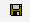
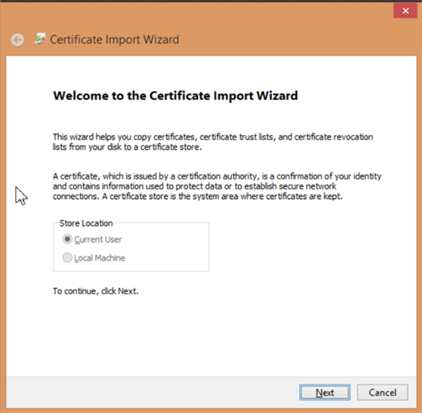

# Downloading and Installing the Digital Certificate{#downloading-and-installing-the-digital-certificate}

After you have installed the Insight program files, you must download and install the digital certificate provided to you by Adobe.

## Downloading and Installing the Digital Certificate {#topic-fed3b44e472c4e4ca6dd5852af14cdb9}

After you have installed the Insight program files, you must download and install the digital certificate provided to you by Adobe.

## Understanding Digital Certificates {#concept-9eed01c8d95440cda6ce29d68e65098c}

Adobe uses X.509 digital certificates to identify and authenticate the client and server components that make up an implementation.

<!--
c_undst_dgtl_crtf.xml
-->

When you install Insight, you must install the digital certificate that authorizes a named individual (for example, Jane Smith) to use the installed client application.

>[!NOTE]
>
>If you need to migrate Insight to another computer or another named user, you must obtain a new certificate from Adobe. To do so, contact Adobe Customer Care.

Insight presents this digital certificate to gain access to a server component. An administrator of a server component can restrict access to server resources based on the common name or organizational unit values that appear in the user’s certificate.

The X.509 digital certificates installed with Adobe applications also enable its client and server components to exchange information over Secure Sockets Layer (SSL). SSL secures transmissions over HTTP using a public-and-private key encryption system. Adobe’s implementation of SSL supports 1024-bit RSA keys and uses a 128-bit RC4 encryption algorithm.

In addition to security, the digital certificate that you install also functions as a license key that enables you to run Insight. To function properly, a digital certificate must be node-locked and current, or the application will not start.

## Node-locked Certificates {#section-984aa8f2f5a1448cadc4afea978aedc9}

A node-locked certificate is a digital certificate that has been registered to the computer on which it is installed. Node locking permanently associates a certificate with a specific node identifier (a value that uniquely identifies a particular computer). To node lock your certificate, your computer must have Internet access to the Adobe License Server or to a proxy server that has access to the License Server.

If you are installing on a computer that cannot access the Internet, you must obtain and install a special pre-locked certificate as described in [Using Digital Certificates on Computers Without Internet Access](../../../home/c-install-insight/install-setup/c-dgtl-crtf.md#section-d3c060131d7f45cda27f68848b704fa1).

If you are installing on a computer that can access the Internet, your digital certificate will be node-locked automatically the first time that you start Insight. After being node-locked, the certificate cannot be used on any other computer. If you need to migrate Insight to another computer, you must obtain a new, unlocked certificate from Adobe.

## Current Certificates {#section-0816b031df3e415ab3f0205b720c723e}

Besides being node-locked, your digital certificate must be current. To remain current, your certificate must be revalidated on a regular basis (generally every 30 days, but can vary depending on your agreement with Adobe). If your computer has Internet access, the revalidation process is completely transparent. Insight automatically connects to the License Server and revalidates the certificate when necessary. If your computer does not have Internet access, you must manually install an updated certificate as described in the following section.

## Using Digital Certificates on Computers Without Internet Access {#section-d3c060131d7f45cda27f68848b704fa1}

If you are installing on a computer that cannot access the Internet, you must request a pre-locked certificate for your installation of Insight. A pre-locked certificate is a digital certificate that Adobe manually locks to the node identifier for the computer.

To request a pre-locked certificate, you must send the node identifier and your certificate number to Adobe Customer Care. To obtain the node identifier for your computer, contact Adobe Customer Care to request the Adobe [!DNL Node Identifier] utility. You also can obtain the node identifier from the alert that Insight issues when it attempts to connect to the License Server and cannot. When you receive the pre-locked certificate, install it as described in the last two steps of [Installing Digital Certificates](../../../home/c-install-insight/install-setup/c-dgtl-crtf.md#task-1dad1e1d86d04100a7bcf87f26303c38).

When the certificate needs to be revalidated, you must download a new, validated certificate from the License Server and reinstall it on your computer (unless your agreement with Adobe states otherwise).

## Installing Digital Certificates {#task-1dad1e1d86d04100a7bcf87f26303c38}

<!--
t_install_dgtl_crtf.xml
-->

**To download and install the digital certificate**

1. Open your web browser to [!DNL https:\\license.visualsciences.com].

   >[!NOTE]
   >
   >Your browser might prompt you to present a digital certificate at this point. If it does, click **[!UICONTROL Cancel]** to dismiss the dialog box.

1. On the login screen, enter the [!DNL Account Name] and the [!DNL Password] that you received from Adobe, then click **[!UICONTROL login]**.
1. Locate the certificate that has been issued for your instance of Insight ( *Your Name*.pem) and click the  icon associated with that certificate.
1. When prompted to save the certificate, click **[!UICONTROL Save]**.
1. Download the file to the [!DNL Certificates] folder in the directory where you installed Insight.

   This folder contains a certificate file named [!DNL trust_ca_cert.pem]. Both certificate files must always be present for Insight to function.

## Windows Certificate Store {#concept-4acb13b7de9340ea8cde8ad84b93358d}

The Windows Certificate Store fallows you to store the client's certificate and private key in the Windows Certificate Store for SSL communication with servers.

<!--
crypto-api.xml
-->

The Windows Certificate Store for the Client is a new feature that allows you to store the SSL communication certificate and private key in the Windows Certificate Store rather than in `Insight/Certificates/<CertName>.pem` file. Using the Windows Certificate Store may be preferable if you use the certificate store for other applications and wish to do certificate management in one place, or for users that enjoy the additional Windows audit logging that the Windows Certificate store provides.

>[!NOTE]
>
>Licensing with the license server is still maintained using the existing `<Common Name>.pem` file, and that the certificate obtained from the certificate store will only be used for communication to the servers that you specify.

## Prerequisites {#section-69b18600052145ff8e5299b7123e69c5}

1. You must have access to the [!DNL certmgr.msc] file with the ability to import a certificate and key into the **Personal** store. (This should be true by default for most Windows users.)

1. The user doing the configuration must have a copy of the **OpenSSL** command-line tool.
1. The server and client must already be configured to use a custom SSL certificate, giving instructions to store the client certificate in the Windows certificate store rather than storing it in the **Certificates** directory.

## Configuring the Windows Certificate Store {#section-3629802122e947d4b4f63e8b732cfe27}

The Windows Certificate Store for Clients is enabled following these steps:

**Step 1: Import the user's SSL certificate and private key into the Windows Certificate Store.**

In [Using Custom Certificates in Data Workbench](../../../home/c-install-insight/install-setup/c-dgtl-crtf.md#concept-ee6a9b5015f84a0ba64a11428b0a72dd) you are directed to put the SSL certificate and key in the following directory:

```
<
<filepath>
  DWB Install folder
</filepath>>\Certificates\
```

The certificate's name is `<Common Name>.pem` such as Analytics Server 1.pem (not the trust_ca_cert.pem file.)

Before the certificate and private key can be imported, they must be converted from . [!DNL pem] format to a [!DNL .pfx] format, such as [!DNL pkcs12.pfx] ).

1. Open a command prompt or terminal and navigate to the directory:

   ```
   <CommonName>.pem c: cd \<filepath>DWB Install folder</filepath>>\Certificates
   ```

1. Run [!DNL openssl] with the following arguments (with the actual [!DNL .pem] file name):

   ```
   openssl pkcs12 -in "<Common Name>.pem" -export -out "<Common Name>.pfx"
   ```

   If prompted, hit **Enter** to skip entering an export password.

1. Run [!DNL certmgr.msc] from the run prompt, start menu, or command line.
1. Open the **Personal** certificate store for the current user.

   

1. Right-click **Certificates** and click **All Tasks** > **Import**.

   Make sure the **Current User** option is selected, then click **Next**.

   

1. Click **Browse** and select the `<CommonName>.pfx` file you created previously. You will have to change the file extension dropdown box from an X.509 Certificate to either **Personal Information Exchange** or to **All Files** in order to see it.

   Select the file and click **Open**, and then **Next**.

1. Do not enter a password, and make sure that only the options **Mark this key as exportable** and **Include all extended properties** are selected.

   

   Click **Next**.

1. Make sure that **Place all certificates in the following store** is selected, and that the certificate store listed is **Personal**. (If you're an advanced user, you can select another store at this point, but you'll have to change the configuration later.)

1. Click **Next** and then click **Finish**. You should see a dialog box telling you that the import was successful and see your certificate in the Certificates folder of the store.

   >[!NOTE]
   >
   >Pay particular attention to the **Issued To** and **Issued By** fields. You'll need these in the next step.

**Step 2: Edit the Insight.cfg file.**

The [!DNL Insight.cfg] file must be edited in order to direct Data Workbench to use the Windows Certificate Store feature. Each server entry in this file must have some additional parameters specified. If the parameters are omitted, the workstation will default to using the existing certificate configuration. If the parameters are specified but have incorrect values, the workstation will enter an error state and you will have to refer to the log file for error information.

1. Open the **Insight.cfg** file (located in the **Insight** installation directory).

1. Scroll down to the server entry that you wish to configure. If you wish to use the Windows Certificate store for every server, you have to make these modifications to every entry in the vector of [!DNL serverInfo] objects.
1. Add these parameters to their [!DNL Insight.cfg] file. You can do this from the workstation, or manually by adding the following parameters to the [!DNL serverInfo] object. (Be sure to use spaces instead of tab characters, and don't make other typographical or syntax errors in this file. )

   ```
   SSL Use CryptoAPI = bool: true
   SSL CryptoAPI Cert Name = string: <Common Name>
   SSL CryptoAPI Cert Issuer Name = string: Visual Sciences,LLC
   SSL CryptoAPI Cert Store Name = string: My
   ```

   The boolean enables or disables the feature. The certificate name matches **Issuer To** in the certificate manager. The certificate issuer name matches **Issued By**, and the **Store Name** must match the certificate store name.

   >[!NOTE]
   >
   >The name "Personal" in the Certificate Manager (certmgr.msc) actually refers to the certificate store named **My.** Consequently, if you import your SSL communication certificate and key (.PFX) into the **Personal** certificate store as recommended, you must set the **SSL CryptoAPI Cert Store Name** string to "My". Setting this parameter to "Personal" will not work. This is a peculiarity of the Windows certificate store.

   A full list of the predefined system stores can be obtained here: [https://msdn.microsoft.com/en-us/library/windows/desktop/aa388136(v=vs.85).aspx](https://msdn.microsoft.com/en-us/library/windows/desktop/aa388136%28v=vs.85%29.aspx). Your system might have additional certificate stores. If you wish to use a store other than "Personal" (such as **My**), you must obtain the canonical name of the certificate store and provide it in the [!DNL Insight.cfg] file. (The system store name "My" is inconsistently referred to as "My" and "MY" by the Windows documentation. The parameter does not appear to be case sensitive.)

1. After you have added these parameters and verified that the values match the list in the Windows Certificate Manager, save the [!DNL Insight.cfg] file.

You can now start the workstation (or disconnect/reconnect to the server). Data Workbench should load your certificate and key from the certificate store and connect normally.

## Log output {#section-a7ef8c9e90ef4bbabaa3cd51a2aca3ab}

When a certificate is not found or is invalid, this error message is thrown to the [!DNL HTTP.log] file.

```
ERROR Fatal error: the cert could not be found!
```

>[!NOTE]
>
>The L4 logging framework can be enabled by setting up the [!DNL L4.cfg] file (see your account manager to set this up).

## Using Custom Certificates in Data Workbench {#concept-ee6a9b5015f84a0ba64a11428b0a72dd}

Instructions for using custom certificates.

<!--
using-custom-certificates-DWB.xml
-->

A certificate used by either the Data Workbench client or server needs to be signed by a trusted CA (Certificate Authority). Data Workbench customers receive certificates that are signed by the Visual Sciences CA. These certificates are trusted by the Data Workbench software, since the [!DNL trust_ca_cert.pem] (provided along with the Insight software and stored in the **Certificates** directory of both servers and clients) contains a *Root CA Certificate* for the Visual Sciences CA. These certificates are used for both licensing of the software and authentication when clients and servers communicate with each other using SSL. Only certificates issued by the Visual Sciences CA can be used for licensing, but other certificates may be used for communication and authentication. Certificates issued by CAs other than Visual Sciences are referred to below as *custom certificates.*

**Important note:** For servers and clients, Data Workbench software uses the certificate files installed in the client or server's **Certificates** directory or certificates explicitly identified in its configuration. However, you can also use the Windows Certificate Store for clients.

The following instructions describe the procedures to be followed to use custom certificates for communication between Data Workbench clients and servers. Not every detail is a hard requirement and different variations in the process can be employed. However, the procedures below have been tested to work.

## Setting up Custom Client Certificates {#section-2083fd41973e451fa404e7a4ae4da591}

1. Add the certificate of the issuing CA to the [!DNL trust_cert_ca.pem], which is installed in the **Certificates** directory of the client and that of every server in every cluster that is to be accessed using this custom certificate.

1. Obtain a custom certificate for each server in the cluster with the following conditions:

    1. Certificate is formatted as a [!DNL .pem] certificate.
    1. Certificate contains its key and is unencrypted (i.e., it has no password/pass phrase).

       A certificate contains its key with one of the following lines:

       ```
       BEGIN PRIVATE KEY
       BEGIN RSA PRIVATE KEY
       ```

       One way to remove the password phrase from a [!DNL .pem] certificate:

       ```
       openssl rsa  -in password-protected-cert.pem -out no-password-cert.pem
       openssl x509 -in password-protected-cert.pem >> no-password.pem
       ```

    1. Certificate has the CN, O, OU, etc. as required for this client in the servers' [!DNL Access Control.cfg] file.
    1. Certificate was issued with a *purpose &#42;&#42;&#42;* of *client* (or both *server* **and** *client*).

       To verify that a certificate has a purpose code of server and/or client, the following commands can be used:

       ```
       openssl verify -CAfile trust_ca_cert.pem -purpose sslserver -x509_strict custom_communications_cert.pem
       openssl verify -CAfile trust_ca_cert.pem -purpose sslclient -x509_strict custom_communications_cert.pem
       ```

       For a server certificates, both commands should yield:

       ```
       custom_communications_cert.pem: OK
       ```

       For a client certificate, only the second command is required to yield [!DNL OK].

1. Place the certificate in the client's **Certificates** directory.
1. In [!DNL Insight.cfg] under the *serverInfo* for each cluster that you want to use this certificate, make sure the *custom client cert* is named, such as:

   ```
   Servers = vector: 1 items
     0 = serverInfo:
       SSL Client Certificate = string:
     <my_custom_client_cert.pem>
   ```

## Setting up Custom Server Certificates {#setting-up-custom-server-certificates}

This section assumes that you have a cluster that is up and running, using Visual Sciences issued certificates, and the configuration follows common practices (such as the *Components for Processing Servers* directory on the master gets synchronized to the *Components* directories of all DPUs).

1. Add the certificate of the issuing CA to the [!DNL trust_cert_ca.pem] which is installed on every server in the cluster and every client that needs to communicate with this cluster.
1. Obtain a custom certificate for each server in the cluster with these requirements:

    1. Custom certificate is formatted as a [!DNL .pem] certificate.
    1. Certificate contains its key and is unencrypted (i.e., it has no password/pass phrase).

       A certificate contains its key if it has a line such as:

       ```
       BEGIN PRIVATE KEY
       BEGIN RSA PRIVATE KEY
       ```

       One way to remove the password phrase from a [!DNL .pem] certificate:

       ```
       openssl rsa  -in password-protected-cert.pem -out no-password-cert.pem
       openssl x509 -in password-protected-cert.pem >> no-password.pem
       ```

    1. Certificate has the same CN as the [!DNL server_cert.pem] currently installed on the server.
    1. Certificate was issued with a purpose of *server* and *client*.

       To verify that a certificate has a purpose code of server and/or client, the following commands can be used:

       ```
       openssl verify -CAfile trust_ca_cert.pem -purpose sslserver -x509_strict custom_communications_cert.pem
       openssl verify -CAfile trust_ca_cert.pem -purpose sslclient -x509_strict custom_communications_cert.pem
       ```

       For a server certificates, both commands should yield:

       ```
       custom_communications_cert.pem: OK
       ```

       For a client certificate, only the second command is required to yield [!DNL OK].

1. Install each server's custom certificate in the **Certificates** directory of the server as [!DNL custom_communications_cert.pem].

1. Using a text editor, add the following line to **Communications.cfg** file in both the *Components* and *Components for Processing Servers* directories, directly below the first line ( [!DNL component = CommServer]):

   ```
   Certificate = string: Certificates\\custom_communications_cert.pem
   ```

1. Restart all servers.

**About Certificate Failure Warning**

When the Insight server or client is looking for a **license** certificate in the **Certificates** directory, it tries to validate all the certificates (except [!DNL trust_ca_cert.pem]), against a hard coded copy of the Insight CA certificate, which fails on any custom certificate present in the directory. The server issues this warning:

```
Certificate failed to verify. Error 20 at 0 depth. Desc: unable to get local issuer certificate. Cert details:
```

This warning can be safely ignored.

## String Encryption {#concept-35da0b53650a4d7e82b240ad27f6d45a}

Encrypt passwords and other strings when communicating between the client and server.

<!--
string_encryption.xml
-->

When communicating between the Data Workbench client (workstation) and server, you can save a Value parameter (such as a password) with the Type of *EncryptedString*. This hides the parameter and saves the string to the *Windows Credential Store* on the server with the corresponding key returned. This primarily stores credentials used in exports but can be used to encrypt any parameter.

* A new folder was added at Server\**EncryptStrings**.

  This is where you set the configuration file to encrypt strings.

* A new configuration file was added at Server\Component\**EncryptedStrings.cfg**.

  ```
  component = EncryptionComponent:
    Path = Path: EncryptStrings\\*.cfg
  ```

  This file polls the *Server*\*EncryptStrings* folder for encryption configuration files.

**To encrypt a string**:

1. Create an **EncryptedStrings.cfg** configuration file for a string with these fields set:

   ```
   Names = vector: 1 items
    0 = NameEncryptValuePair:
     EncryptValue = EncryptedString: // left empty as input then output will be filled by server
     Name = string: // Name for identifier
     Value = string: // Value to be encrypted
   ```

    * *Value* - This field contains the plain text string that needs to encrypted.

      This is server-side encryption only. The *Value* setting is encrypted only on the server computer.

    * *Name* - This field contains a value identifying the encrypted string.
    * *EncryptValue* - This field will be left empty in the input configuration file. The encrypted value will be returned in this field.

   You can add multiple **NameEncryptValuePair** values for different fields for encryption.

   >[!NOTE]
   >
   >All empty Value fields will be removed.

1. Save the **EncryptedStrings.cfg** file to the Server\**EncryptStrings** folder.

**Output file**

An output file will be generated with the same name as the input file with a <*filename*>.*encrypted* extension. For example, if the input file is named *sample.cfg* then the output file will be named *sample.cfg.encrypted*.
